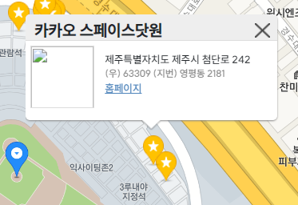
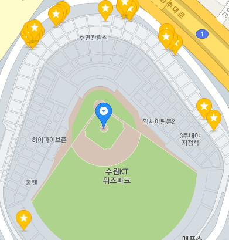
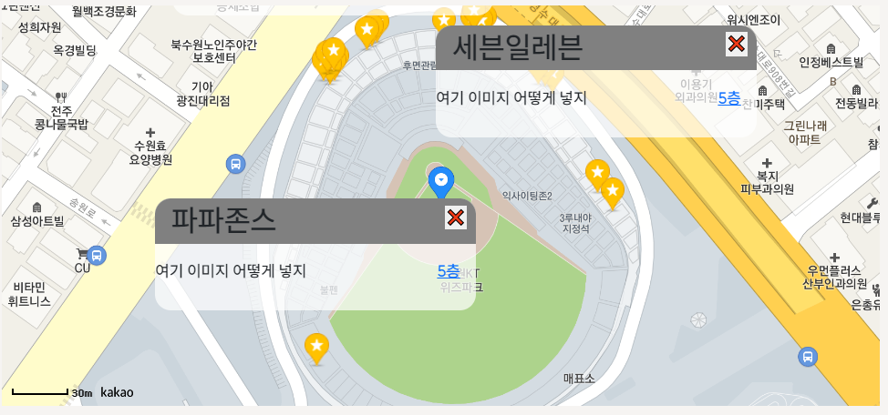

# 카카오맵 다중 마커 관리

  - 카카오맵을 이용한 API에서 마커를 여러개 찍는 것을 코드로 구현

```javascript
    var mapContainer = document.getElementById('map'), // 지도를 표시할 div  
    mapOption = { 
        center: new kakao.maps.LatLng({{ stadium.lat }}, {{ stadium.lon }}), // 지도의 중심좌표
        level: 2 // 지도의 확대 레벨
    };

var map = new kakao.maps.Map(mapContainer, mapOption); // 지도를 생성합니다
 
var new_dicts = {};
var positions = [];

// 마커를 표시할 위치와 title 객체 배열입니다 
    
        var name = "{{ store.name }}";
        var lat = {{ store.lat }};
        var lon = {{ store.lon }};
        new_dicts['name'] = name;
        new_dicts['latlng'] = new kakao.maps.LatLng(lat,lon)
        new_dicts['pk'] = {{ store.pk }}
        positions.push(new_dicts);
        var new_dicts = {};
    

// 마커 이미지의 이미지 주소입니다
var imageSrc = "https://t1.daumcdn.net/localimg/localimages/07/mapapidoc/markerStar.png"; 
    
for (var i = 0; i < positions.length; i ++) {
    // 마커 이미지의 이미지 크기 입니다
    var imageSize = new kakao.maps.Size(24, 35); 
    
    // 마커 이미지를 생성합니다    
    var markerImage = new kakao.maps.MarkerImage(imageSrc, imageSize); 
    
    // 마커를 생성합니다
    var marker = new kakao.maps.Marker({
        map: map, // 마커를 표시할 지도
        position: positions[i].latlng, // 마커를 표시할 위치
        image : markerImage // 마커 이미지 
    });
    var content =  '<div class="wrap_store">' + 
        '    <div class="info_store">' + 
        '        <div class="title">' + 
        '            카카오 스페이스닷원' + 
        '            <div class="close" onclick="closeOverlay()" title="닫기"></div>' + 
        '        </div>' + 
        '        <div class="body">' + 
        '            <div class="img">' +
        '                ' +
        '           </div>' + 
        '            <div class="desc_add">' + 
        '                <div class="ellipsis">제주특별자치도 제주시 첨단로 242</div>' + 
        '                <div class="jibun ellipsis">(우) 63309 (지번) 영평동 2181</div>' + 
        `                <div><a href="foods/home/{{ team.pk }}/store/${positions[i].pk}" target="_blank" class="link">홈페이지</a></div>` + 
        '            </div>' + 
        '        </div>' + 
        '    </div>' +    
        '</div>';
    var overlay = new kakao.maps.CustomOverlay({
        map: map,
         clickable: true, 
        content: content,
        position: positions[i].latlng,
         xAnchor: 0.5,
        yAnchor: 2, 
    });
    overlay.setMap(null)
    kakao.maps.event.addListener(marker, 'click', makeClickListener(map,overlay));
}
function closeOverlay() {
    overlay.setMap(null);     
}
 kakao.maps.event.addListener(marker, 'mouseover', makeOverListener(map,customOverlay)); 
 kakao.maps.event.addListener(marker, 'mouseout', makeOutListener(customOverlay)); 
function makeClickListener(map, overlay) {
    return function() {
        overlay.setMap(map)
    };
};

// 커스텀 오버레이를 닫기 위해 호출되는 함수입니다 
// 인포윈도우를 표시하는 클로저를 만드는 함수입니다 
function makeOverListener(map,customOverlay) {
    return function() {
        customOverlay.setMap(map)
    };
}

// 인포윈도우를 닫는 클로저를 만드는 함수입니다 
function makeOutListener(customOverlay) {
    return function(event) {
        customOverlay.setMap(null)
    };
}
```

  - map의 데이터를 가져와서 그 위에 마커를 여러개 찍어주는 코드를 구현하여 클릭하면 커스텀 오버레이가 나오게 구현을 시도함.
  - 클릭하면 오버레이는 나오나 닫힘 버튼이 작동하지 않아서 새로운 코드를 구현할려고 함.





[참고 사이트](https://devtalk.kakao.com/t/topic/103147/2)

  - 위 사이트 내용을 보고 다시 코드를 구현해봄
  - 여러개의 마커에 click 액션을 부여해야 하는경우 각각 요소를 만들어서 event를 추가해주는 방식을 적용해야 했다.

[참고 사이트2](https://devtalk.kakao.com/t/topic/103147)
[참고 사이트3](https://devtalk.kakao.com/t/topic/111797)

  - 이를 바탕으로 코드를 구현하면

```javascript
var new_dicts = {};
var positions = [];


// 마커를 표시할 위치와 title 객체 배열입니다 
    
        var name = "{{ store.name }}";
        var lat = {{ store.lat }};
        var lon = {{ store.lon }};
        new_dicts['name'] = name;
        new_dicts['latlng'] = new kakao.maps.LatLng(lat,lon)
        new_dicts['pk'] = {{ store.pk }}
        new_dicts['address'] = "{{ store.detail }}"
        new_dicts['image'] = "{{ store.store_image }}"
        positions.push(new_dicts);
        var new_dicts = {};
    

// 마커 이미지의 이미지 주소입니다
var imageSrc = "https://t1.daumcdn.net/localimg/localimages/07/mapapidoc/markerStar.png"; 
// 마커 이미지의 이미지 크기 입니다
var imageSize = new kakao.maps.Size(24, 35); 

// 마커 이미지를 생성합니다    
var markerImage = new kakao.maps.MarkerImage(imageSrc, imageSize); 
    
positions.forEach(function (pos) {
    // 마커를 생성합니다
    var marker = new kakao.maps.Marker({
        map: map, // 마커를 표시할 지도
        position: pos.latlng, // 마커를 표시할 위치
        image : markerImage // 마커 이미지 
    });
    var content = document.createElement("div");
    var content_middle = document.createElement("div");
    var content_div = document.createElement("div");
    
    content.className = 'overlay';
    content_middle.className = "overlay_middle";
    content_div.className = 'overlay_name';
    content_div.innerHTML = pos.name;
    content_middle.appendChild(content_div);

    var closeBtn = document.createElement("button");
    var quitBtn = document.createElement("p");
    quitBtn.innerHTML = "❌";
    closeBtn.appendChild(quitBtn)
    closeBtn.onclick = function() {
        overlay.setMap(null);
    }
    content_middle.appendChild(closeBtn);
    content.appendChild(content_middle);

    if ( {{ team.pk }} === 3) {
        content.insertAdjacentHTML('beforeend', `
        <div class="content_add">
            <p>여기 이미지 어떻게 넣지</p>
            <div class="content_text">
                <a class="address" href="/foods/home/9/store/${pos.pk}">
                    ${pos.address}
                </a>
            </div>
        </div>
    `);
    }
    else {
    content.insertAdjacentHTML('beforeend', `
    <div class="content_add">
        <p>여기 이미지 어떻게 넣지</p>
        <div class="content_text">
            <a class="address" href="/foods/home/{{ team.pk }}/store/${pos.pk}">
                ${pos.address}
            </a>
        </div>
    </div>
    `);
    }
```

  - createElement를 통하여 요소들을 생성한 후 innerHTML, appendChild 등을 통하여 요소를 삽입해주고 css를 조작하였다.
  - innerHTML은 요소의 내용을 바꿔주지만 insertAdjacentHTMl은 요소 자체를 삽입할 수 있는 기능을 가지고 있다.
  - insertAdjacentHTML 의 경우 4개의 옵션이 존재하고 그에 따른 내용을 넣을 수 있다.
    - beforebegin : element 앞에
    - afterbegin : element 안에 가장 첫번쨰 child
    - beforeend : element 안에 가장 마지막 child
    - afterend : element 뒤에





  - 추가로 아래 코드에서 map에 값을 넣어줄 경우 자동으로 맵에 마커가 표시가 됨 => 자기가 오버레이를 띄우고싶다 하면 map에 값넣고 아니면 map을 없애면됨!!

```javascript
    var overlay = new kakao.maps.CustomOverlay({
        map: map,
        clickable: true,
        content: content,
        position: positions[i].latlng,
        xAnchor: 0.5,
        yAnchor: 2,
    });
```