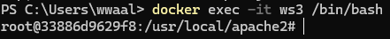

# Docker

- docker hub == app store
- image == program
- container == process
- docker hub 에서 원하는 프로그램을(image) 다운로드 하여 사용할 수 있다.

  - docker pull {원하는 프로그램}

    

  - docker images => 설치된 프로그램을 확인하는 명령어

    

- docker run [OPTIONS] IMAGE [COMMAND] => 컨테이너를 만들기 위한 명령어
  - docker run httpd
  - docker run --name(이름정하는거) ws2 httpd
- docker ps => 도커 컨테이너 정보

  

  - 현재 실행되고 있는 정보들

- docker stop [NAME] => 실행을 중지시킬 컨테이너 이름

  

- docker ps -a => 모든 도커 컨테이너들의 목록을 보여줌

  

- docker start [NAME] => 중지시킨 컨테이너를 다시 실행시킴

  

- docker logs [NAME] => 로그를 확인할 컨테이너 이름

  

  - docker logs -f [NAME] => 로그를 실시간으로 확인할 수 있음

- docker rm [NAME] => 삭제할 컨테이너 이름이지만 실행중인 컨테이너는 삭제할 수 없다.

  

  - 도커가 실행중이라 삭제가 되지않는 모습

  

  - 실행중인 도커를 중지한 후 도커를 삭제하는 방법

  - docker rm --force [NAME] => Stop을 하지않고도 컨테이너 삭제가 가능하다.

- docker rmi [OPTION] IMAGE => 원하는 이미지 삭제

  

## 간단한 네트워크 동작

- 웹 브라우저에서 Port(65535개 존재)로 요청이 들어오면 그 포트에 해당하는 Container 와 연결된다.
- 포트를 통해서 요청을 받으면 그 요청 받은 Container는 원하는 작업의 결과를 다시 Web Server 를 통해서 전달해준다.

- 이러한 컨테이너가 설치된 운영체제를 Host 라고 얘기하며 내부에는 여러개의 Container가 존재한다.
- 각 각 독립적인 실행환경을 가지고있다.
- Web Browser로 Web Server로 접속을 요청할때 Host에 접속이 시도된 Port 와 연결하고자 하는 Container를 연결해주면 된다.
  - ex. host(80) 번과 Container(30) 의 경우 => docker run 80:30 httpd
  - ex. host(80) 번과 Container(80) 의 경우 => docker run 80:80 httpd
  - ex. host(8000) 번과 Container(80) 의 경우 => docker run 8000:80 httpd
- 이러한 방식을 port forwarding 이라고 얘기한다.

  - docker run --name [NAME] -p {들어오는 Port: 연결되는 Port} [IMAGE]

  

  - localhost:8081 포트에 접속을 시도하면 아래와 같은 결과가 나온다.

  

## 컨테이너 연결

- docker exec [ContainerName] [COMMAND]
  - docker exec -it ws3 /bin/bash => 지속적인 연동을 통해서 docker container 명령어 시행
  - i : interactive
  - t : tty
  - CS 지식 필요함 찾아서 정리 예정

### Host 내부에서 Container와 File System 연결

- docker run -p 8081:80 -v [연결할 File System] : [연결 될 Container File] [IMAGE]
- 이런 연결을 통해서 docker 내부 수정하기 어려운 파일을 연결할 File System 수정을 통해서 버전 관리를 진행한다.
