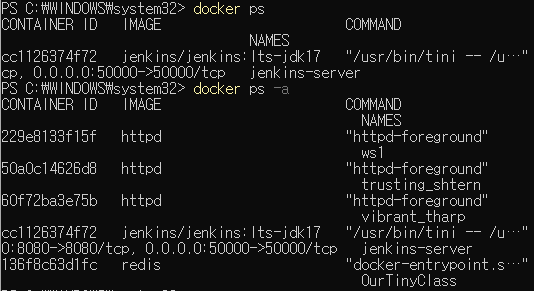

# Docker

- docker hub == app store
- image == program
- container == process
- docker hub 에서 원하는 프로그램을(image) 다운로드 하여 사용할 수 있다.

  - docker pull {원하는 프로그램}

    

  - docker images => 설치된 프로그램을 확인하는 명령어

    

- docker run [OPTIONS] IMAGE [COMMAND] => 컨테이너를 만들기 위한 명령어
  - docker run httpd
  - docker run --name(이름정하는거) ws2 httpd
- docker ps => 도커 컨테이너 정보

  

  - 현재 실행되고 있는 정보들

- docker stop [NAME] => 실행을 중지시킬 컨테이너 이름

  

- docker ps -a => 모든 도커 컨테이너들의 목록을 보여줌

  

- docker start [NAME] => 중지시킨 컨테이너를 다시 실행시킴

  

- docker logs [NAME] => 로그를 확인할 컨테이너 이름

  

  - docker logs -f [NAME] => 로그를 실시간으로 확인할 수 있음

- docker rm [NAME] => 삭제할 컨테이너 이름이지만 실행중인 컨테이너는 삭제할 수 없다.

  

  - 도커가 실행중이라 삭제가 되지않는 모습

  

  - 실행중인 도커를 중지한 후 도커를 삭제하는 방법

  - docker rm --force [NAME] => Stop을 하지않고도 컨테이너 삭제가 가능하다.

- docker rmi [OPTION] IMAGE => 원하는 이미지 삭제

  
