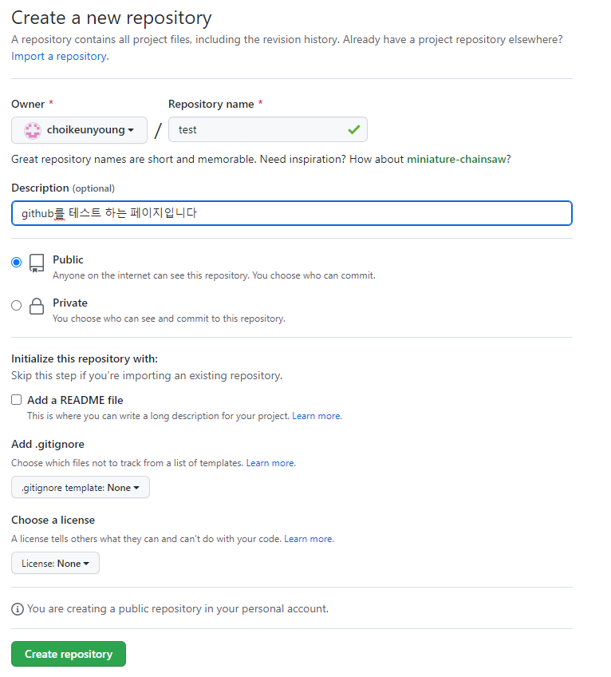
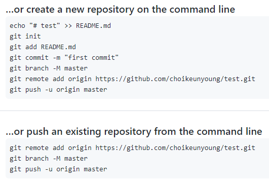
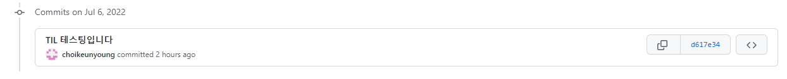
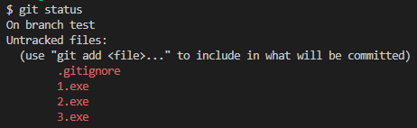
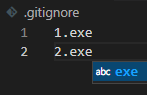
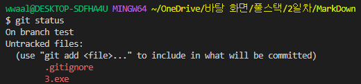

# **GitHub 사용법**

- 원격 저장소이며 GitHub, GitLab, Bitbucket 등이 있다.
- git pull을 통하여 협업하는 과정에서 사용 가능하다. ( 원격 저장소 → 로컬 )
- git push를 통하여 작업한 내용을 넣을 수 있다. ( 로컬 → 원격 저장소 )

**1. Create repository 버튼 클릭**

**2. repository 이름 설정 후 공개 여부 등 사소한 설정들 설정**

**3. 생성 하면 https://github.com/choikeunyoung/test.git 와 같은 링크가 생성되며 github.com/사용자이름/git 페이지 이름으로 생성된다. (* 여기서 사용자 이름을 생성 후 변경해 줄 경우 로컬에 지정된 사용자 이름도 전부 바꿔줘야 작업이 가능하다 )**

**4. 생성하면 Terminal 에 입력하는 방법을 자세히 알려준다.**

**5. 원격 저장소의 데이터를 로컬로 저장하는 방법**
 - $ git remote add origin (URL) << URL 자리에는 git 링크를 넣어준다.
 - 깃아 원격저장소 추가해줘 오리진으로 URL을
 - 한번만 로컬 저장소에 저장 하면 된다.
 - 잘못 설정했을 경우 .git이 들어있는 폴더에서 rm -rf .git 을 입력하여 삭제하고 다시 설정해줄 수 있다.

- git push <원격저장소이름> <브랜치이름> 으로 사용되며

- push가 Authentication failed 되는 경우는 인증 정보 확인이 필요함 (창이 뜨는걸로 기억함)

# **‼‼ PUSH 하는 과정에서 발생하는 오류**

👉 
    To https://github.com/choikeunyoung/TIL.git
    ! [rejected]        master -> master (fetch first)
    error: failed to push some refs to 'https://github.com/choikeunyoung/TIL.git'
    hint: Updates were rejected because the remote contains work that you do
    hint: not have locally. This is usually caused by another repository pushing
    hint: to the same ref. You may want to first integrate the remote changes
    hint: (e.g., 'git pull ...') before pushing again.
    hint: See the 'Note about fast-forwards' in 'git push --help' for details.

**로컬에 저장된 내용과 원격장치에 저장된 내용이 다르기 때문에 생기는 오류**
 - 내 컴퓨터에는 A라는 파일이 존재하지만 인터넷에는 B라는 파일이 올라갔기 때문
 - 인터넷과 내 컴퓨터 둘다 A 파일이지만 인터넷에서 A라는 파일을 수정했을 경우 컴퓨터와 인터넷 상에서의 log 값이 다르기 때문에 위와 같은 오류가 난다.
 
 

 위 log 값과 아래 log 값을 비교하며 같으면 그대로 작업해도 되지만 다를 경우 pull 을이용하여 작업을 한다. (*git log --oneline 사용*)

 

 - git pull origin master ( git pull 원격저장소 브랜치) >> 인터넷상으로 수정한 파일을 내 로컬 환경으로 pull을 이용하여 당겨온다.
 - 기존에는 위 명령어를 입력 할 경우 vim 이라는 창이 뜬다. 이를 고치는 방법 >> vs code를 이용하기 때문에 git config --global core.editor "code --wait” 를 입력해준다.

# **‼ .gitignore 사용

 - .gitignore 을 이용하면 commit이 필요없는 파일을 따로 지정 할 수 있다.
 
 

 

 

 - 위와 같이 적힌 이름들을 무시할 수 있다.

# **😮 참고하기 좋은 사이트 (계속 추가할 예정)😮

 [gitignore](https://www.toptal.com/developers/gitignore/)
  - 위 사이트에 들어가 프로젝트를 진행할 때 필요한 언어나 패키지들을 입력하면 쉽게 만들 수 있다.
