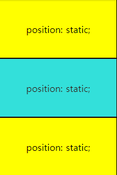
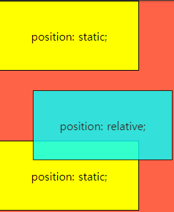
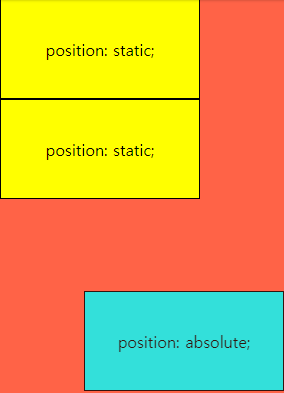
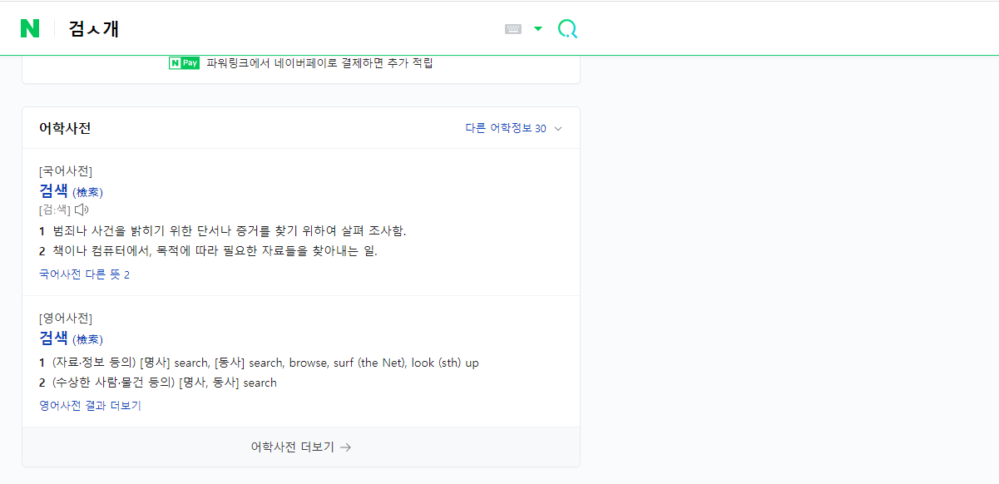
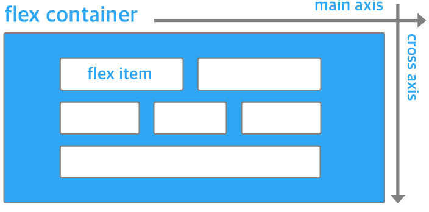
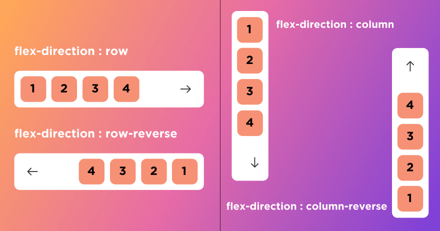
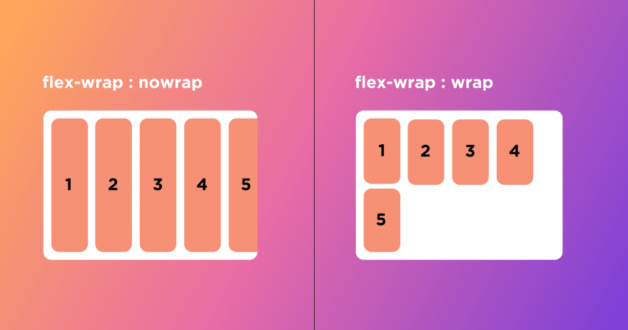
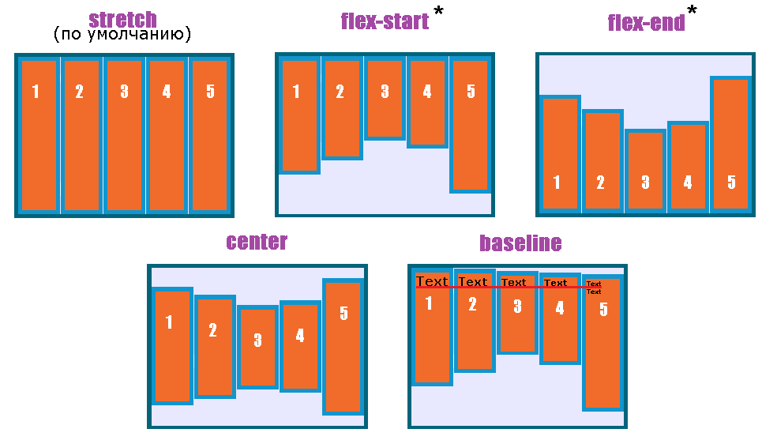
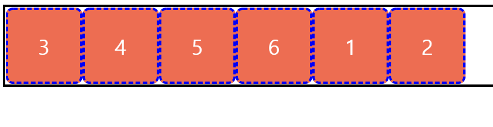

**inline-block 간 4px 마진 존재**

# CSS Position
  - 문서 상에서 요소의 위치를 지정
  - static : 모든 태그의 기본 값(기준 위치)
    - 일반적인 요소의 배치 순서에 따름(좌측 상단)
    - 부모 요소 내에서 배치될 때는 부모 요소의 위치를 기준으로 배치 됨
  - 아래 좌표 프로퍼티(top, bottom, left, right)를 사용하여 이동 가능
   1. relative : 상대 위치
     - 자기 자신의 static 위치를 기준으로 이동 (normal flow 유지)
     - 레이아웃에서 요소가 차지하는 공간은 static일 때와 같음 (normal position 대비 offset)
```CSS
    .relative {
        position : relative;
        top: 100px;
        left: 100px;
    }
/* 기존의 위치에서 위로 100px 왼쪽 100px 부분으로 이동 */
```

   
   

   2. absolute : 절대 위치
     - 요소를 일반적인 문서 흐름에서 제거 후 레이아웃 공간을 차지하지 않음 (normal flow 에서 벗어남)
     - static이 아닌 가장 가까이 있는 부모/조상 요소를 기준으로 이동 (없는 경우 브라우저 화면 기준으로 이동)

   

   3. fixed
     - 요소를 일반적인 문서 흐름에서 제거 후 레이아웃에 공간을 차지하지 않음 (normal flow 에서 벗어남)
     - 부모 요소와 관계없이 viewport를 기준으로 이동 (화면 기준)

   

   4. sticky : 스크롤에 따라 static => fixed로 변경
     - 속성을 적용한 박스는 평소에 문서 안에서 position: static 상태와 같이 일반적인 흐름에 따르지만 스크롤 위치가 임계점에 이르면 position: fixed와 같이 박스 화면이 고정되는 속성 (인터넷 검색기능)

   

## CSS 원칙
  - CSS 원칙 I, II : Normal flow
    - 모든 요소는 좌측 상단에 배치
    - display에 따라 크기와 배치가 달라짐
  - CSS 원칙 III 
    - position으로 위치를 기준으로 변경
      - relative 본인의 위치

## CSS Layout
  - CSS Layout techniques
    - Display
    - Position
    - Float (CSS1, 1996)
    - Flexbox (2012)
    - Grid (2017)
    - 기타
      - Responsive Web Design(2010), Media Queries (2012)
  - Float
    - 박스를 왼쪽 혹은 오른쪽으로 이동시켜 텍스트를 포함 인라인요소들이 주변을 wrapping 하도록 함
    - normal flow를 벗어남

## Flexbox
  - 행과 열 형태로 아이템들을 배치하는 1차원 레이아웃 모델
  - 축
    - main axix (메인 축)
    - cross axix (교차 축)

   

  - 구성 요소
    - Flex Container (부모 요소)
    - Flex Item (자식 요소)
  - flex-direction : row => row로 배치할지 column 으로 배치할지 지정 가능

  - Flex Container (부모 요소)
    - flexbox 레이아웃을 형성하는 가장 기본적인 모델
    - Flex Item들이 놓여있는 영역
    - display 속성을 flex 혹은 inline-flex로 지정
  
  - Flex Item (자식 요소)
    - 컨테이너에 속해 있는 컨텐츠(박스)
  
  - Flex 속성
    - 배치 설정
      - flex-direction
        - Main axix 기준 방향 설정
        - 역방향의 경우 HTML 태그 선언 순서와 시각적으로 다르니 유의 (웹 접근성에 영향)
   
     
   
      - flex-wrap
        - 아이템이 컨테이너를 벗어나는 경우 해당 영역 내에 배치
        - 기본적으로 컨테이너 영역을 벗어나지 않도록 함
      
   

      - flex-flow => flex-direction 과 flex-wrap을 합친 것

    - 공간 나누기
      - justify-content (main axis)
        - Main axis를 기준으로 공간 배분
        1. flex-start
        2. flex-end
        3. center
        4. space-between
        5. space-around
        6. space-evenly
   
   
      
      - align-content (cross axis)
        - Main axis를 기준으로 공간 배분
        1. flex-start
        2. flex-end
        3. center
        4. space-between
        5. space-around
        6. space-evenly
   
   

    - 정렬
      - align-items
        - 모든 아이템을 Cross axis를 기준으로 정렬
        1. stretch
        2. flex-start
        3. flex-end
        4. center
        5. baseline

   

      - align-self
        - 개별 아이템을 Cross axis 기준으로 정렬
        - 컨테이너에 적용하는 것이 아닌 개별 아이템에 적용
        1. stretch
        2. flex-start
        3. flex-end
        4. center
        5. baseline
    
    - Flex에 적용하는 속성
      - 기타 속성
        - flex-grow : 남은 영역을 아이템에 분배
        - order : 배치 순서
        
   