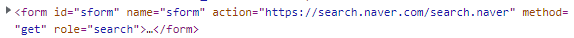
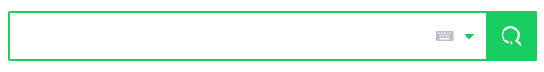
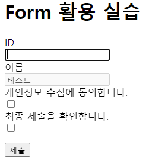
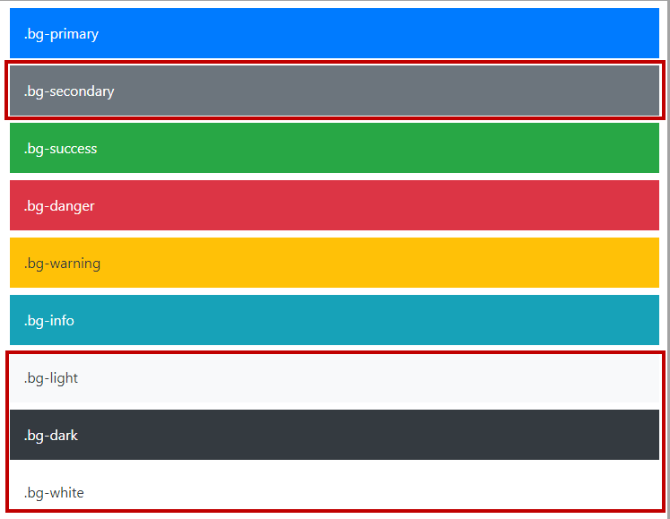
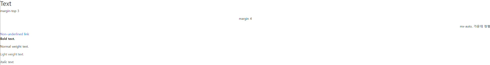

# HTML 문서 구조화
  - table의 각 영역을 명시하기 위해 <thead> <tbody> <tfoot> 요소를 활용
  
  

  - 모두가 필수 요소인 것은 아니다.
  - tr : table row => 테이블의 행
  - td : table data => 테이블의 내용
```html
    <tr>
        <td>내용</td>
        <td>내용</td>
    </tr>
```
  - <thead> => tr > th
  - <tbody> => tr > td
  - <tfoot> => tr > td
  - <caption>

## form
  - <form>은 정보(데이터)를 서버에 제출하기 위해 사용되는 태그
  - <form> 기본 속성
    - action : form을 처리할 서버의 URL(데이터를 보낼 곳)
    - method : form을 제출할 때 사용할 HTTP 메서드 (GET 혹은 POST)
    - enctype : method가 post인 경우 데이터의 유형

    
    
    
  - input
    - 다양한 타입을 가지는 입력 데이터 유형과 위젯이 제공됨
    - 대표적인 속성
      - name : form control에 적용되는 이름 (이름/값 페어로 전송됨)
      - value : form control에 적용되는 값 (이름/값 페어로 전송됨)
      - required : form data가 서버로 제출되기 전 반드시 채워져 있어야 하는 필드
      - readonly : <input>요소의 입력 필드가 읽기 전용임을 명시
      - autofocus : 페이지가 로드될 때 자동으로 focus 가 <input>요소로 이동
      - autocomplete : <input>요소에서 자동 완성 기능을 사용할지 여부를 명시
      - disabled : <input>요소가 비활성화 됨
  - input label
    - label을 클릭하여 input 자체의 초점을 맞추거나 활성화 시킬 수 있음
      - 사용자는 선택할 수 있는 영역이 늘어나 웹 / 모바일 환경에서 편하게 사용할 수 있음
      - label 과 input 입력의 관계가 시각적 뿐만 아니라 화면리더기에도 label을 읽어 쉽게 내용을 확인 할 수 있도록 해줌
      - <input>에 id 속성을, <label>에는 for 속성을 활용하여 상호 연관을 시킴
```html
    <label for="agreement">개인정보 수집에 동의합니다.</label>
    <input type='checkbox' name='agreement' id='aggrement'>
```

   

   - 일반적으로 입력을 받기 위하여 제공되며 타입별로 HTML 기본 검증 혹은 추가 속성을 활용할 수 있음
      - text : 일반 텍스트 입력
      - password : 입력 시 값이 보이지 않고 문자를 특수기호(*)로 표현
      - email : 이메일 형식이 아닌 경우 form 제출 불가
      - number : min, max, step 속성을 활용하여 숫자 범위 설정 가능
      - file : accept 속성을 활용하여 파일 타입 지정 가능
    
    - input 유형 - 항목 중 선택
      - 일반적으로 label 태그와 함께 사용하여 선택 항목을 작성함
      - 동일 항목에 대하여 name을 지정하고 선택된 항목에 대한 value를 지정해야 함
        - checkbox : 다중 선택
        - radio : 단일 선택 => name 을 기준으로 나뉨

    **사용자가 입력 or 선택 , 개발자가 입력 하면 value(값) name(이름) 으로 매핑되어 서버에 저장**

    - input 유형 - 기타
      - 다양한 종류의 input을 위한 picker를 제공
        - color : color picker
        - date : date picker
      - hidden input을 활용하여 사용자 입력을 받지 않고 서버에 전송되어야 하는 값을 설정
        - hidden : 사용자에게 보이지 않는 input

# Bootstrap
  - CDN (Content Delivery(Distribution) Network)
    - 컨텐츠(CSS, JS, Images, Text 등)을 효율적으로 전달하기 위해 여러 노드에 가진 네트워크에 데이터를 제공하는 시스템

  - spacing (Margin and padding)
    > {property}{sides}-{size}
    > mt-3 => margin-top : 3
    1. property
      - m => for classes that set margin
      - p => for classes that set padding
    2. sides
      - t => margin-top or padding-top
      - b => margin-bottom or padding-bottom
      - s => (start) margin-left or padding-left in LTR / margin-right or padding-right in RTL
      - e => (end) margin-right or padding-right LTR / margin-left or padding-left in RTL
      - x => *-left and *-right
      - y => *-top and *-bottom
      - blank => margin or padding 4방향
    3. size
      - 0 => margin or padding setting 0
      - 1 => margin or padding setting 1rem 기준 0.25 => 4px
      - 2 => margin or padding setting 1rem 기준 0.5 => 8px
      - 3 => margin or padding setting 1rem => 16px
      - 4 => margin or padding setting 1rem 기준 1.5 => 24px
      - 5 => margin or padding setting 1rem 기준 3 => 48px
      - auto => margin auto
    4. Color
      
    

    5. Text

    

```html
<!doctype html>
<html lang="en">
  <head>
    <meta charset="utf-8">
    <meta name="viewport" content="width=device-width, initial-scale=1">
    <title>Bootstrap demo</title>
    <link href="https://cdn.jsdelivr.net/npm/bootstrap@5.2.0/dist/css/bootstrap.min.css" rel="stylesheet" integrity="sha384-gH2yIJqKdNHPEq0n4Mqa/HGKIhSkIHeL5AyhkYV8i59U5AR6csBvApHHNl/vI1Bx" crossorigin="anonymous">
    <script src="https://cdn.jsdelivr.net/npm/@popperjs/core@2.11.5/dist/umd/popper.min.js" integrity="sha384-Xe+8cL9oJa6tN/veChSP7q+mnSPaj5Bcu9mPX5F5xIGE0DVittaqT5lorf0EI7Vk" crossorigin="anonymous"></script>
	<script src="https://cdn.jsdelivr.net/npm/bootstrap@5.2.0/dist/js/bootstrap.min.js" integrity="sha384-ODmDIVzN+pFdexxHEHFBQH3/9/vQ9uori45z4JjnFsRydbmQbmL5t1tQ0culUzyK" crossorigin="anonymous"></script>
  </head>
<body>
<h2>Text</h2>
<p class="text-start">margin-top 3</p>
<p class="text-center">margin 4</p>
<p class="text-end">mx-auto, 가운데 정렬</p>
<a href="#" class="text-decoration-none">Non-underlined link</a>
<p class="fw-bold">Bold text.</p>
<p class="fw-normal">Normal weight text.</p>
<p class="fw-light">Light weight text.</p>
<p class="fst-italic">Italic text.</p>
</body>
</html>
```