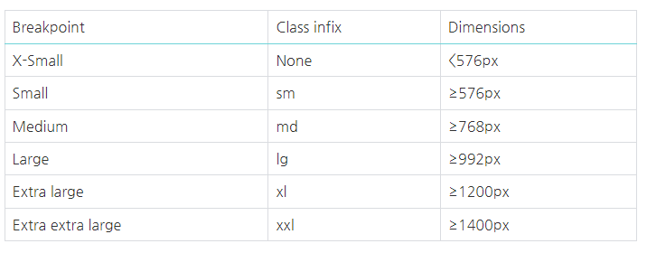

aria-describedby => 웹 접근성 관련된 기능

# Bootstrap Grid System
  - Grid system ( web design )
    - 요소들의 디자인과 배치에 도움을 주는 시스템
    - 기본 요소
      - Column : 실제 컨텐츠를 포함하는 부분
      - Gutter : Column 과 Column 사이의 공간 (사이 간격)
      - Container : Column들을 담고 있는 공간
    - 12 Column Grid 와 16 Column Grid 가 존재하는 이유 => 약수가 많아야 배치를 다양하게 해볼 수 있기 때문에
    - Bootstrap Grid system 은 flexbox로 제작됨
    - container, rows, column으로 컨텐츠를 배치하고 정렬
    - 반드시 기억해야 할 2가지!
      - 12개의 column
      - 6개의 grid breakpoints 

      

```html
    <div class='container'>
        <div class='row'>
            <div class='col'></div>
            <div class='col'></div>
            <div class='col'></div>
        </div>
    </div>
```