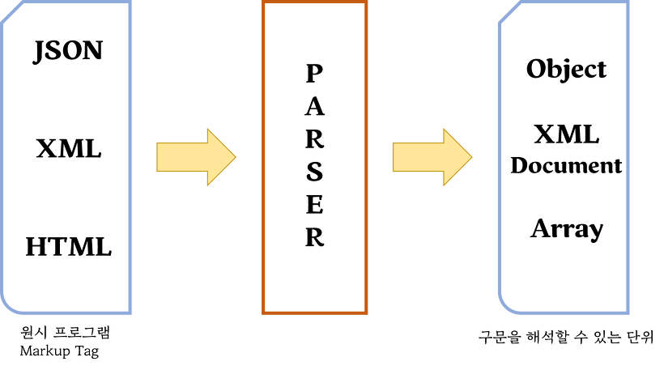
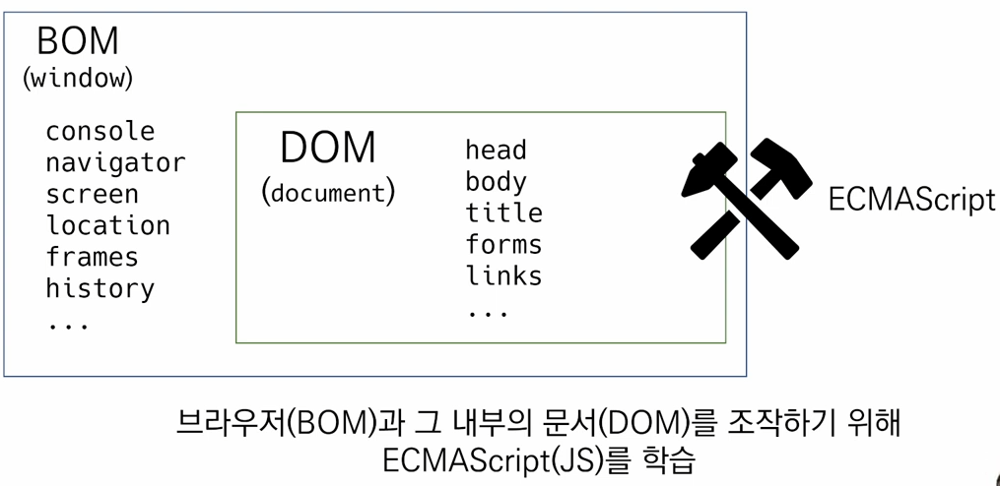
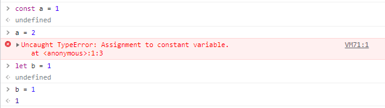
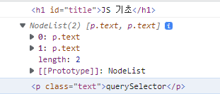

# JavaScript의 필요성
  - 브라우저 화면을 '동적'으로 만들기 위함
  - 브라우저를 조작할 수 있는 유일한 언어
  - 서로 다른 자바스크립트가 만들어지며 크로스 브라우징 이슈가 발생하여 웹 표준의 필요성 제기
  - 크로스 브라우징
    - W3C에서 채택된 표준 웹 기술을 채용하여 각각의 브라우저마다 다르게 구현되는 기술을 비슷하게 만들되, 어느 한쪽에 치우치지 않도록 웹 페이지를 제작하는 방법론 (동등성)
    - 브라우저마다 렌더링에 사용하는 엔진이 다르기 때문

## DOM(Document Object Model)
  - DOM 조작
    - 문서(HTML) 조작
  - DOM 이란?
    - HTML, XML과 같은 문서를 다루기 위한 문서 프로그래밍 인터페이스
    - 문서를 구조화하고 구조화된 구성 요소를 하나의 객체로 취급하여 다루는 논리적 트리 모델
    - 문서가 구조화 되있기 때문에 각 요소는 객체로 취급
    - 단순한 속성 접근, 메서드 활용뿐만 아니라 프로그래밍 언어적 특성을 활용한 조작 가능
    - 주요 객체
      - window : DOM을 표현하는 창. 가장 최상위 객체
      - document : 페이지 컨텐츠의 Entry Point 역할을 하며, <body> 등과 같은 수많은 다른 요소들을 포함
      - navigator, location, history, screen

    

    - 파싱(Parsing)
      - 구문 분석, 해석
      - 브라우저가 문자열을 해석하여 DOM Tree 로 만드는 과정
    
    

  - BOM 조작
    - navigator, screen, location, frames, history, XHR
  - BOM 이란? 
    - Browser Object Model
    - 자바스크립트가 브라우저와 소통하기 위한 모델
    - 브라우저 창, 프레임을 추상화 하여 프로그래밍적 제어를 할 수 있도록 제공하는 수단
      - 버튼, URL 입력창, 타이틀 바 등 브라우저 윈도우 및 웹 페이지 일부분을 제어 가능
    - window 객체는 모든 브라우저로부터 지원받으며 브라우저의 창(window)를 지칭

  - JavaScript Core (ECMAScript) 프로그래밍 문법
    - Data Structure(Object, Array), Conditional Expression, Iteration

  

  - 전체 구조

## DOM 조작
  - const : 변경이 불가능한 선언
  - let : 변경이 가능한 선언

  

  - querySelector : 한개의 값만 반환
  - querySelectorAll : 모든 값 반환

```html
<body>
    <h1 id="title">JS 기초</h1>
    <h2>DOM 조작</h2>
    <p class="text">querySelector</p>
    <p class="text">querySelectorAll</p>

    <script>
        console.log(document.querySelector('#title'))
        console.log(document.querySelectorAll('.text'))
        console.log(document.querySelector('.text'))
    </script>
</body>
```

  

  - document.createElement('a')
  > <a></a> 태그 생성
  - innerTEXT : 텍스트 값 삽입
  > <a>안녕하세요</a>
  - body.appendChild()
  > 자식요소로 삽입
  - innerHTML : 태그요소 삽입
  ><h1>
  > <h2>안뇽하세요</h2>
  ></h1>
  - title.remove()
  > 값 지우는 것
  - setAttribute : 속성 설정
  > a.setAttribute('href', 'https://syllaverse.com')
  - getAttribute('href')
  > a의 href 속성 가져오기
  - classlist
  > class 리스트형태로 반환해줌


## Vanilla JavaScript
  - 크로스 브라우징, 간편한 활용 등을 위해 많은 라이브러리 등장(jQuery 등)
  - ES6 이후, 다양한 도구의 등장으로 순수 자바스크립트 활용의 증대

```javascript
    $('li').css('color','red')
    간단하게 나타낼 수 있는 식을
    document.querySelectorAll('li').forEach(item => item.style.color='red')
    복잡하게 나타낸다.
```

## node.js
  - JavaScript에 Runtime 환경 제공 => 프로그램을 실행시킬 수 있는 환경
  - JavaScript를 사용하기 위해 만들어진 것
  - C/C++ , Java와 같은 프로그래밍 언어
  - Node.js 를 설치하면 터미널프로그램에서 브라우저 없이 JavaScript를 사용할 수 있다.
  - 이를 이용하여 서버를 만들 수 있음