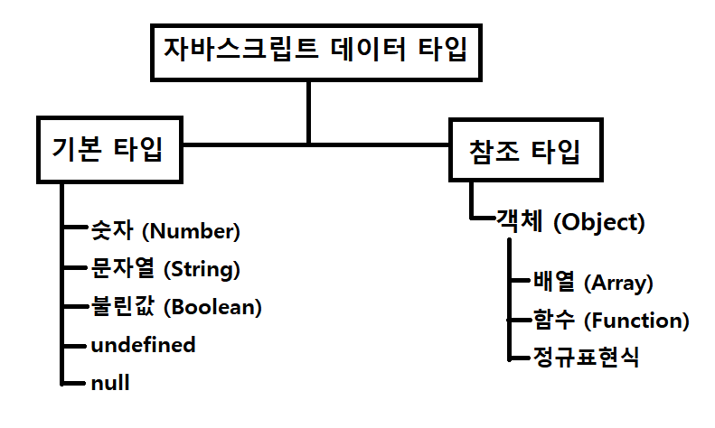

# 변수와 식별자

선언, 할당, 초기화
  - 선언 (Declaration)
    - 변수를 생성하는 행위 또는 시점
```JavaScript
    let foo
    console.log(foo)
```
  - 할당 (Assignment)
    - 선언된 변수에 값을 저장하는 행위 또는 시점
```JavaScript
    foo = 11
    console.log(foo)
```
  - 초기화 (Initialization)
    - 선언된 변수에 처음으로 값을 저장하는 행위 또는 시점
```JavaScript
    let bar = 0
    console.log(bar)
```

  - let, const : let은 값의 재할당이 가능하지만 const는 불가능함 둘다 재선언은 불가능함
  - 블록 스코프*
  - var
    - var로 선언한 변수는 재선언 및 재할당 모두 가능
    - ES6 이전에 변수를 선언할 때 사용되는 키워드
    - 호이스팅*되는 특성으로 인해 예기치 못한 문제 발생 가능
    - 함수 스코프*
      - 함수의 중괄호 내부를 가리킴
      - 함수 스코프를 가지는 변수는 함수 바깥에서 접근 불가능

## 데이터 타입
  - 자바스크립트의 모든 값은 특정한 데이터 타입을 가짐
  - 크게 원시 타입(Primitive Type) 과 참조 타입(Reference Type)로 분류됨

  

  - 원시 타입
    - 객체가 아닌 기본 타입
    - 변수에 해당 데이터

  - 참조 타입
    - 객체 타입의 자료형
    - 변수에 해당 객체의 참조값이 담김
    - 다른 변수에 복사할 때 참조 값이 복사됨

  - 숫자 타입
    - 정수,실수 구분 없는 하나의 숫자 타입
    - 부동소수점 형식을 따름
    - NaN (Not-A-Number)
      - 계산 불가능한 경우 반환되는 값
        - ex) 'Angel' / 1004 => NaN

  - 문자열 타입
    - 텍스트 데이터를 나타내는 타입
    - 16비트 유니코드 문자의 집합
    - 작은따옴표 또는 큰따옴표 모두 가능
    - 템플릿 리터럴

  - undefined
    - 변수의 값이 없음을 나타내는 타입

  - null
    - 변수의 값이 없음을 의도적으로 표현할 때 사용하는 데이터 타입
    - null 타입과 typeof 연산자
      - typeof 연산자 : 자료형 평가를 위한 연산자

## 연산자
  - 오른쪽에 있는 피연산자의 평가 결과를 왼쪽 피연산자에 할당하는 연산자
  - 다양한 연산에 대한 단축 연산자 지원

```JavaScript
    let x = 0
    x += 10
    x -= 3
    x *= 10
```

  - 비교 연산자
    - 피연산

  - 동등 비교 연산자 (==)

  - 일치 비교 연산자 (===)
    - 두 연산자가 같은 값으로 평가되는지 비교 후 boolean 값을 반환

  - 논리 연산자
    - 세 가지 논리 연산자로 구성
      - and 연산은 '&&' 연산자를 이용
      - or 연산은 '||' 연산자를 이용
      - not 연산은 '!' 연산자를 이용
    - 단축 평가 지원
      - false && true => false
      - true || 
    - 삼항 연산자
      - 세 개의 피연산자를 사용하여 조건에 따라 값을 반환하는 연산자
      - 가장 왼쪽의 조건식이 참이면 콜론(:) 앞의 값을 사용하고 그렇지 않으면 콜론(:) 뒤의 값을 사용
      - 삼항 연산자의 결과 값이기 때문에 변수에 할당 가능
```JavaScript
    console.log(true ? 1 : 2) // 1
    console.log(false ? 1 : 2) // 2

    const result = 
```

  - 조건문

  - 반복문
   - While
     - 조건문이 참인 동안 반복 시행
   - for
     - 세미콜론(;)으로 구분되는 세 부분 으로 구성
     - initialization
       - 최초 반복문 진입 시 1회만 실행되는 부분
     - condition
       - 매 반복 시행 전 평가되는 부분
     - expression
       - 매 반복 시행 이후 평가되는 부분
     - 블록 스코프 생성
```JavaScript
    for (initialization; condition; expression) {

    }
```

   - for...in
     - 
   - for...of
     - 반복  가능한(iterable)

   - for...in vs for...of
    > for...of 를 사용할 경우 객체 반환시 오류가 발생하지만 for...in을 사용하여 객체를 다룰경우 오류가 나지 않는다. 또한 for...in 은 인덱스 값을 반환해줌

## 함수
  - 함수의 정의
    - 함수의 이름과 함께 정의하는 방식
    - 3가지 부분으로 구성
      - 함수의 이름 (name)
      - 매개변수 (args)
      - 함수 body (중괄호 내부)

```JavaScript
    function 
```

  - 참조 타입 중 하나로써 function 타입에 속함
  - JavaScript에서 함수를 정의하는 방법은 주로 2가지로 구분
    - 함수 선언식
    - 함수 표현식
      - 함수를 표현식 내에서 정의하는 방식
        - 어떤 하나의 값으로 결정되는 코드의 단위
      - 함수의 이름을 생략하고 익명 함수로 정의 가능
        - 익명 함수 : 이름이 없는 함수
        - 익명 함수는 함수 표현식에서만 가능
      - 3가지 부분으로 구성
        - 함수의 이름 (생략 가능)
        - 매개변수 (args)
        - 몸통 (중괄호 내부)

```JavaScript
    const name = function (args) {

    }
    const add = function (num1, num2) {
        return num1 + num2
    }
    add(1,2)
```

  - 매개변수와 인자의 개수 불일치 허용
  - Rest Parameter
    - 함수가 정해지지 않은 수의 매개변수를 배열로 받음
    - 매개변수에 인자가 넘어오지 않을 경우 빈 배열로 처리

```JavaScript
    const restOpr = function ( arg1, arg2, ...restArgs) {
        return [arg1, arg2, restArgs]
    }
```

  - Spread operator
    -배열 인자를 전개하여 전달 가능

```JavaScript
    const restOpr = function (arg1, arg2, arg3) {
        return arg1 + agr2 + agr3
    }

    const numbers = [1, 2, 3]
    spreadOpr(...numbers) // 6
```
  - 호이스팅 - 함수 표현식
    - 반면 함수 표현식으로 선언한 함수는 함수 정의 전에 호출 시 에러 발생
    - 함수 표현식으로 정의된 함수는 변수로 평가되어 변수의 scope 규칙을 따름

```JavaScript

```

  - var로 함수표현식을 작성한 경우, 변수가 선언 전 undefined 로 초기화 되어 다른 에러가 발생

```JavaScript
    console.log(sub) // undefined
    sub(7, 2) // Uncaught TypeError: sub is not a function

    var sub = function (num1, num2) {
        return num1 - num2
    }
```

## Arrow Function(화살표 함수)
  - 메서드로 Arrow Function을 사용하지 않는다.
  - 함수를 

```JavaScript
    const arrow1 = function (name) {
        return 'hello, ${name}'
    }

    // 1. function 키워드 삭제
    const arrow2 = (name) => { return 'hello, ${name}' }
    // 2. 매개변수가 1개일 경우에만 ( ) 생략 가능
    const arrow3 = name => { return 'hello, ${name}' }
    // 3. 함수 바디가 return을 포함한 표현식 1개일 경우에 { }  & return 삭제 가능
    const arrow4 = name => 'hello, ${name}'
```

## 객체
  - 객체는 속성의 집합이며 중괄호 내부에 key와 value의 쌍으로 표현
  - key는 문자열 타입만 가능
  - value는 모든 타입(함수포함) 가능
  - 객체 요소 접근은 점 또는 대괄호로 가능
  - 메서드는 객체의 속성이 참조하는 함수
  - 객체.메서드명() 으로 호출 가능
  - 메서드 내부에서는 this 키워드가 객체