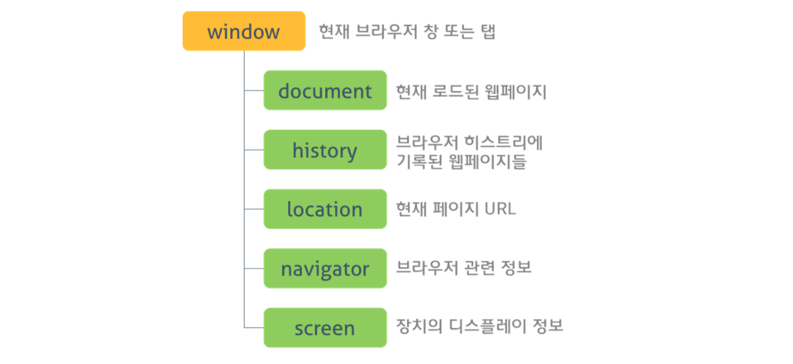
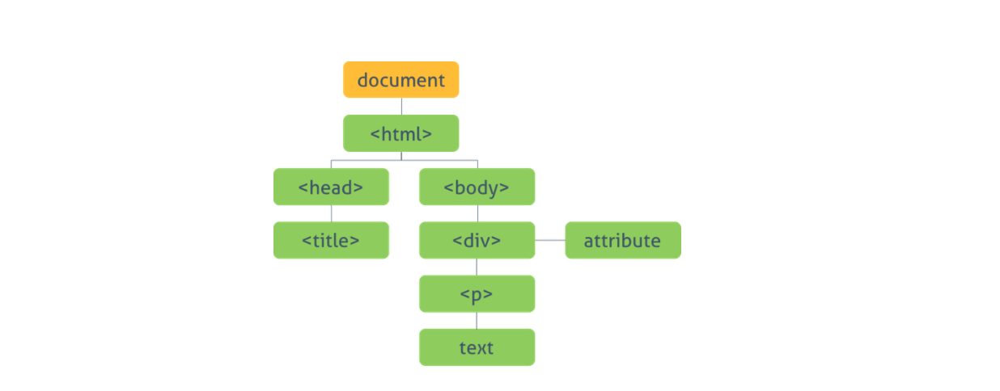

# 빌트인 객체

## 21.1 자바스크립트 객체 분류

- 표준 빌트인 객체 : ECMAScript 사양에 정의된 객체
- 호스트 객체 : ECMAScript 사양에 정의되지 않은 객체지만 자바스크립트 실행 환경에서 추가로 제공하는 객체
- 사용자 정의 객체 : 사용자가 직접 정의한 객체

## 21.2 표준 빌트인 객체

- Object, String, Number, Boolean, Symbol, Date, Array ... 등등
- 인스턴스 생성할 수 있는 객체들을 일컬어 의미

### 호스트 객체

- 위의 표준 빌트인 객체를 제외한 객체들
- window, HTMLElement, XmlHttpRequest 등 DOM 노드 객체와 같이 호스트 환경에 정의된 객체





## 21.3 원시값과 래퍼 객체

- 원시값 : 문자열, 숫자, 불리언 등
- 표준 빌트인 함수가 존재하는데 원시값으로 대체하여 사용해도 빌트인 함수가 동작함
- 자바스크립트 엔진이 일시적으로 원시값을 연관된 객체로 변환해 주기 때문
- 암묵적으로 연관된 객체를 생성하여 프로퍼티에 접근하거나 메서드를 호출 후 다시 원시값으로 북귀
- 이러한 임시 객체를 래퍼 객체라고 말함

```JS
    const str = 'hi';
    const str2 = new String()

    // String 인스턴스로 변환
    console.log(str.length); // 2
    console.log(str.toUpperCase()); // HI

    console.log(typeof str); // string
    console.log(typeof str2); // object

    str2.name = "hello"
    str.name = "hello"

    console.log(str2.name) // hello
    console.log(str.name) // undefined
```

## 21.4 전역 객체

- 코드가 실행되기 이전 단계에서 자바스크립트 엔진에 의해 어떤 객체보다 먼저 생성되는 특수한 객체
- this, window, self 및 var 키워드 선언한 전역 변수, 전역 함수 프로퍼티를 가짐
- 전역 객체는 어떤 객체에도 속하지 않은 모든 빌트인 객체의 최상위 객체 ( 프로토타입 상속 관계상 최상위 객체는 아님 )
- 의도적으로 생성이 불가능, window 혹은 global 생략 가능

```JS
    window.parseInt('F',16); // 15

    parseInt('F',16); // 15

    var foo = 1;
    console.log(window.foo); // 1

    // 선언하지 않은 변수에 값을 암묵적 전역할당, bar는 전역 변수가 아닌 전역 객체의 프로퍼티
    bar = 2;
    console.log(window.bar); // 2
```

### 21.4.1 빌트인 전역 프로퍼티

- 전역 객체의 프로퍼티

#### Infinity

- 무한대

### NaN

- Not-a-Number 숫자가 아님

### undefined

- 원시 타입 undefined 를 가짐

### 21.4.2 빌트인 전역 함수

- 전역 객체의 메서드

### eval

- 문자열을 인수로 받아 코드가 표현식인 경우 런타임에 평가하여 값을 생성
- 전달받은 인수가 표현식이 아닌 문이라면 문자열 코드를 런타임에 실행

```JS
    eval('1 + 2') // 3
    eval('var x = 5') // x => 5

```

- 자신이 호출된 위치에 해당하는 기존의 스코프를 런타임에 동적으로 수정

```JS
    const x = 1;

    function foo() {
        eval('var x = 2;');
        console.log(x); // 2
    }

    foo();
    console.log(x); // 1
```

### isFinite

- 전달받은 인수가 정상적인 유한수인지 검사하는 함수

```JS
    isFinite(0); //true
    isFinite(2e64); // true
    isFinite('10'); // true '10' => 10
    isFinite(null); // true null => 0
    isFinite(NaN); // false
    isFinite(Infinity); // false
```

### isNaN

- 전달받은 인수가 NaN인지 검사하여 불리언 타입으로 반환

```JS
    isNaN(NaN); // true
    isNaN(10); // false

    isNaN('banana') // true banana => NaN
    isNaN('10') // false '10' => 10

    isNaN(undefined) // true => NaN
```

### parseFloat

- 전달받은 문자열 인수를 부동 소수점 숫자로 해석하여 반환

```JS
    parseFloat('3.14') // 3.14
    parseFloat('10.00') // 10

    // 공백은 첫 문자열만
    parseFloat('34 45 66') // 34
    parseFloat('40 yeares') // 40

    // 첫 문자열이 숫자로 반환불가능하면 NaN
    parseFloat('He was 40') // NaN
```

### parseInt

- 전달받은 문자열 인수를 정수로 해석하여 반환

### encodeURI / decodeURI

- 완전한 URI를 문자열로 전달받아 이스케이프 처리를 위해 인코딩 및 디코딩 하는 것
- '=', '?', '&' 인코딩 및 디코딩 하지 않음

### encodeURIComponent / decodeURIComponent

- 함수 URI 구성 요소를 인수로 전달받아 인코딩 및 디코딩 한다 ( 쿼리 스트링 부분 )
- '=', '?', '&' 부분도 모두 인코딩 및 디코딩
