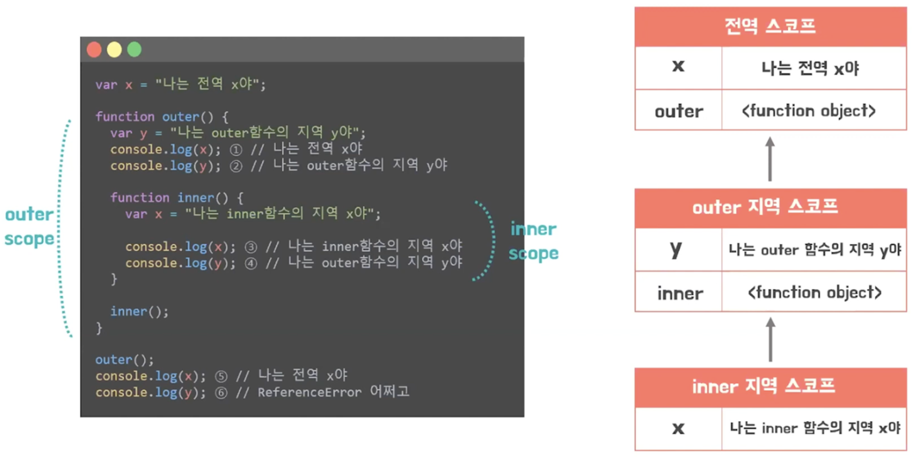
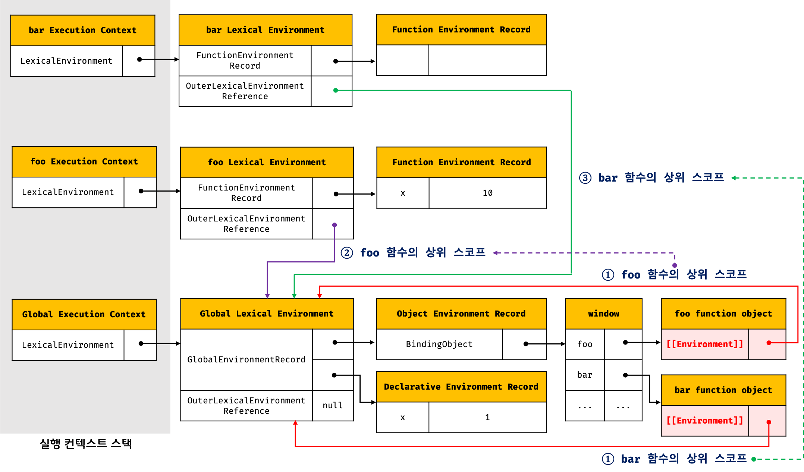

# 클로저

- 함수를 일급 객체로 취급하는 함수형 프로그래밍 언어에서 사용되는 중요한 특성
- 함수와 그 함수가 선언된 렉시컬 환경과의 조합이다.

```JS
    const x = 1;

    function outerFunc() {
        const x = 10;

        function innerFunc() {
            console.log(x) // 10
        }

        innerFunc();
    }

    outerFunc();
```

- outerFunc 내부에서 innerFunc가 정의되고 호출되었기 때문에 상위 스코프인 outerFunc 의 x에 접근이 가능함

```JS
const x = 1;

function outerFunc() {
    const x = 10;
    innerFunc();
}

function innerFunc() {
    console.log(x) // 1
}

outerFunc();
```

- outerFunc 내부에 innerFunc 가 존재하지 않기 때문에 outerFunc 결과를 반영할 수 없다.



## 24.1 렉시컬 스코프

- 어디서 호출했는지가 아닌 어디에 정의했는지에 따라 상위 스코프를 결정한다. 라는 것이 렉시컬 스코프이다

```JS
    const x = 1;

    function foo() {
        const x = 10;
        bar();
    }

    function bar() {
        console.log(x);
    }

    foo() // 1
    bar() // 1
```

- **렉시컬 환경에 저장할 참조값, 상위 스코프에 대한 참조는 정의가 평가되는 시점에 위치에 의해 결정된다!!**

## 24.2 함수 객체의 내부 슬롯

- 정의된 위치와 호출되는 위치가 다를 수 있기때문에 렉시컬 스코프가 가능하려면 함수는 호출되는 환경과는 무관하게 정의된 환경을 기억해야한다.
- 자신의 내부 슬롯에 정의된 환경, 상위 스코프 참조를 저장한다.
- 함수 객체의 내부 슬롯에 저장된 현재 실행 중인 컨텍스트의 렉시컬 환경의 참조가 바로 상위 스코프이다.

```JS
const x = 1;
function foo() {
    const x = 10;
    bar();
}

function bar() {
    console.log(x); // 1
}

foo();
bar();
```



## 24.3 클로저와 렉시컬 환경

- 함수가 선언된 환경을 함께 저장한 개념을 의미

```JS
    const x = 1;
    function outer() {
        const x = 10;
        const inner = function () {
            console.log(x);
        };
        return inner
    }

    const innerFunc = outer();
    innerFunc(); // 10
```

- innerFunc 에 outer() 라는 return 값으로 inner 이라는 함수를 할당해준 변수를 해주기 때문에 inner 이 동작하는 시점에서 상위 스코프 값을 참조할 수 있는 것이 클로저 이다.
- 위의 예시에서는 outer() 함수가 innerFunc에 할당해준 후 Life Cycle이 종료되었고, 이후 innerFunc()를 통하여 inner 라는 함수를 호출하기 때문에 외부 함수보다 중첩 함수가 오래 생존하였기 때문에 x = 10 이라는 결과를 볼 수 있다.
- **상위 함수의 변수를 inner에서 참조할 수 있다면 inner함수가 클로저 이다.**

- 상위 스코프의 어떤 식별자도 참조하지 않는 경우는 클로저라 하지 않음
- 외부로 반환되지 않는 경우도 클로저라 하지 않음 => 상위를 참조하지만 Life Cycle 이 더 짧기 때문

```JS
function foo() {
    const x = 1;
    const y = 2;

    function bar() {
        const z = 3;


        console.log(z);
    }

    return bar
}

const bar = foo();
bar()

// 외부로 반환되지 않는 경우
function foo() {
    const x = 1;

    function bar() {
        console.log(x);
    }
    bar()
}

foo()
```

- 클로저에 의해 참조되는 변수는 자유 변수라고 칭한다.

## 24.4 클로저의 활용

- 상태를 안전하게 변경하고 유지하기 위해 사용
- 상태를 안전하게 은닉하고 특정 함수에게만 상태 변경을 허용하기 위해 사용

```JS
    // num 증가 함수
    let num = 0;

    const increase = function () {
        return ++ num;
    }

    console.log(increase()) // 1
    console.log(increase()) // 2
    console.log(increase()) // 3
    // num 값이 외부에서 변경될 경우 원하는 동작이 안될 수 있음

    const increase = function () {
        let num = 0;

        return ++ num
    }

    console.log(increase()) // 1
    console.log(increase()) // 1
    console.log(increase()) // 1
    // 제대로 동작하지 않음

    // 클로저 활용

    const increase = (function () {
        let num = 0;

        return function () {
            return ++num;
        };
    }());

    console.log(increase()); // 1
    console.log(increase()); // 2
    console.log(increase()); // 3
```

- 렉시컬 환경을 기억하고 있기 때문에 increase 함수의 내부 함수는 자유 변수의 num 의 변화를 인지하고 count 값이 증가하는 결과를 나타내준다.
- 즉시 실행함수는 선언과 동시에 실행되기 때문에 num 0 으로 초기화 후 return 값으로 증가를 가져옴
- 호출될 때마다 return 값으로 기존의 num 값에 ++ 를 유지한 채 다음 값 출력함
- 즉, 상태가 의도치 않게 변경되지 않도록 안전하게 은닉하고 특정 함수에서만 상태 변화를 허용하여 안전하게 유지시킨다.

## 24.5 캡슐화와 정보 은닉

- 캡슐화 : 객체 상태를 나타내는 프로퍼티와 프로퍼티를 조작하는 동작인 메서드를 묶는 것
- 정보 은닉 : 객체의 특정 프로퍼티나 메서드를 감추는 목적
- 정보 은닉은 외부에 공개할 필요없는 객체 조작, 변경 방지 등을 통해 객체 간 상호 의존성을 낮추는 효과를 가짐
- 대부분의 객체 지향 언어에서는 public, private, protected 접근 제한자를 통해 공개 범위 한정

```JS
    function Person(name, age) {
        this.name = name; // public
        let _age = age // private

        this.sayHi = function () {
            console.log(`Hi! My name is ${this.name}. I am ${_age}.`);
        }
    }

    const me = new Person('Lee', 20);
    me.sayHi(); // Hi My name is Lee. I am 20.
    // 객체가 생성될 때마다 sayHi 메서드가 중복 생성됨

    function Person(name, age) {
        this.name = name
        let _age = age
    }

    Person.prototype.sayHi = function() {
        console.log(`Hi! My name is ${this.name}. I am ${_age}.`);console.
    }
    // _age 를 참조할 수 없음 , 모든 객체가 하나의 메서드를 공유

    const Person = (function () {
        let _age = 0

        function Person(name, age) {
            this.name = name
            _age = age
        }

        Person.prototype.sayHi = function() {
            console.log(`Hi! My name is ${this.name}. I am ${_age}.`);console.
        }

        return Person
    }());

    const me = new Person('Lee', 20);
```

## 24.6 자주 발생하는 실수

```JS
    var funcs = [];

    for (var i = 0; i < 3; i++) {
        funcs[i] = function () { return i; };
    }

    for (var j = 0; j < funcs.length; j++) {
        console.log(funcs[j]());
    }
    // 3 3 3 반환
    // var은 전역 변수 스코프이기 때문에 return i 할 경우 3인 값을 리턴해줌

    var funcs = [];

    for (var i = 0; i < 3; i++) {
        funcs[i] = (function (id) {
            return function () {
                return id
            }
        }(i));
    }

    for (var j = 0; j < funcs.length; j++) {
        console.log(funcs[j]());
    }
```

- var 사용 말고 let 을 사용하면 간단함 => const, let 반복문이 실행될 때마다 새로운 렉시컬 환경이 생성됨

```JS
    const funcs = [];

    for (let i = 0; i < 3; i++) {
        funcs[i] = function () { return i; };
    }

    for (let j = 0; j < funcs.length; j++) {
        console.log(funcs[j]());
    }
```
