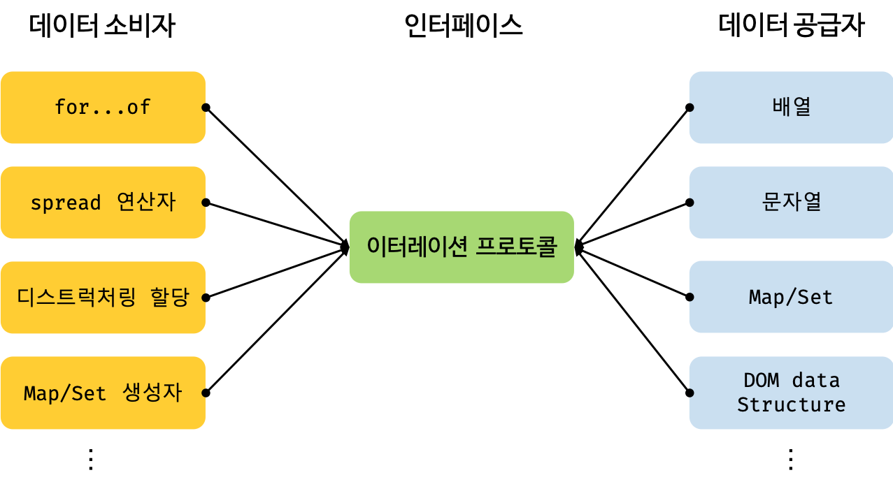

# 34. 이터러블

- 자료를 반복할 수 있는 객체를 의미

## 34.1 이터레이션 프로토콜

- 순회 가능한 데이터 컬렉션을 만들기 위한 ECMAScript 에서 약속한 규칙
- 이터러블 프로토콜과 이터레이터 프로토콜이 존재

### 이터러블 프로토콜

- 이터레이터를 리턴하는 [Symbol.iterator]() 메서드를 가진 객체
- for 문 순회, 스프레드 문법(...)

### 이터레이터 프로토콜

- 이터레이터 프로토콜을 준수한 이터레이터 반환
- {value: 값, done: true/false} 형태의 이터레이터 객체를 리턴하는 next() 메서드를 가진 객체를 의미

```JS
const arr = [1,2,3];
// arr 가 이터러블 프로토콜을 가진 객체
const iter = arr[Symbol.iterator]();

iter.next()
//>{value:1,done: false}
iter.next()
//>{value:2, done: false},
iter.next()
//{value:3, done: false}
iter.next()
//{value: undefined, done: true}
```

- 이터러블 Symbol.iterator 메서드가 반환하는 이터레이터는 next 메서드를 갖는다

### 동작

1. for..of가 시작되자마자 for..of는 Symbol.iterator를 호출
2. 반환된 객체(이터레이터)를 순회
3. 다음 값이 필요한 경우 next() 메서드 호출
4. 반환값은 {done: Boolean, value: any} 형태여야함 done = true 의 경우 반복이 종료됨을 의미

## 34.2 빌트인 이터러블

- JS 에서 이터레이션 프로토콜을 준수한 빌트인 이터러블들

| 빌트인 이터러블 | Symbol.iterator 메서드                                                          |
| --------------- | ------------------------------------------------------------------------------- |
| Array           | Array.prototype[Symbol.iterator]                                                |
| String          | String.prototype[Symbol.iterator]                                               |
| Map             | Map.prototype[Symbol.iterator]                                                  |
| Set             | Set.prototype[Symbol.iterator]                                                  |
| TypedArray      | TypedArray.prototype[Symbol.iterator]                                           |
| arguments       | arguments.prototype[Symbol.iterator]                                            |
| DOM컬렉션       | NodeList.prototype[Symbol.iterator] / HTMLCollection.prototype[Symbol.iterator] |

## 34.3 이터러블과 유사 배열 객체

- 이터러블 : Symbol.iterator 가 구현된 객체
- 유사 배열 : 인덱스와 length 프로퍼티가 있어 배열처럼 보이는 객체

```JS
// 유사 배열
let arrayLike = {
  0: "Hello",
  1: "World",
  length: 2
};

for (let i = 0; i < arrayLike.lengt; i++) {
    arrayLike[i]
}

for (const item of arrayLike) {
    item // TypeError : arrayLike is not iterable
}

Array.from(arrayLike); // ["Hello", "World"]


let arr = Array.from(arrayLike); // ["Hello", "World"] 배열이 됨으로서 이터러블 객체도 된다.
for (let item of arr) {}
```

## 34.4 이터레이션 프로토콜의 필요성

- 다양한 데이터 공급자가 하나의 순회 방식을 갖도록 규정하여 효율적 데이터 공급하는 것이 목표
- 데이터 소비자와 공급자 간 연결하는 인터페이스 역할


