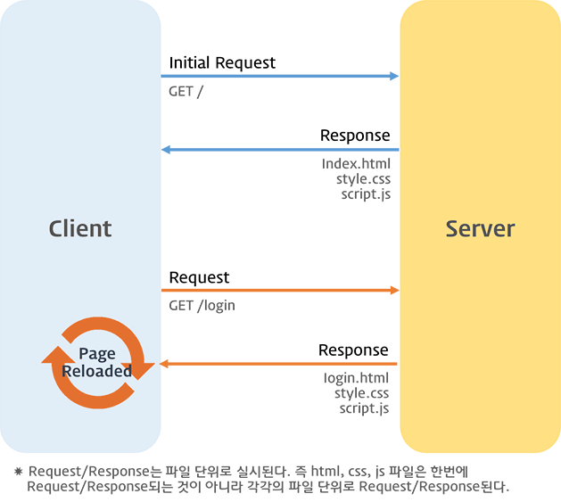
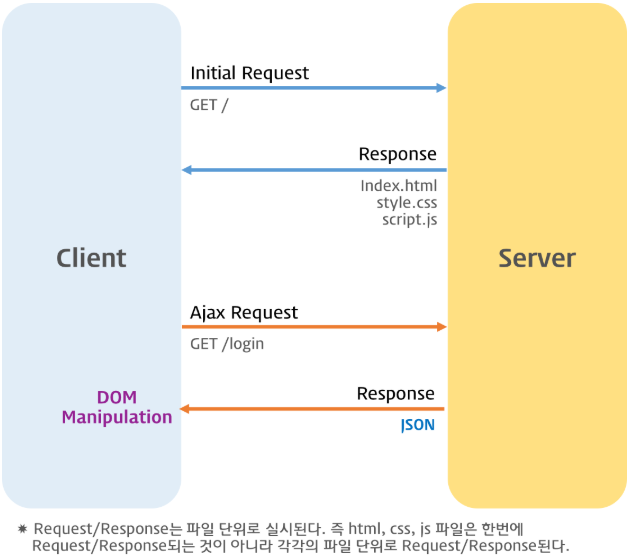

# 43. Ajax

- JS를 사용하여 브라우저가 서버에서 비동기 방식으로 데이터를 요청하고 페이지를 동적으로 갱신하는 프로그래밍 방식
- Web API 인 XMLHttpRequest 방식으로 동작





- 매 요청시마다 모든게 렌더링 되기 때문에 효율이 떨어짐
- Ajax 를 통한 부분적 렌더링

## 43.2 JSON(JavaScript Object Notation)

- 클라이언트와 서버간 HTTP 통신을 위한 텍스트 데이터 포맷
- 객체 리터럴과 유사하게 key, value 로 구성

```JS
{
    "name": "Kim",
    "age" : 20,
    "alive" : true
}
```

### 43.2.2 JSON.stringify

- 객체를 JSON 포맷 문자열로 변환시킴
- 클라이언트가 서버로 객체를 전송하기위해 문자열화 해야하며 이를 직렬화라 한다.

```JS
const obj = {
    "name": "Kim",
    "age" : 20,
    "alive" : true
}

const json = JSON.stringify(obj);
console.log(json)
// { "name": "Kim", "age" : 20, "alive" : true }

const json2 = JSON.stringify(obj, null, 2)
console.log(json2)
/*{
  "name": "Kim",
  "age": 20,
  "alive": true
}*/

//JSON.stringify(value: any, replacer?: (number | string)[] | null, space?: string | number): string
```

## 43.2.3 JSON.parse

- JSON 포맷의 문자열을 객체로 변환
- 서버로부터 클라이언트에 전송된 JSON 데이터는 문자열이다.

```JS
const obj = {
    "name": "Kim",
    "age" : 20,
    "alive" : true
}

const json = JSON.stringify(obj);
console.log(json)
// { "name": "Kim", "age" : 20, "alive" : true }

const parsed = JSON.parse(json)
console.log(parsed)
/*
{
    "name": "Kim",
    "age" : 20,
    "alive" : true
}
*/
```

## 43.3 XMLHttpRequest

- form 태그 or a 태그 등을 통해 HTTP 요청 전송 기능을 기본 제공하고 있다.
- XMLHttpRequest 객체를 사용한다 했으며 이는 무엇인지에 대해서 설명함

### 43.3.1 XMLHttpRequest 객체 생성 및 프로퍼티와 메서드

```JS
const xml = new XMLHttpRequest();
```

#### 프로토타입 프로퍼티

| 프로토타입 프로퍼티 | 설명                                                                                                                           |
| ------------------- | ------------------------------------------------------------------------------------------------------------------------------ |
| readyState          | HTTP 요청의 현재 상태를 나타내는 정수 <br> UNSENT : 0 <br> OPENED : 1 <br> HEADERS_RECEIVED : 2 <br> LOADING : 3 <br> DONE : 4 |
| status              | HTTP 요청에 대한 응답 상태를 나타내는 정수                                                                                     |
| statusText          | HTTP 요청에 대한 응답 메세지를 나타내는 문자열                                                                                 |
| responseType        | HTTP 응답 타입                                                                                                                 |
| response            | HTTP 요청에 대한 응답 몸체                                                                                                     |
| responseText        | 서버가 전송한 HTTP 요청에 대한 응답 문자열                                                                                     |

#### 이벤트 핸들러 프로퍼티

| 이벤트 핸들러 프로퍼티 | 설명                                                         |
| ---------------------- | ------------------------------------------------------------ |
| onreadystatechange     | readyState 프로퍼티 값이 변경된 경우                         |
| onloadstart            | HTTP 요청에 대한 응답을 받기 시작한 경우                     |
| onprogress             | HTTP 요청에 대한 응답을 받는 도중 주기적 발생                |
| onabort                | abort 메서드에 의해 HTTP 요청이 중단된 경우                  |
| onerror                | HTTP 요청에 에러가 발생한 경우                               |
| onload                 | HTTP 요청이 성공적으로 완료한 경우                           |
| ontimeout              | HTTP 요청이 시간초과 된 경우                                 |
| onloadend              | HTTP 요청이 완료한 경우. HTTP 요청이 성공 또는 실패하면 발생 |

#### 객체의 메서드

| 메서드           | 설명                                     |
| ---------------- | ---------------------------------------- |
| open             | HTTP 요청 초기화                         |
| send             | HTTP 요청 전송                           |
| abort            | 이미 전송된 HTTP 요청 중단               |
| setRequestHeader | 특정 HTTP 요청 헤더의 값을 설정          |
| getRequestHeader | 특정 HTTP 요청 헤더의 값을 문자열로 반환 |

### 43.3.3 HTTP 요청 전송

1. XMLHttpRequest.prototype.open 메서드로 요청을 초기화
2. 필요에 따라 setRequestHeader 메서드로 특정 HTTP 요청에 헤더 값을 설정
3. send 메서드로 HTTp 요청을 전송

**XMLHttpRequest().open(method, url[, async])**

| 매개변수 | 설명                                             |
| -------- | ------------------------------------------------ |
| method   | HTTP 요청 메서드("GET", "POST", "PUT", "DELETE") |
| url      | HTTP 요청을 전송할 URL                           |
| async    | 비동기 요청 여부 옵션으로 기본 true              |

| HTTP 요청 메서드 | 종류           | 목적                  | 페이로드 |
| ---------------- | -------------- | --------------------- | -------- |
| GET              | index/retrieve | 모든/특정 리소스 취득 | X        |
| POST             | create         | 리소스 생성           | O        |
| PUT              | replace        | 리소스의 전체 교체    | O        |
| PATCH            | modify         | 리소스의 일부 수정    | O        |
| DELETE           | delete         | 모든/특정 리소스 삭제 | X        |

- setRequestHeader 에서 Content-type 설정을 통해 서버가 응답할 데이터 타입을 설정할 수 있다.
- 설정을 하지 않을시 헤더가 \*/\* 로 모든 걸 받을 수 있게 된다

### 43.3.4 HTTP 요청 응답

- 서버가 전송한 응답을 처리하려면 HTTP 요청의 현재 상태를 나타내는 readyState 프로퍼티 값이 변경된 경우 발생하는 readystatechange 이벤트 객체를 캐치해야 함

```JS
  // XMLHttpRequest 객체 생성
  const xhr = new XMLHttpRequest();

  // HTTP 요청 초기화
  // https://jsonplaceholder.typicode.com은 Fake REST API를 제공하는 서비스다.
  xhr.open('GET', 'https://jsonplaceholder.typicode.com/todos/1');

  // HTTP 요청 전송
  xhr.send();

  // readystatechange 이벤트는 HTTP 요청의 현재 상태를 나타내는 readyState 프로퍼티가
  // 변경될 때마다 발생한다.
  xhr.**onreadystatechange** = () => {
    // readyState 프로퍼티는 HTTP 요청의 현재 상태를 나타낸다.
    // readyState 프로퍼티 값이 4(XMLHttpRequest.DONE)가 아니면 서버 응답이 완료되지 상태다.
    // 만약 서버 응답이 아직 완료되지 않았다면 아무런 처리를 하지 않는다.
    if (xhr.readyState !== XMLHttpRequest.DONE) return;

    // status 프로퍼티는 응답 상태 코드를 나타낸다.
    // status 프로퍼티 값이 200이면 정상적으로 응답된 상태이고
    // status 프로퍼티 값이 200이 아니면 에러가 발생한 상태다.
    // 정상적으로 응답된 상태라면 response 프로퍼티에 서버의 응답 결과가 담겨 있다.
    if (xhr.status === 200) {
      console.log(JSON.parse(xhr.response));
      // {userId: 1, id: 1, title: "delectus aut autem", completed: false}
    } else {
      console.error('Error', xhr.status, xhr.statusText);
    }
  };
```
