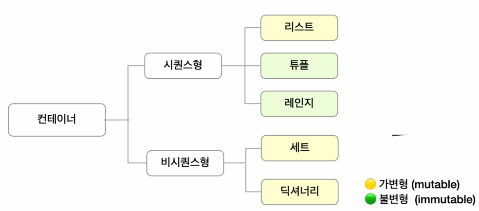
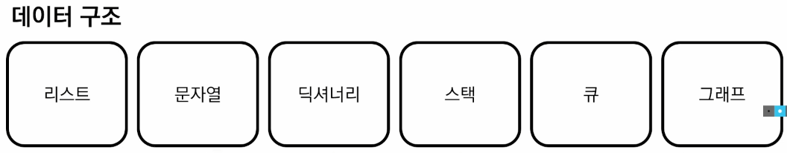
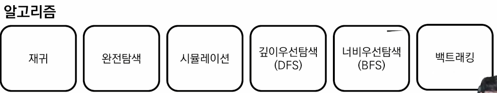
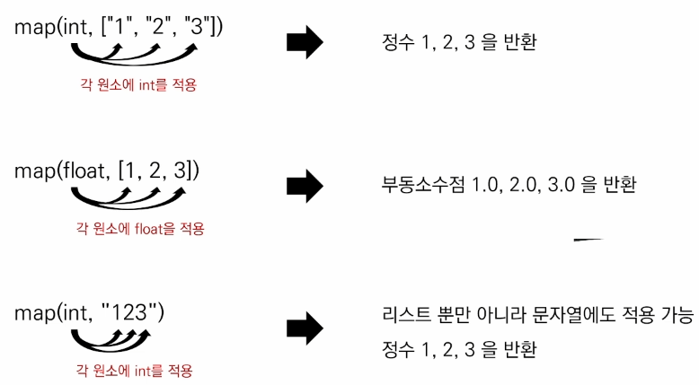

# 알고리즘이란?
  - 어떤 문제를 해결하기 위해 정해진 일련의 절차나 행동

  

  ## 코딩테스트에서 평가하는 두가지 사항
    - 문제 의도를 정확히 파악하고, 적절한 해결 방법을 적용할 수 있는가?
    - 해결 방법을 프로그래밍을 통해 능숙하게 구현할 수 있는가?
    - 코딩테스트를 통해 완벽하게 현업 능력을 평가할 수 없지만 어느정도 실력을 측정하는데 좋은 지표가 된다.

  ## 매번 다른 유형을 푸는 것이 좋다? => X
    - 연습 때는 같은 유형의 문제를 단기간에 여러 번 반복하는 것이 좋고 코딩테스트 직전에 모의고사처럼 시간 제한을 두고 여러 유형을 푸는 것이 좋다.
  
  ## 오랜 시간 고민했는데 풀리지 않을 때, 끝까지 답을 보지 않는 것이 좋다? => X
    - 이후에 답을 보지 않고 반드시 한번 더 풀어서 내 것으로 만들어야 한다.
    - 최대한 타인의 답을 많이 보면서 여러 풀이를 습득하는 것이 좋다.
  
  ## 알고리즘 문제는 몇 문제 정도 풀어야 할까?
    - 약 300~350 문제 사람마다 다르지만, 통계적으로 300~350 문제 정도 풀면 무난하게 합격할 수 있다.
  
  ## 기타 꿀팁
    - 변수명 대충 짓지 않기 (ex. a,b,c, ...)
    - 언어가 가지는 내장 함수, 라이브러리를 적극 활용 하기
    - 반복되는 코드는 함수화를 통해 가독성 있게 작성하기
    - 면접을 위해 풀이를 남에게 설명하는 연습 반드시 필요

# 데이터 구조 & 알고리즘
  **- 프로그램 = 데이터 구조 + 알고리즘**
  - 왜 데이터 구조가 중요한가?
    - 필요한 상황에 따라 필요한 틀에 저장하는 것이 효율적으로 문제를 푸는데 도움이 된다.
    - 구조를 안다는 것은 어떻게 저장하고 어떻게 활용할 수 있는지 안다.

    

    - 코딩 테스트를 위한 데이터 구조와 알고리즘

    

    - 데이터 구조 종류

    

    - 알고리즘 종류

    

# 입력 & 출력
  - 입력 활용 예시(input)
    - input()은 사용자의 입력 한 줄을 문자열로 받는 함수

```python
    word = input()
    >>> happyhacking
```

  - 내장 함수 map(function, iterable)

  

  - print()는 데이터를 출력할 수 있는 함수이며, 자동적으로 줄 바꿈 발생
    - 콤마(,)를 이용하여 여러 인자를 넣으면 공백을 기준으로 출력
    - end, sep 옵션을 사용하여 출력 조작하기

```python
    a = "happy"
    b = "hacking"
    print(a, end="@")
    print(b)
    >>> happy@hacking
    print(a, b, sep="\n")
    >>> happy
    >>> hacking
```
