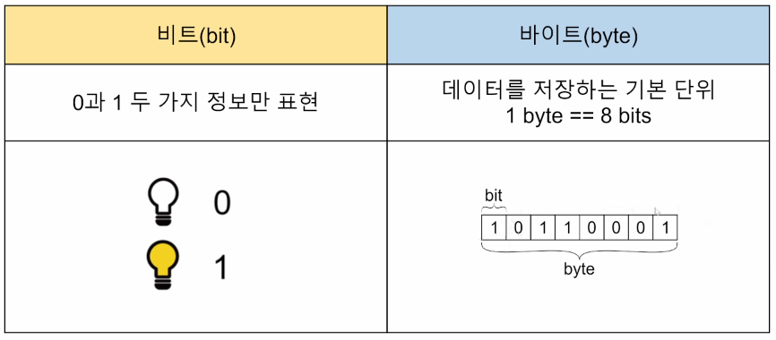
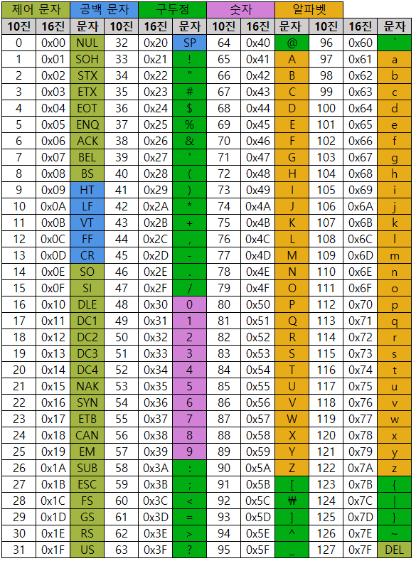

# 리스트 컴프리헨션


# 문자열
  1. 문자열 슬라이싱
   - 문자열은 immutable(변경 불가능한) 자료형 => 순회가능
```python
    s = 'abcdefghi'
    s[2:5] => 'cde'
    s[-6:-2] => 'defg"
    s[2:-4] => 'cde'
    s[2:5:2] => 'ce'
    s[-6:-1:3] => 'dg'
    s[2:5:-1] => ''
    s[5:2:-1] => 'fed'
    s[:3] => 'abc'
    s[5:] => 'fghi'
```
   - 문자열 길이를 알면 - index 값을 구하기 쉽다 

  2. 문자열 메서드
   - .split(기준 문자)
     - 문자열을 기준 문자로 나누어 리스트로 반환
     - 괄호안에 값이 없을 시 공백 기준으로 설정
```python
    word = "I play the piano"
    print(word.split())
    #["I","play","the","piano"]
```
   - .strip(제거할 문자)
     - 문자열 양쪽 끝 특정 문자를 모두 제거한 새로운 문자열 반환
     - 괄호안에 아무것도 넣지 않을 경우 자동으로 공백 제거
     - 제거할 문자를 여러 개 넣으면 모든 문자들을 제거

```python
    word = "Hello World "
    print(word.strip())
    # Hello World
    word = "aHello Worlda"
    print(word.strip("a"))
    # Hello World
    print(word.strip("Hd"))
    # ello Worl
    word = "Hello Worlddddddd "
    print(word.strip("d"))
```
   - .find(찾는 문자)
     - 특정 문자가 처음으로 나타나는 위치를 반환
```python
    word = "apple"
    print(word.find("p"))
    # 1
    print(word.find("k"))
    # -1
```
   - .index(찾는 문자)
     - 특정 문자가 처음으로 나타나는 위치를 반환
     - 찾는 문자가 없으면 오류 발생
```python
    print(word.find("p"))
    # 1
    print(word.find("k"))
    # ValueError : substring not found
```
   - .count(개수를 셀 문자)
     - 문자열에서 특정 문자 몇 개인지 반환
     - 문자 뿐 아니라 문자열의 개수도 확인 가능
```python
    word = 'banana'
    print(word.count)
```
   - .replace(기존 문자, 새로운 문자)
     - 문자열에서 기존 문자를 새로운 문자로 수정 한 새로운 문자열 반환
     - 특정 문자를 빈 문자로 수정하면 해당 문자를 삭제한 것 같은 효과
```python
    word = 'happyhacking'
    print(word.reaplce('happy', 'angry'))
    # angryhacking
    print(word.reaplce('h', 'H'))
    # HappyHacking
    print(word.reaplce('happy', ""))
    # hacking
```
   - 삽입할 문자.join(iterable)
     - iterable의 각 원소 사이에 특정 문자를 삽입한 새로운 문자열 반환
     - 공백 출력, 콤마 출력 등 원하는 출력 형태를 위해 사용
```python
    word = 'happyhacking'
    print(" ".join(word))
    # h a p p y h a c k i n g
    print(",".join(word))
    # h,a,p,p,y,h,a,c,k,i,n,g

    print("@".join(word))
    # 
```
  3. 아스키(ASCII) 코드
    - 컴퓨터는 숫자만 이해할 수 있다

  

    - 문자가 저장되는 방식 => ASCII(American Standard Code for Information Interchange) 사용
    
  

    - 알파벳을 표현하는 대표 인코딩 방식
    - 각 문자를 표현하는데 1byte(8bits) 사용 ( 1byte == 8bits )
    