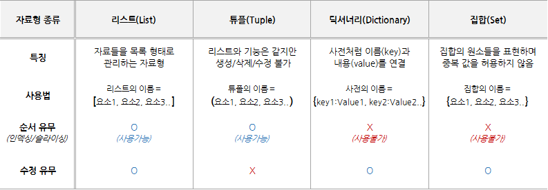

# 딕셔너리
  
  1. 해시 테이블
   - 딕셔너리 자료구조가 파이썬에 내장 되어 있다. (Non-sequence & Key-Value)
```python    
    {
        "name" : "Kyle",
        "gender" : "male",
        "address" : "Seoul"
        # Key는 immutable(변경 불가능)
    }
```
   - 해시 함수 : 임의 길이의 데이터를 고정 길이의 데이터로 매핑
   - 해시 : 해시 함수를 통해 얻어진 값

   

   - 파이썬 리스트와 딕셔너리 비교

   

   - 딕셔너리 사용은 언제 할까?
     - 1. 리스트를 사용하기 힘든 경우
     - 2. 데이터에 빠른 접근 탐색이 필요한 경우
     - 3. 현실 세계의 대부분 데이터를 다룰 경우

  2. 딕셔너리 기본 문법
   - 선언 변수 = { Key1: value1, Key2: value2, ...}
```python
    a = {
        "name" : "Kyle",
        "gender" : "male",
        "address" : "Seoul"
    }
    print(a)
    
```
   - 삽입/수정
```python
    a = {
        "name" : "Kyle",
        "gender" : "male",
        "address" : "Seoul"
    }
    a["job"] = "coach"
    print(a)
```
   - 삭제
```python
    a = {
        "name" : "Kyle",
        "gender" : "male",
        "address" : "Seoul"
    }
    gender = a.pop("gender")
    print(a)
    print(gender)
    # {'name': 'kyle', 'address': 'Seoul'}
    # male
```
   - 조회
```python
    a = {
        "name" : "Kyle",
        "gender" : "male",
        "address" : "Seoul"
    }
    print(a["name"])
    # kyle
    a = {
        "name" : "Kyle",
        "gender" : "male",
        "address" : "Seoul"
    }
    print(a.get("name"))
    # kyle
```

  3. 딕셔너리 메서드
    - .keys()
      - 딕셔너리 key 목록이 담긴 dict_keys 객체 반환
```python
    a = {
        "name" : "Kyle",
        "gender" : "male",
        "address" : "Seoul"
    }
    print(a.keys())
    # dict_keys(['name', 'gender', 'address'])
    for key in a.keys():
        print(key)
    # name gender address
```
   - .values()
     - 딕셔너리 key 목록이 담긴 dict_values 객체 반환
```python
    a = {
        "name" : "Kyle",
        "gender" : "male",
        "address" : "Seoul"
    }
    print(a.values())
    # dict_values(['kyle', 'male', 'Seoul'])
    for value in a.values():
        print(value)
    # kyle male Seoul
```
   - .items()
     - 딕셔너리의 (key, value) 쌍 목록이 담긴 dict_items 객체 반환
```python
    a = {
        "name" : "Kyle",
        "gender" : "male",
        "address" : "Seoul"
    }
    print(a.items())
    # dict_keys([('name', 'kyle'), ('gender', 'male'), ('address', 'Seoul')])
    for key, value in a.items():
        print(key, value)
    # name kyle
    # gender male
    # address Seoul
```