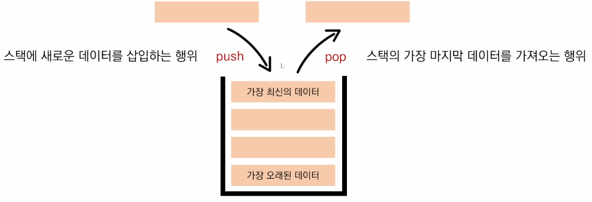
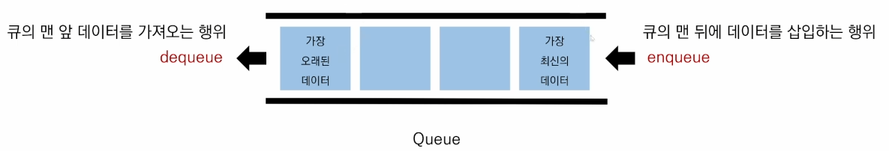
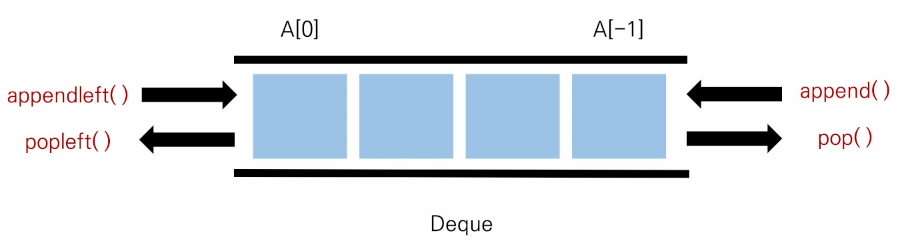

# 데이터구조 & 알고리즘
  - Data Structure 
  - 왜 데이터 구조가 중요한가?
    - 문제 상황에 따라 더 적합한 통이 필요하다
    - 문제 상황에 따라 더 적합한 도구가 필요하다
  - 왜 써야하는지
    - 왜 만들어 졌고, 언제 써야하는지를 알아야 한다

# 스택
  - 쌓는다는 의미로 데이터를 한쪽에서만 넣고 빼는 자료구조 형태
  - 가장 마지막에 들어온 데이터가 가장 먼저 나가는 LIFO(Last-in First-out) 후입선출 방식
  
  

  - 왜 Stack를 써야할까?
    1. 뒤집기, 되돌리기, 되돌아가기 (ex. 홈페이지 뒤로가기, 윈도우 탐색기)
    2. 마무리 되지 않은 일을 임시 저장 (ex. 괄호 매칭, 함수 호출, 백트래킹, DFS(깊이우선탐색))
  - Python 에서는 List로 스택을 간단하게 관리가 가능하다.
  - 같은 구조와 크기의 자료를 정해진 방향으로만 쌓을 수 있으며 top으로 정한 곳을 통해서만 접근이 가능하다.
  - 넣는 것을 push (python에서는 append) 꺼내는 것을 pop (python 에서도 동일)
  - 비어있는 원소를 추출할 경우 stack underflow 라는 오류가 발생하고
  - 스택이 넘치는 경우는 stack overflow 가 발생한다.

# 큐
  - 한 쪽 끝에서 데이터를 넣고, 다른 한 쪽에서 데이터를 빼는 자료 구조
  - 가장 먼저 들어온 데이터가 가장 먼저 나가는 FIFO(First-in First-out) 선입선출 방식

  

  - 데이터를 빼기 위해서는 append는 상수 복잡도를 가지지만 pop 는 선형복잡도를 가지기 때문에 복잡도가 위험하다.
  - 제일 첫 원소를 front 삽입연산만 이루어지는 곳을 rear로 명칭을 말한다.
  - Queue는 어디 사용되는가?
    1. 우선순위 같은 작업 예약
    2. 은행 업무
    3. 콜센터 고객 대기시간
    4. 프로세스 관리, BFS(너비 우선탐색)

  - 덱(Deque, Double-Ended Queue)자료 구조
    - 양 방향으로 삽입과 삭제가 자유로운 큐

  

  - 데이터 삽입, 추출이 많은 경우, 시간을 크게 단축 시킬 수 있다.
  
  - python 에서는 내장함수를 통하여 사용이 가능하다
```python
from collections import deque
```
  - 위 문장을 활용하여 deque를 구현할 수 있으며 앞에서 말했던 데이터 삽입, 추출 등 시간을 크게 단축 시킬 수 있다.

**참고할만한 사이트**
[Stack&Queue](https://brightwon.tistory.com/8)