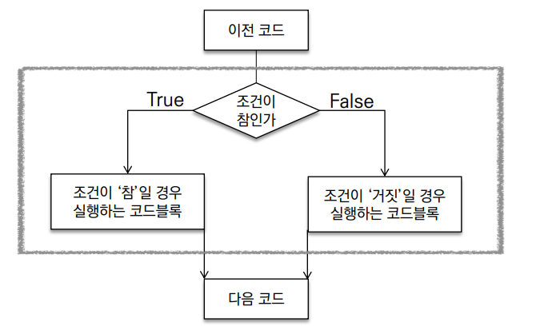
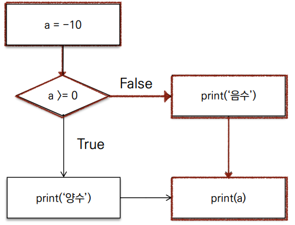
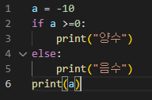
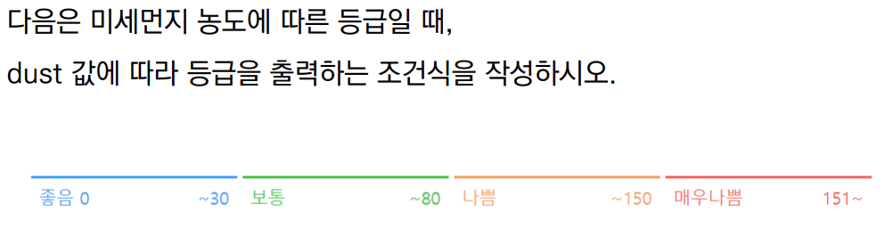
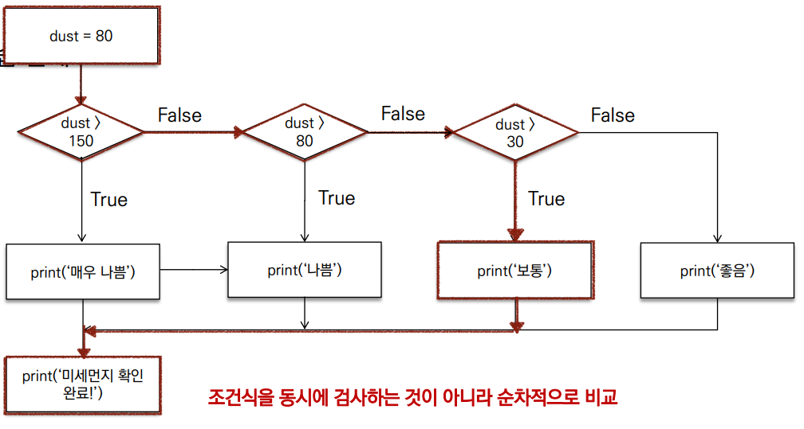
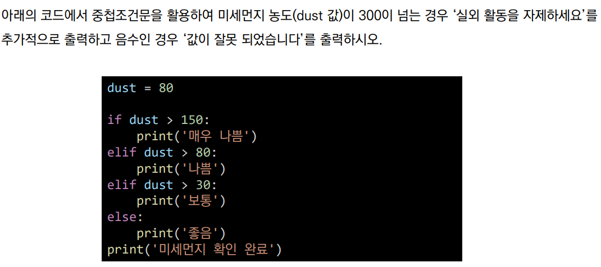
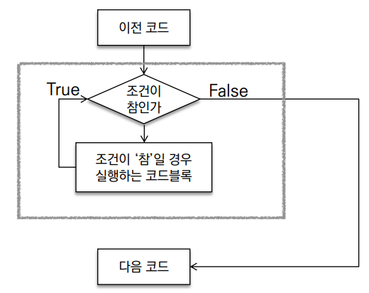
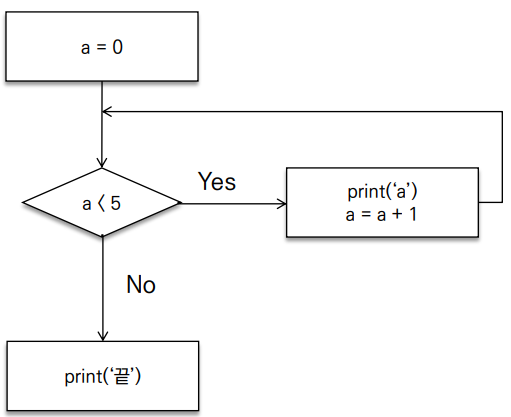
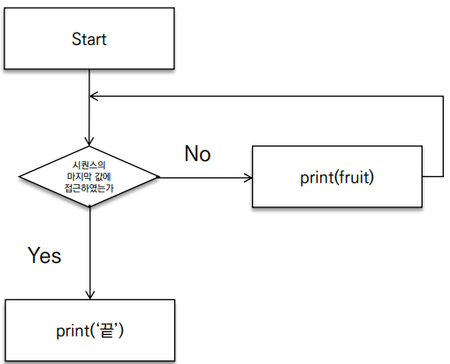

# **Python 제어문**
  - Python은 기본적으로 위에서 아래로 순차적 명령을 수행
  - 특정 상황에 따라 코드를 선택적으로 실행하거나 실행하게 하는 제어가 필요
  - 제어문의 종류는 조건문과 반복문이 존재

## **조건문**
  
    - 조건문의 기본 형태는 위와 같이 조건이 참인지 거짓인지에 따라 그 조건을 설정해준다.
    - 기본형태로는

``` python
    if < 조건식 >: 
        실행할 내용
    else:
        실행할 내용
```
   와 같고 실제 사용하는 방법을 보면

   

   그림의 코드를 조건문을 사용해서 구성해볼 경우

   

   처럼 구성할 수 있으며 -10을 넣었기때문에 값은 "음수" 가 나온다.

   - 위의 간단한 예제와 같이 조건문을 어떻게 설정해주느냐에 따라서 내가 원하는 값들을 도출해낼 수 있다.
   - 조건문은 자주 사용되기 때문에 꼭 제대로 익혀둬야 한다.
  **1. 복수조건문**
```python
    if <조건식>:
        실행할 내용
    elif <조건식>:
        실행할 내용
    else:
        실행할 내용
```
   - 위와 같은 형식으로 구성되며 간단한 예제를 통해 확인해본다.
   
   

   - 위 조건에 맞도록 코드를 구성하면
```python
    dust=int(input())

    if dust > 150:
        print("매우 나쁨")
    elif dust > 80:
        print("나쁨")
    elif dust > 30:
        print("보통")
    else:
        print("좋음")
    print("미세먼지 확인 완료")
```
   - 앞의 그림에 맞도록 코드를 구성할 경우 이와같이 구성이된다.
   - 여기서 생각해볼 점은 python은 위에서부터 아래로 코드가 내려오기 때문에 입력된 dust값이 150보다 큰지부터 시작해서 30이하까지 내려오게 된다.
   - 조건문은 다양한 방법으로도 구성이 가능하기 때문에 꼭 위의 코드만이 정답이라고 할 수 없다.
   - 사람마다 다양한 조건식을 세울 수 있으므로 다양한 방식으로 접근하는 것도 익혀둬야 한다.

   

   **2. 중첩 조건문**
```python
    if <조건식>:
        실행할 내용
        if <조건식2>:
            실행할 내용
    else:
        실행할 내용
```
   - 중첩 조건문은 조건문 내부에 또 조건문이 들어간 구조이며 위와같이 구성한다.
   - 간단한 실습문제를 통하여 중첩 조건문에 대해서 파악해본다.

   

   - 위의 조건에 맞도록 코드를 수정하기 위해서는 어떻게 해야할까?
```python
    dust=int(input())

    if dust > 150:
        print("매우 나쁨")
        if dust > 300:
            print("실외 활동을 자제하세요")
    elif dust > 80:
        print("나쁨")
    elif dust > 30:
        print("보통")
    else:
        if dust >=0:
            print("좋음")
        else:
            print("값이 잘못되었습니다")
```
   - 기존의 코드를 가져와서 내부에 조건문을 위와같이 수정해주면 앞의 그림에서 요구했던 조건문의 구조가 완성된다.
**3. 조건표현식**
   - 조건표현식은 일반적으로 조건에 따라 값을 할당 할 때 활용
```python
    <true인 경우 값> if <조건식> else <false인 경우 값>
```
   - 같은 구조를 가지지만 이러한 구조보단
```python
    if <조건식>:
        실행할 내용
    else:
        실행할 내용
```
   - 구조를 더 많이쓰이므로 구조가 있다는 것만 알아두고 넘어가도 된다.

## **반복문**
  
  

  - 위와 같은 구조를 가지며 조건에 따라서 계속 시행되거나 반복한 후 종료된다.
  - 반복문의 종류는 while, for 등이 있으며, 반복문 제어는 break, continue, for-else 를이용하여 제어한다.

  **1. while**
```python
        while <조건식>:
            실행할 내용
```
    
   - 조건이 참인 경우 들여쓰기가 되어 있는 코드 블록이 실행됨
   - 코드 블록이 모두 실행되고, 다시 조건식을 검사하며 반복함.
   - while문은 무한 루프를 하지 않도록 종료조건이 반드시 필요.
   - 횟수를 모른는 반복문을 할때 용이함.

   

   - 위 그림을 예시로 반복문을 알아보자.

```python
    while a<5:
        print(a)
        a += 1
    print("끝")
```
   - 종료 조건은 a<5 일경우 종료하고 a+=1을 통해 a값을 증가시켜주는 구조이다.
   - 위처럼 while문은 종료조건을 달아주지 않을 경우 계속해서 반복 시행하는 반복문이 된다.
   - ✨이후 조건문과 반복문으로 모든 코드를 구성해도 된다 할 만큼 자주 사용한다. 별도의 실습을 올리기 보다는 스스로 반복하여 익히는게 중요한 부분이다.

   **2. for**
```python
    for <변수명> in <iterable>:
        실행할 내용
```
   - for문은 시퀸스(string, tuple, list, range)를 포함한 순회가능한 객체 요소를 모두 순회하는 구조이다.

   

   - 위의 순서도를 코드화 하면

```python
    for fruit in ['table', 'desk', 'dish']:
        print(fruit)
    print("끝")
    table
    desk
    dish
```
   - 처럼 리스트 내부의 모든 값들을 다 순회하는 구조를 가진다.
   - Iterable의 종류는 str, list, dict가 있고 순회형 함수로는 range, enumerate 등이 있다.
   - 만약 내가 받아온 문자의 한 글자씩 순회하고 싶을 경우
```python
    x = input()
    for char in x:
        print(char)
```
   - 을 시행할 경우 내가 만약 "hello"를 입력하였다면 h,e,l,l,o 가 출력된다.
   - 이처럼 for문은 while문에 비하여 순서가 정해지거나 반복할 횟수를 알 경우 동작하는데 사용된다.
   - range를 활용하여 출력하는것도 가능하다.
```python
    x = input()
    for idx in range(len(x)):
        print(x[idx])
```
   - 위의 코드는 len()이라는 길이를 구하는 함수를 사용하여 input이 된 문자열의 길이를 확인하였다.
   - 이후 range를 이용하여 len(x) 문자열의 길이만큼 범위를 설정하여 idx에 0~len(x)까지 값을 넣어준 후
   - 리스트의 값을 print(x[0]), print(x[1]), print(x[2]) 등 이렇게 출력해준 결과값을 나타낸다.


### **for 문과 while 문, 조건식에 대해서 아주 간단하게 머리속의 내용을 정리해 보았지만 실제 사용하는 부분에서는 아주 일부분을 다룬 내용이다.**
### **조건문과 반복문을 동시에 사용하여 우리가 원하는 내용을 더 디테일하게 표현할 수 있는 만큼 제대로 쓰임새를 알고 개념을 이해해 둬야한다.**