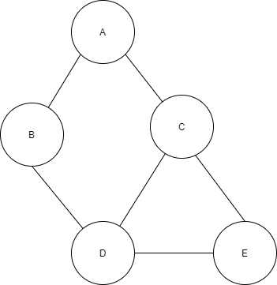

# 그래프
  - 정점(Vertex 혹은 Node)과 이를 연결하는 간선(Edge)들의 집합으로 이루어진 비선형 자료구조
  - 정점(Vertex) : 간선으로 연결되는 객체이며, 노드(Node)라고도 한다.
  - 간선(Edge) : 정점 간의 연결관계를 표현하는 선을 의미
  - 경로(Path) : 시작 정점부터 도착정점까지 거치는 정점을 나열하는 것
  - 인접(Adjacency) : 두 개의 정점이 하나의 간선으로 직접 연결된 상태를 의미

   

  1. 그래프의 종류
   - **무방향 그래프(Undirected graph)**
    - 간선의 방향이 없는 가장 일반적 그래프
    - 간선을 통해 양방향의 정점 이동 가능
    - 차수(Degree) : 하나의 정점에 연결된 간선의 개수
    - 모든 정점의 차수의 합 = 간선 수 * 2
    
   

   - **유방향 그래프**
    - 간선의 방향이 있는 그래프
    - 간선의 방향이 가리키는정점으로 이동 가능
    - 차수(Degree) : 진입 차수와 진출 차수로 나누어짐
     - 진입 차수(In-degree) : 외부 정점에서 한 정점으로 들어오는 간선 수
     - 진출 차수(out-degree) : 한 정점에서 외부 정점으로 나가는 간선 수

  

  2. 그래프의 표현
   - 인접 행렬 (Adjacent matrix) : 두 정점을 연결하는 간선이 없으면 0, 있으면 1을 가지는 행렬로 표현하는 방식

  

   - 새로운 인접 행렬 만들어 보기

```python
    n = 7 # 정점 개수
    m = 7 # 간선 개수
    
    graph = [[0] * n for _ in range(n)]

    for i in range(m):
        x,y = map(int,input().split())
        graph[x][y] = 1
        graph[x][y] = 1
    # 입력으로
    0 1
    0 2
    1 3
    1 4
    2 4
    2 5
    4 6
    graph = [
        [0, 1, 1, 0, 0, 0, 0],
        [1, 0, 0, 1, 1, 0, 0],
        [1, 0, 0, 0, 1, 1, 0],
        [0, 1, 0, 0, 0, 0, 0],
        [0, 1, 1, 0, 0, 0, 1],
        [0, 0, 1, 0, 0, 0, 0],
        [0, 0, 0, 0, 1, 0, 0]
    ]
```

   - 인접 행렬의 경우 직관적이고 만들기는 쉽지만 불필요한 공간이 낭비된다

   - 인접 리스트
    - 리스트를 통하여 각 정점에 대한 인접 정점들을 순차적으로 표현하는 방식

  

```python
    n = 7 # 정점 개수
    m = 7 # 간선 개수
    
    graph = [[0] * n for _ in range(n)]

    for i in range(m):
        x,y = map(int,input().split())
        graph[x].append(y)
        graph[y].append(x)
    # 입력으로
    0 1
    0 2
    1 3
    1 4
    2 4
    2 5
    4 6
    graph = [
        [1, 2],
        [0, 3, 4],
        [0, 4, 5],
        [1],
        [1, 2, 6],
        [2],
        [4]
    ]
```