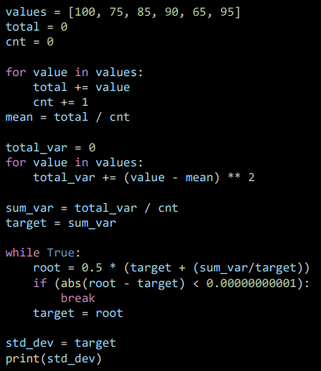
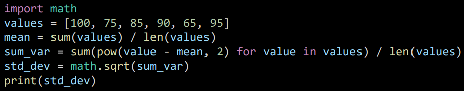
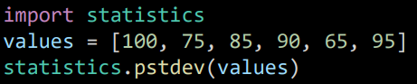

# Python 함수
  - 특정한 기능을 하는 코드의 묶음
  - 반복적인 동작을 수행하기 위해 만들면 편하게 사용이 가능함
  1. 사용자 함수(Custom Function)
    - 구현된 함수가 아닌 사람이 직접 만든 함수
```python
    def function_name:
        실행할 내용
        return 리턴값
```
   - 구조를 가지며 함수를 사용해야 하는 이유는 앞서 말했듯이 반복된 작업을 편리하게 하기 위해서이다.

   
   
   - 위 그림을 참고해서 보면 표준편차를 구하는 과정이다.
   - 여기서 합을 구하는 부분과 표준편차를 구하는 방법을 python에 저장된 내부 함수를 사용 할 경우 더 간단하게 나타낼 수 있다.

   

   - math 라는 함수를 import(정의)를 통하여 합을 구하는 (sum)과 제곱근(sqrt)를 사용하여 손쉽게 표준 편차를 구하는 것을 볼 수 있다.

   

   - 다른 내장함수를 사용하여 바로 표준편차를 구하는 것을 볼 수 있다.
   - 이처럼 다양한 함수들이 존재하며 그 상황에 맞도록 사용할 수 있도록 연습을 해야한다.
   - 하지만 함수가 동작하는 원리를 이해하는 것 또한 매우 중요하게 해야 할 일이다.