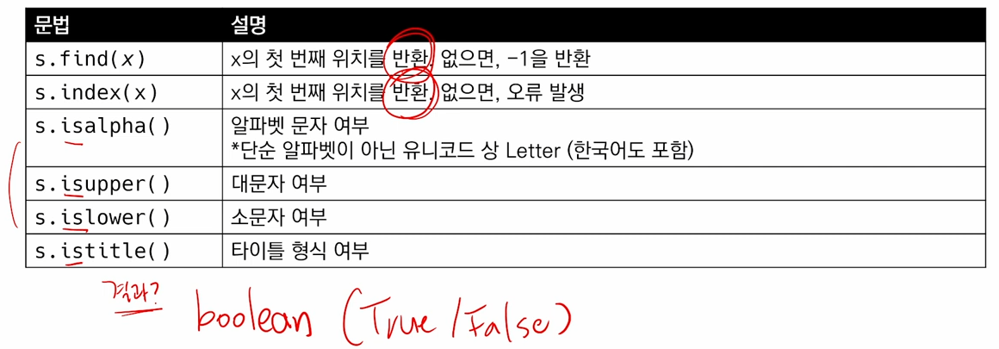
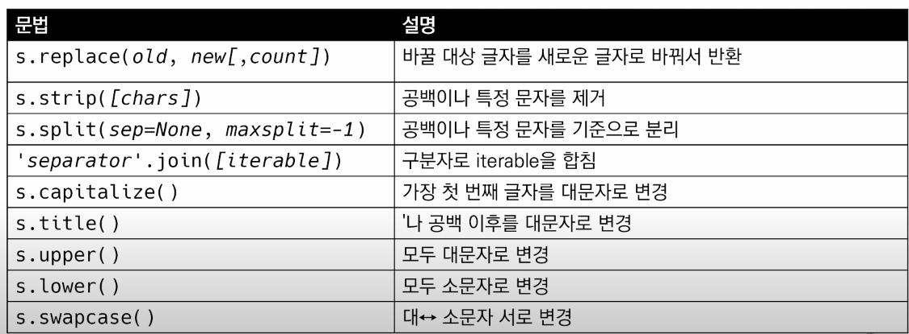
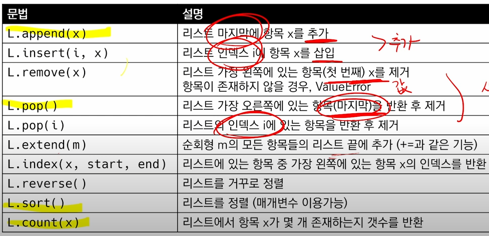
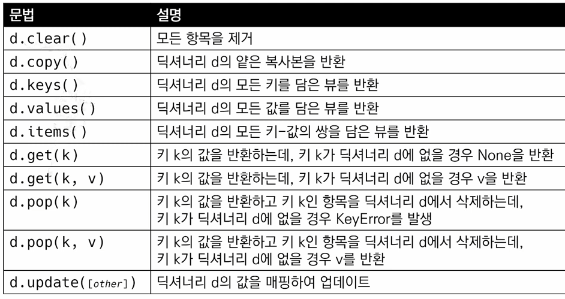

# Python 메서드
  **타입.메서드(여기에 인풋)**
   1. 문자열

   - 문자들의 나열
    
   
    
   - 문자열.find(x)
```python
    'apple'.find('p')
    #위치를 반환 1
    'apple'.find('k')
    #없으면 -1 반환
```
   - 문자열.index(x)
      - x의 첫 번째 위치를 반환하며 없을시 오류가 발생
```python
    'apple'.index('p')
    # 1
    'apple'.index('k')
    # ValueError : substring not found
```

   - 문자열 검증(순서랑 상관없음)

```python
    'abc'.isalpha() # 문자열인지 확인하는것
    #True
    'abc'.isupper() # 모두 대문자인가?
    #False
    'ab'.islower() # 모두 소문자?
    #True
    'Title Title!'.istitle() #앞의 문자가 대문자인지?
    #True
```    
   - 숫자 형식인지 확인하는 명령어
```python
    isdecimal() # 사용으로 숫자형식인지 확인 가능
```
   - 문자열 변경
    
   
    
   - 문자열.replace(old, new[,count])
     - 바꿀 대상 글자를 새로운 글자로 바꿔서 반환
     - count를 지정하면, 해당 개수만큼 시행
     - 없으면 count 값이 없으면 모두 변경한다
```python
    'coone',replace('o','a')
    # caane
    'wooooowoo'.replace('o','!',2)
    # w!!ooowoo
```
   - 문자열.strip([chars])
     - 특정 문자를 지정하면 양쪽 제거(strip), 왼쪽 제거(lstrip), 오른쪽 제거(rstrip)
      - 문자열을 따로 정하지 않으면 공백을 제거 (공백은 space, enter, 개행등 도 포함)
```python
    '       와우!\n'.strip()
    # '와우!'
    '       와우!\n'.lstrip()
    # '와우!\n'
    '       와우!\n'.rstrip()
    # '       와우!'
    '안녕하세요????'.rstrip('?')
    # '안녕하세요'
```
   - 문자열.split(sep=None, maxsplit=-1)
     - 문자열을 특정한 단위(sep)로 나눠 리스트로 반환
     - sep이 None이거나 지정되지 않으면 기본값으로는 단일 공백 문자를 제거하는 기본값으로 되어있으며 선행/후행 되는 공백은 지우지 않은다.
     - maxsplit값이 -1 되어있으면 제한이 없다.
```python
    'a,b,c'.split('_')
    # ['a,b,c']
    'a,b,c'.split()
    # ['a','b','c']
```
    
   - 문자열.join([iterable])
     - 반복가능한(iterable) 컨테이너 요소들을 separator(구분자)로 합쳐 문자열 반환
     - 문자열이 아닌 값이 있으면 TypeError가 발생한다.
```python
    ''.join(['3','5'])
    # 35
    names = ','.join(['홍길동', '김철수'])
    print(names)
    # 홍길동,김철수
```
   - 문자열 변경 예시
```python
    msg = 'hI! Everyone.'
    print(msg)
    # hI! Everyone.
    print(msg.capitalize())
    # Hi! everyone.
    print(msg.title())
    # Hi! Everyone.
    print(msg.upper())
    # HI! EVERYONE.
    print(msg.lower())
    # hi! everyone.
    print(msg.swapcase())
    # Hi! eVERYONE.
```
   - 리스트
     - 변경 가능한 값들로 나열된 자료형
     - 순서를 가지고 서로 다른 타입 요소를 가질 수 있다
     - 변경(mutable)과 반복(iterable)이 가능하다 

   

   - 리스트.extend(iterable)
     - 리스트에 iterable 항목을 추가함
```python
     a = ['apple']
     a.extend('banana','mango')
     # error : 한개의 값만 넣어줘라!
     a.extend(['banana','mango'])
     # a = ['apple','banana','mango']
```
   - 리스트.remove(x)
     - 리스트에서 값이 x 인 것 삭제
```python
    numbers = [1,2,3,'hi']
    # [1,2,3,'hi']
    numbers.remove('hi')
    # [1,2,3]
    numbers.remove('hi')
    # error : list.remove(x) : x not in list
```
   - 리스트.pop(i)
     - 정해진 위치 i의 값을 삭제하고 반환
     - i가 지정되지 않으면, 마지막의 항목을 삭제 후 반환
```python
    numbers = [1,2,3,'hi']
    # [1,2,3,'hi']
    numbers.pop()
    
```
   - 리스트.clera()
     - 모든 항목 삭제
```python
    numbers = [1,2,3,'hi']
    # [1,2,3,'hi']
    numbers.clear()
    # None
```
   - 리스트.count(x)
```python
    numbers = [1,2,3,1,1]
    numbers.count(1)
    # 3
    numbers.count(100)
    # 0
```
   - 리스트.sort()
     - 원본 리스트를 정렬함. None 반환
     - sorted 함수와 비교를 해보면
     - 리스트 메서드와 함수의 차이로 위(메서드)를 사용하면 메서드를 정렬된 상태로 return(원본 변경)
     - 함수를 사용할 경우 원본을 변경하지 않고 sorted 된 값을 return
```python
    a = [10, 1 , 100]
    new_a = a.sort()
    print(a, new_a)
    # [1, 10, 100] None
    b = [10, 1, 100]
    new_b = sorted(b)
    print(b, new_b)
    # [10, 1, 100] [1, 10, 100]
```
   - 리스트.reverse()
     - 순서를 반대로 뒤집는것(정렬 X)
```python
    numbers = [3,2,5,1]
    result = numbers.reverse()
    print(numbers, result)
    # [1,5,2,3] None
```

   - **함수와 메서드 구분하는 방법 => S.V() 이면 메서드 Sum() 함수**
```python
    a = [1, 2, 3]
    a = a.append(4)
    print(a)
    # a.append(4)의 return 값을 a에 저장하지만 None이 return 된다.
    # list.append()의 메서드는 반환값이 None 이다.
    a = [1, 2, 3]
    a.append(4)
    print(a)
```
-------------------------------------------------------------------
```python
    a = [1, 2, 3]
    # sum 함수의 return 값을 변수 result에 할당
    result = sum(a)
```
-------------------------------------------------------------------
```python
    # 리스트는 mutable
    a = [1, 2, 3]
    a[0] = 100
    print(a)
    # [100, 2, 3]

    # 문자열은 immutable
    a = 'hi'
    a[0] = 'c'
    print(c)
    # TypeError: 'str' object does not support item assignment
```
   2. 딕셔너리(Dictinoary)

   

   - 딕셔너리.get(key[,default])
     - key를 통해 value를 가져옴
     - keyError가 발생하지 않고, default 값을 설정 가능함(기본 : None)
```python
    my_dict = {'apple':'사과', 'banana':'바나나'}
    my_dict = ['pineapple']
    #KeyError => pineapple 이 없음
    print(my_dict.get('pineapple'))
    #None
    print(my_dict.get('apple'))
    # 사과
    print(my_dict.get('pineapple',0))
    # 0
```
   - 딕셔너리.pop(key[,default])
     - key가 내부에 존재하면 제거 후 반환
     - 없으면 keyError
```python
    my_dict = {'apple':'사과', 'banana':'바나나'}
    data = my_dict.pop('apple')
    print(data, my_dict)
    # 사과 {'banana' : '바나나'}
```
   - 딕셔너리.update([other])
     - 값을 제공하는 key, value로 덮어씌움.
```python
    my_dict = {'apple':'사', 'banana':'바나나'}
    my_dict.update(apple='사과')
    print(my_dict)
    # {'apple': '사과', 'banana' : '바나나'}
```
   - dict['문자열'] = <넣고싶은 값> 으로 값을 추가함
```python
    my_dict = {'apple':'사', 'banana':'바나나'}
    my_dict['apple'] = '토마토'
    print(my_dict)
    # {'apple': '토마토', 'banana' : '바나나'}
```