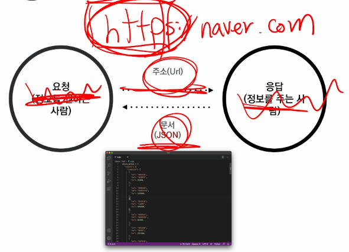

## API(Application Programming Interface)
  - 컴퓨터나 컴퓨터 프로그램 사이의 연결
  - 일종의 소프트웨어 인터페이스이며 다른 종류의 소프트웨어 서비스를 제공
  - 사용하는 방법을 기술하는 문서나 표준 API 사양/명세 (seecification)
  - 프로그램으로 제어를 하는 것
  - 주소로 요청을 보낼 시 문서로 응답한다

  

  - API 활용시 확인 사항
    - 요청하는 방식에 대한 이해
        - 인증 방식
        - URL 생성
        - 기본 주소
        - 원하는 기능에 대한 추가 경로
        - 요청 변수 (필수와 선택)
    - 응답 결과에 대한 이해
        - 응답 결과 타입 (JSON)
        - 응답 결과 구조

```python
    # pip install requests
    import requests
    # URL로
    order_currency = BTC
    payment_currency = KRW
    URL = f'https://api.bithumb.com/public/ticker/{order_currency}_{payment_currency}'
    # 요청을 보내서
    response = requests.get(URL)
    # 응답 받은 값을 가져온다.
    print(response, type(response)) # <Re>
```