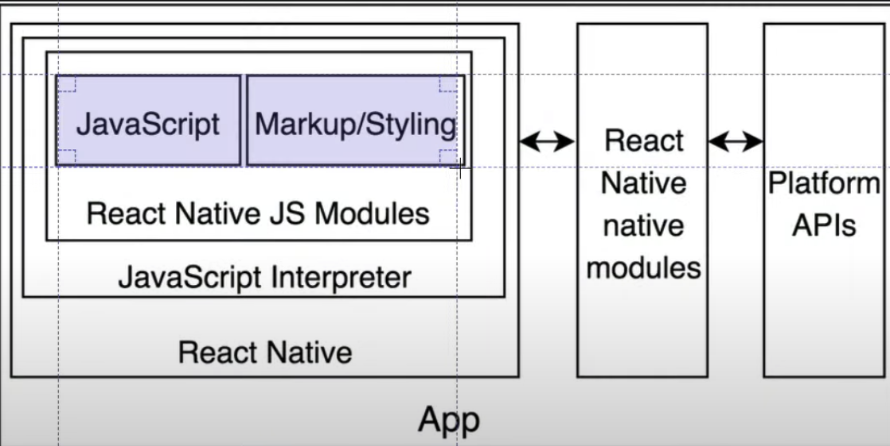

# React Native

- React 문법으로 IOS, Android 개발을 할 수 있는 프레임 워크
- 크로스 플랫폼 앱으로 Android, IOS 똑같이 작동하는 앱을 의미함
- Browswer 가 따로 존재하지 않고 Bridge가 존재함
- IOS, Android 에 각각 요청을 보내서 만들어달라고 하는 역할
- 동작방식

  1. Event 발생
  2. Event에 대한 메세지가 Bridge를 통해서 JavaScript 부분에 도착
  3. 정해진 JavsScript 코드를 Native 운영체제에 메세지를 보냄
  4. 메세지를 Bridge를 통해서 IOS, Android에 다시 도착하여 실행시킴

  

- JavaScript 영역

  - 자바스크립트 스레드: 자바스크립트 코드가 실행되는 장소, 리액트로 구성

- 브릿지(Bridge)

  - 자바스크립트 코드를 이용해 네이티브 계층과 통신할 수 있는 연결 역할
  - 브릿지는 자바스크립트 스레드(thread)에서 정보를 받아 네이티브로 전달

- 네이티브 영역
  - 메인 스레드 : UI 담당
  - 섀도(shadow) 스레드 : 레이아웃을 계산하는 데 사용하는 백그라운드 스레드
  - 네이티브 모듈 : 각 모듈에는 자체 스레드가 있는데, 안드로이드의 경우 thread pool을 공유

## 장점

- JavaScript를 사용하는 개발자라면 러닝 커브가 낮다.
- 소스코드의 재사용과 생산성이 높다. (React 와 비슷)
- 하나의 언어로 두 개의 OS 앱 개발이 가능하기 때문에 비용이 저렴하고 쉽게 배울 수 있다.

## 단점

- JavaScript 혹은 React를 접하지 않은 개발자들은 러닝 커브가 높다.
- 네이티브 브릿지를 사용하여 스레드를 연결시키는 동작을 하는 하이브리드 앱이다 보니 기존의 네이티브 개발 방식 보다는 성능이 떨어진다.
- 오픈 소스이다 보니 업데이트가 자주 발생하여 수정되는 기능 때문에 버그가 자주 발생한다.
- 네이티브 기능을 개발하기 위해 리액트 네이티브에서 기능을 제공해야 한다. 신규 기능 개발하기 위해서는 리액트 네이티브가 지원을 해줘야한다.

## React Native 렌더링 과정

- React 컴포넌트 작성

  - React 컴포넌트는 React Native 애플리케이션의 UI를 정의하고 각 컴포넌트는 JavaScript 함수로 작성되며, props와 state를 이용하여 UI를 렌더링한다.

- Virtual DOM 업데이트

  - React 컴포넌트는 Virtual DOM을 사용하여 UI를 업데이트하며 메모리 상에 존재하는 가상 DOM 이다.

- Native 모듈 호출

  - React Native Bridge를 통해 Native 모듈이 호출되고, 모듈은 Objective-C(or Swift) 혹은 Java로 작성된 코드로 네이티브 기능을 제공한다.

- Native UI 업데이트

  - Native 모듈을 호출하여 UI 업데이트를 진행, 네이티브 모듈은 React Native Bridge를 통해 JavaScript 에서 호출된다.

- 실제 DOM 업데이트

  - Native UI 업데이트가 완료되면, React Native 애플리케이션에서 실제 DOM이 업데이트된다.

- React Native 애플리케이션의 구성요소와 렌더링 과정을 이해하면 React Native의 동작 방식을 더욱 쉽게 이해할 수 있다.
