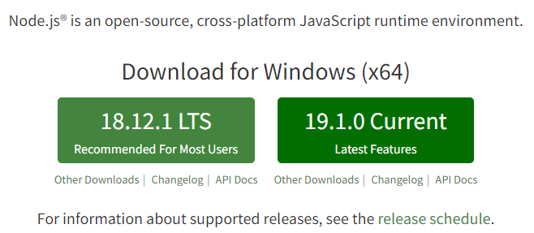

# 개발환경 구축하기
  - Node.js (javascript runtime)
  - npm (node package manager)

  1. Node.js 사이트 들어가기 (Node.js)[https://nodejs.org/en/]

  

   - LTS는 안정화 된 버전
   - current는 현재 최신 버전

  2. VS Code 설치하기 (vscode)[https://code.visualstudio.com/]

  

   - IDE(Integrated Development Environment) 개발환경을 도움을 주는 프로그램