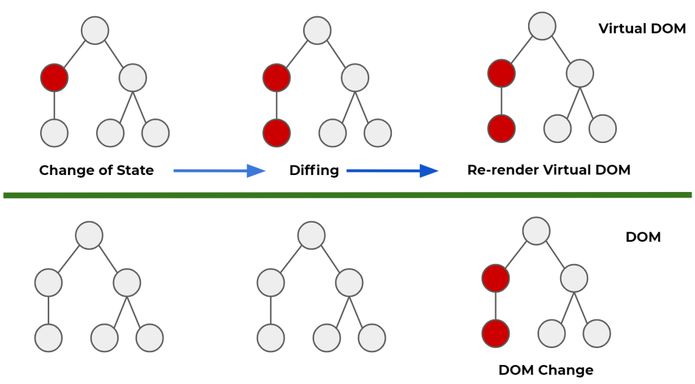

# 개발환경 구축하기
  - Node.js (javascript runtime)
  - npm (node package manager)

  1. Node.js 사이트 들어가기 (Node.js)[https://nodejs.org/en/]

  

   - LTS는 안정화 된 버전
   - current는 현재 최신 버전

  2. VS Code 설치하기 (vscode)[https://code.visualstudio.com/]

  

   - IDE(Integrated Development Environment) 개발환경을 도움을 주는 프로그램
  

# React

  - 사용자 인터페이스(UI)
    - 사용자과 컴퓨터프로그래밍이 상호작용하기 위해 중간에서 입출력 조정해주는 것
    - 버튼, 텍스트 입력창 등 => 버튼을 입력함으로써 페이지 반응 하는 것들
  
  - UI 라이브러리
    - 사용자 인터페이스를 만들기위한 지능 모음집
    - React 는 대표적인 JS UI 라이브러리
    - 화면을 만들기 위한 기능을 모아둔 것
    - 종류
      - NGULARJS => 구글에서 만든 오픈소스 프로젝트 JS 기반 웹 개발 오픈소스 프로젝트 (사실상 공식적 지원이 중지됨)
      - React => 현재 가장 많이 사용중
      - Vue.js => 오픈 소스 프로젝트 많이 사용중
  
  - 프레임워크 vs 라이브러리 => 제어 권한이 누구한테 있는가에서 차이가 생김
    - 프레임워크 => 흐름에 대한 제어 권한을 프레임워크가 가짐 => 제어 권한이 프레임워크
    - 라이브러리 => 개발자가 필요한 부분만 가져다 사용하는 것 => 제어 권한이 개발자
  
  - SPA(Single Page Application)
    - 사용자가 특정페이지를 요청시 그 페이지를 채워서 보내주는 역할을 함.

  - 장단점
    - 장점
      1. 빠른 업데이트 & 렌더링 속도
        - 페이지 요청시 글이나 항목들이 뜨는 속도가 빠른 것을 의미
        - 이를 위해 Virtual DOM(Document Object Model) 을 사용 => 가상의 돔은 하나의 웹 사이트의 모든 정보를 담고있는 그릇이라 생각하면 됨.
      
      

        - Virtual DOM 에서는 업데이트 되야하는 부분만 업데이트 한 후 DOM을 다시 렌더링 하는 역할을 하지만 만약 없을 경우 DOM 자체를 다시 렌더링 해야하기 때문에 렌더링이 빠른 것이다.
        - Component-Based 구조로 구성되어있다. 작은 레고들이 모여서 한개의 모형이 되는 것이다.
        - 대표적인 사이트가 airbnb 가 React로 구성되어 있다. => div 박스들이 모여서 만들어지는 것과 같음.
        - 재사용성(Reusability)이 높다.
          1. 만들어두면 다른곳에서도 가져다 쓰기 쉽기때문이다. (개발기간 단축!!)
          2. 유지 보수가 용이하다. (그 부분만 수정해서 다시 가져다 사용할 수 있다!!)
      2. 활발한 지식공유& 커뮤니티가 구성되어 있다.
      3. React Native 를 이용하여 모바일 웹 개발이 용이하다.

    - 단점
      1. 방대한 학습량 => 다양한 개념들이 등장함
        - Virtual DOM
        - JSX
        - Component
        - State
        - Props
      2. 계속해서 기술이 변화함.
      3. 높은 상태관리 복잡도. => State를 관리하는 것이 중요함!!