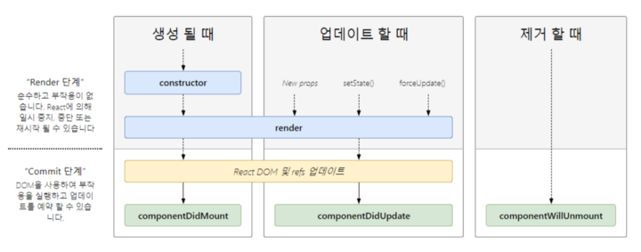

# State

  - 상태 라는 뜻을 가지지만 React 에서는 Component의 상태 라는 의미
  - React Component의 변경 가능한 Data
  - State는 개발자가 정의한다.
  - 렌더링이나 데이터 흐름에 사용되는 값만 State에 포함시켜야 한다.
  - JavaScript 객체이다.

```JavaScript
class LikeButton extends React.Component {
    constructor(props) {
        super(props);

        this.state = {
            liked: false
        };
    }
}
```
  - 모든 함수에는 constructor라는 생성자를 가지고 있다.
  - state는 직접 수정 할 수 없다.
  - setState 함수를 사용하여 수정해야한다.

```JavaScript
// 잘못된 방법
this.state = {
    name: "Inje"
};
// setState 함수를 통한 수정(정상)
this.setState({
    name: "Inje"
});
```

# Lifecycle

  - React Component 생성 주기

  

  - Component가 계속 존재하는 것이 아닌 시간의 흐름에 따라 생성되고 업데이트되고 사라진다.

  - Function Component 는 State 사용 불가, Lifecycle 에 따른 기능구현 불가능
  - Class Component는 State 사용 가능, setState를 통한 state업데이트, Lifecycle method 제공