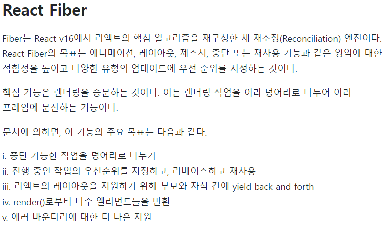

# 3장 중요하지만 헷갈리는 리액트 개념 이해하기

## 목차
## [3.1 장](#31-상태값과-속성값으로-관리하는-uiuser-interface-데이터)
## [3.2 장](#32-리액트-요소와-가상-돔)
## [3.3 장](#33-리액트-훅-기초-익히기)
## [3.4 장](#34-콘텍스트-api로-데이터-전달하기)

  - 리액트의 다양한 기능과 개념중 핵심적인 내용을 설명한다.
  - 프레임워크나 라이브러리를 온전히 이해하지 못하면 기술의 부채가 늘어난다.

## 3.1 상태값과 속성값으로 관리하는 UI(User Interface) 데이터

  - UI(User Interface) 데이터를 컴포넌트 내부에서 관리되는 상태값과 부모 컴포넌트에서 내려주는 속성값으로 관리한다.
  - 리액트를 사용하기 위해서는 결국 상태값과 속성값을 이용해서 구현해야 한다.
  - UI(User Interface) 데이터가 변경되면 화면을 다시 나타내야 한다.
  - UI 데이터가 변동될 때마다 돔 요소들을 직접 수정해야하며 수정하다 보면 코드가 섞이게 되고 복잡해지게 된다.
  - 리액트는 화면의 모든 코드를 컴포넌트 함수에 선언형으로 작성하여 UI 데이터 변경을 감지하여 컴포넌트 함수를 이용해 화면을 자동으로 갱신해준다.

### 3.1.1 리액트를 사용한 코드의 특징

```html
<html>
    <body>
        <div class="todo">
            <h3>할 일 목록</h3>
            <ul class="list"></ul>
            <input class="desc" type="text" />
            <button onclick="onAdd()">추가</button>
            <button onclick="onSaveToServer()">서버에 저장</button>>
        </div>
    <script>
        let currentId = 1;
        const todoList = [];
        function onAdd() {
            const inputEl = document.querySelector('.todo .desc');
            const todo = { id: currentId, desc: inputEl.value };
            todoList.push(todo);
            currentId += 1;
            const elemList = document.querySelector('.todo .list');
            const liEl = makeTodoElement(todo);
            elemList.appendChild(liEl);
        }
    </script>
    </body>
</html>
```

  - 초기 화면을 구현하고 todolist 배열에 할일 목록을 추가하고 저장하는 부분이다.
  - 로직과 UI 코드가 복잡하게 얽혀있고 가독성이 낮다.

```JS
    function Mycomponent() {
        const [desc, setDesc] = useState("");
        const [currentId, setCurrentId] = useState(1);
        const [todoList, setTodoList] = useState([]);
        function onAdd() {
            const todo = { id: currentId, desc };
            setCurrentId(currentId + 1);
            setTodoList([...todoList, todo]); // ...todoList 는 리스트 전체의 값을 의미함
        }
        function onSaveToServer() {
            // todoList 전송
        }
        return (
        <div class="todo">
            <h3>할 일 목록</h3>
            <ul>
                {todoList.map(todo => (
                    <li key={todo.id}>
                        <span>{todo.desc}</span>
                        <button data-id={todo.id} onClick={onDelete}>
                            삭제
                        </button>
                    </li>
                ))}
            </ul>
        </div>
        )
    }
    
```

  - 같은 코드를 리액트를 사용하여 변경한 것이다.
  - 상태값이 수정되면 컴포넌트 함수를 실행하여 화면을 갱신한다.
  - 앞서 사용한 HTML 코드를 명령형 프로그래밍, React를 이용한 코드를 선언형 프로그래밍이라 부른다.
    - 명령형 프로그래밍 : 무엇을 어떻게 진행할 것인지에 가깝다. => "저 자리가 비었네요 저기가서 앉을게요."
    - 선언형 프로그래밍 : 무엇을 할 것인가에 가깝다. => "앉을 자리를 부탁할께요."
  - 명령형 프로그래밍의 경우 돔 환경이 아닌 곳에서 사용하기 힘들다.
  - 선언형 프로그래밍의 경우 다양한 방식과 추상화 단계가 높기 때문에 사용방법이 다양하다.

### 3.1.2 컴포넌트의 속성값과 상태값

  - 상태값 : 해당 컴포넌트가 관리하는 데이터
  - 속성값 : 부모 컴포넌트로부터 전달받는 데이터
  - 리액트는 속성값과 상태값으로 관리되며 속성값과 상태값으로 관리하지 않으면 UI 데이터가 변경돼도 화면이 갱신되지 않을 수 있다.

```JS
let color ="red";
function MyComponent() {
    function onClick() {
        color = "blue";
    }
    return (
        <button style={{ backgroundColor: color }} on Click={onClick}>
            좋아요
        </button>
    );
}
```

  - color 데이터는 배경의 색을 나타내며 초기 의도한 대로 색이 잘 나오지만 버튼을 클릭하면 color 데이터는 파란색으로 변하지만 UI데이터가 변경된 것을 감지하지 못해서 그대로 빨간색 화면이 나타난다.
  - 이는 상태값을 이용하지 않았기 때문에 변경을 감지하지 못한 것이다.

```JS
import React, { useState } from "react";

function MyComponent() {
    const [color, setColor] = useState("red");
    function onClick() {
        setColor("blue");
    }
    return (
        <button style={{ backgroundColor: color }} on Click={onClick}>
            좋아요
        </button>
    );
}
```

  - 상태값을 추가할 때는 'useState' 훅을 사용한다.
  - 'useState'의 인자는 초기 값을 의미하며 배열을 반환해준다. (첫 번째 원소는 상태값, 두 번째 원소는 상태값 변경 함수)
  - 리액트는 상태값 변경 함수가 호출되면 상태값을 변경하고 해당 컴포넌트를 다시 렌더링 한다.
  - 속성값은 부모 컴포넌트가 전달해 주는 데이터이며 대부분 UI 데이터를 포함하게 된다.

```JS
function Title(props) {
    return <p>{props.title}</p>;
}
```

  - 부모 컴포넌트로 부터 title의 속성값을 받고 부모 컴포넌트가 렌더링될 때마다 같이 렌더링 되기때문에 title 속성값의 변경 사항이 바로 화면에 보인다.
  - 상태값과 속성값을 통해서 UI 데이터를 관리하는 것이 리액트의 핵심 기술이다.

  - 만약 특정한 속성값이 변경될 때만 렌더링 되길 원하면 "React.memo"를 이용할 수 있다.
  - "React.memo(Title)" 이처럼 Title 컴포넌트가 선언될 경우 컴포넌트 속성값이 변경되는 경우에만 렌더링 된다.
  - 같은 컴포넌트라도 자신만의 상태값이 존재하게 된다.

```JS
function APP() {
    return (
        <div>
            <MyComponent />
            <MyComponent />
        </div>
    );
}
```

  - 두개의 "MyComponent"가 존재하지만 각자 다른 상태값들을 가지고 있고 컴포넌트는 같더라도 다른 것이다.
  - 속성값의 경우 불변(immutable) 변수지만 상태값은 변하는(mutable) 변수이다.
  - 자식에게 전달되는 컴포넌트는 부모 컴포넌트에서 관리하기 떄문에 수정할 수 없도록 막혀있다.
  - 상태값은 직접 수정이 가능하지만 화면이 갱신되거나 하지는 않는다. (??)

### 3.1.3 컴포넌트 함수의 반환값

  1. 우리가 작성한 컴포넌트와 HTML에 정의된 거의 모든 태그 사용가능
  2. 문자열과 숫자를 반환 가능
  3. 배열 반환 가능 (각 요소들은 key 값을 가지고 있어야한다. => 구분하기 위해서)
  4. 프래그먼트(fragment)사용하면 배열과 key 값을 부여하지 않아도 배열로 반환
  5. 프래그먼트를 바벨을 사용하여 <React.fragment> 가 아닌 <> 로 축약하여 표현
  6. null or boolean을 반환하면 아무것도 렌더링하지 않음
  6. 리액트 포털(portal)을 이용하면 컴포넌트의 현재 위치와 관련없이 특정 돔 요소에 렌더링 가능 (ReactDOM.createPortal( 넣을내용, 위치 );)

## 3.2 리액트 요소와 가상 돔

  - 리액트 요소는 UI를 표현하는 수단이다.
  - 렌더링 성능을 높이기 위해 가상 돔을 활용한다.
  - 기존의 방식은 돔을 변경하면 돔을 다시렌더링 하지만 리액트의 경우 메모리에 가상돔을 생성하여 기존의 돔과 비교한 후 변경된 점만 찾아서 실제 돔에 렌더링 해주는 방식을 사용한다.

### 3.2.1 리액트 요소 이해하기

  - JSX 코드 createElement 변환 과정 이해하기

```JS
const element = <a href="http://google.com">click here</a>;
const element = React.createElement(
    'a',
    { href: 'http://google.com' },
    'click here',
);
```

  - JSX 코드가 createElement 코드로 변환되는 과정이다
  - 한개 더 예시를 살펴보자

```JS
const element = ( 
    <a key="key1" style ={{ width: 100}} href="http://google.com">click here</a>
);
const element = React.createElement(
    type: 'a',
    key : "key1",
    ref: null,
    props: { 
        href: 'http://google.com',
        style: {
            width: 100,
        },
        children : 'click here'
        },
);
```

  - key 와 ref를 제외한 값들은 모두 props 로 들어가게 된다.
  - type에 "" 문자열이 아닌 컴포넌트가 들어갈 경우 해당 컴포넌트도 createElement 로 변경하는 과정을 거쳐 type 에는 모두 문자열만 오도록 변환해주는 과정을 진행중이다.
  - 리액트 요소는 불변 객체이기 때문에 속성값을 변경할 수 없다.

### 3.2.2 리액트 요소가 돔 요소로 만들어지는 과정

  - 데이터 변경에 의한 화면 업데이트는 렌더 단계와 커밋 단계를 거치게 된다.
    - 렌더 단계 : 실제 돔에 반영할 변경 사항을 파악하는 단계
      - 가상 돔을 이용하여 이전의 가상돔과 비교하여 달라진 점을 찾아 실제 돔에 적용하여 변경 사항을 최소화
      - 돔을 변경하는 작업이 다른 작업에 비해 오래 걸리기 때문에 필요한 부분만 변경하는 것이 좋다.

    - 커밋 단계 : 파악된 변경 사항을 실제 돔에 반영하는 단계
  - 파이버 구조체 변환



## 3.3 리액트 훅 기초 익히기

  - 함수형 컴포넌트에 기능을 추가할 때 사용한다.
  - 상태값을 사용할 수 있고, 자식 요소에 접근할 수 있다.
  - 훅이 주는 장점이 되게 다양하고 적극적으로 개발 진행중이라고 한다.

### 3.3.1 상태값 추가하기 : useState

  - useState를 사용하면 배열을 반환해주고 배열의 첫 번쨰 원소는 상태값, 두 번째 원소는 상태값 변경 함수다.
  - 상태값 변경함수가 호출 될 경우 해당 컴포넌트를 다시 렌더링하고 자식도 같이 렌더링 된다.
  - 상태값 변경 함수는 비동기 동작을 진행하며 배치처리를 진행하여 한번에 처리한다.

```JS
    function MyComponent() {
        const [count, setCount] = useState({ value : 0});
        function onClick() {
            setCount({value : count.value + 1});
            setCount({value : count.value + 1});
        }
        console.log("render called");
        return (
            <div>
                <h2>{count.value}</h2>
                <button onClick={onClick}>증가</button>
            </div>
        );
    }
```

  - 이 코드를 보면 value 값이 2가 증가되어야 할 것 같지만 실제로는 1만 증가하게 된다.
  - 효율적 렌더링을 하기 위해 여러 상태값을 요청을 배치처리 하기때문이다.
  - 즉 일정 시간동안 변화한 상태값들을 모아서 한번에 처리한다.
  - 만약 값을 2 증가시키고 싶을 경우 함수를 사용하면 해결할 수 있다.

```JS
function onClick() {
    setCount(prev => prev + 1);
    setCount(prev => prev + 1);
}
```

  - 함수의 경우 비동기 처리가 되지만 순서가 보장되기 때문에 처음 시행된 setCount의 변경값이 두번째로 실행되는 값으로 들어가게 된다.
  - 같은 상태값변경 함수를 사용할 경우 함수를 이용하면 배치처리에서도 순서를 부여할 수 있다.
  - 다른 상태값변경 함수를 사용할 경우 상태값 변경함수는 순서대로 처리된다.

  - useState는 클래스형 컴포넌트 setState와는 다르게 동작하며 setState 메서드는 기존 상태값과 새로 입력된 값을 병합하지만 useState는 이전의 상태값을 덮어씌운다. (...state를 사용하면 이전 상태값을 가져올 수 있음)
  - 리액트 외부에서 등록된 이벤트 함수는 상태값 변경 함수를 호출하면 배치로 처리되지 않는다.

### 3.3.2 컴포넌트에서 부수 효과 처리하기 : useEffect => 이 부분 자세히 모르겠습니다.

  - 함수 외부 상태를 변경하는 연산을 부수 효과라고 부른다.
  - 부수효과 함수는 렌더링 결과가 실제 돔에 반영된 후 호출된다.
  - useEffect(진행할 내용, 의존성 배열) 로 구성되며 의존성 배열의 변화에 따라 진행할 내용을 적용시킨다.

### 3.3.3 훅 직접 만들기

  - 훅들을 사용하여 커스텀 훅을 만들 수 있다.
  - 커스텀 훅을 사용하면 쉽게 로직을 재사용 할 수 있고 프로젝트 진행에있어서 도움이 많이된다.
  - 마운트 : 컴포넌트의 첫 번째 렌더링 결과가 실제 돔에 반영된 상태를 의미한다.

### 3.3.4 훅 사용 시 지켜야 할 규칙

  - 규칙 1 : 하나의 컴포넌트에서 훅을 호출하는 순서는 항상 같아야 한다.

    ```JS
    if (value === 0) {
        const [v1, setV1] = useState(0);
    }
    else {
        const [v1, setV1] = useState(0);
        const [v2, setV2] = useState(0);
    }
    ```
    - 조건식 내부에 훅을 넣을 경우 조건에 따라 훅이 호출되는 순서가 바뀌게 되므로 안된다.
    
    ```JS
    for (let i = 0; i < value; i++) {
        const [num, setNum] = useState(0);
    }
    ```

    - 루프 안에서 훅을 호출하는 경우도 순서가 보장되지 않는다.

    ```JS
    function func1() {
        const [num,setNum] = useState(0);
    }
    ```

    - 함수가 언제 호출될지 모르기 때문에 순서가 보장되지 않는다.

  - 규칙 2 : 훅은 함수형 컴포넌트 또는 커스텀 훅 안에서만 호출되어야 한다.
    - 훅은 함수형 컴포넌트를 위한 기능이기 때문에

## 3.4 콘텍스트 API로 데이터 전달하기

  - 상위 컴포넌트에서 하위 컴포넌트로 데이터를 전달하기 위해서 속성값이 사용된다.
  - 상위 컴포넌트에서 내가 가고싶은 하위 컴포넌트까지 전달하는데 중간에 거치는 컴포넌트에서도 불필요하게 속성값이 들어가는 무의미한 경우가 발생한다.
  - 이를 방지하기 위해 콘텍스트 API를 이용하여 중첩 구조가 복잡한 상황에서도 원하는 컴포넌트에 쉽게 데이터를 전달할 수 있다.

### 3.4.1 콘텍스트 API 이해하기

  - 콘텍스트 API를 이용하면 중간에 다른 컴포넌트가 개입하지 않아도 속성값을 전달할 수 있다.

  ```jS
    const UserContext = React.createContext("");

    function App() {
        return (
            <div>
                <UserContext.Provider value="mike">
                    <div>상단 메뉴</div>
                    <Profile />
                    <div>하단 메뉴</div>
                </UserContext.Provider>
            </div>
        );
    }
    function Profile() {
        return (
            <div>
                <Greeting />
            </div>
        );
    }

    function Greeting() {
        return (
            <UserContext.Consumer>
                {username => <p>{`${username}님 안녕하세요`}</p>}
            </UserContext.Consumer>
        );
    }
  ```
  - createContext를 호출하면 객체가 생성되고 구조는 다음과 같다.
  ```
    React.createContext(defaultValue) => {Provider, Consumer}
  ```
  - 상위 컴포넌트에서는 Provider로 데이터를 전달하고 하위 컴포넌트에서는 Consumer로 데이터를 사용한다.
  - Consumer 컴포넌트는 가장 가까운 Provider 컴포넌트를 찾고 최상위에 도달할 때까지 Provider 컴포넌트를 찾기 못하면 기본값이 사용된다.
  - 상위 Provider 컴포넌트의 속성값이 변할 경우 하위 모든 Consumer 컴포넌트가 다시 렌더링 되며 중간 컴포넌트의 렌더링 여부와 상관없이 Consumer 컴포넌트가 다시 렌더링 된다.

### 3.4.2 콘텍스트 API 활용하기
  
  - 중첩사용이 가능하다.

```JS
    <ThemeContext.Provider value="light">
        <UserContext.Provider value="mike">
        </UserContext.Provider>
    </ThemeContext.Provider>

    <ThemeContext.Consumer>
        {theme => (
            <UserContext.Consumer>
                {username => (

                )}
            </UserContext.Consumer>
        )}
    </ThemeContext.Consumer>

```

  - 데이터 종류별로 콘텍스트를 만들어 사용하면 렌더링 성능상 이점이 있기 때문
  - 상위 컴포넌트 값을 하위에서도 쓸수있다.

### 3.4.3 콘텍스트 API 사용 시 주의할 점

  - 콘텍스트 데이터로 객체가 전달될 경우 불필요한 렌더링이 발생한다.
  - Provider 를 찾지못할 경우 기본값이 사용된다.