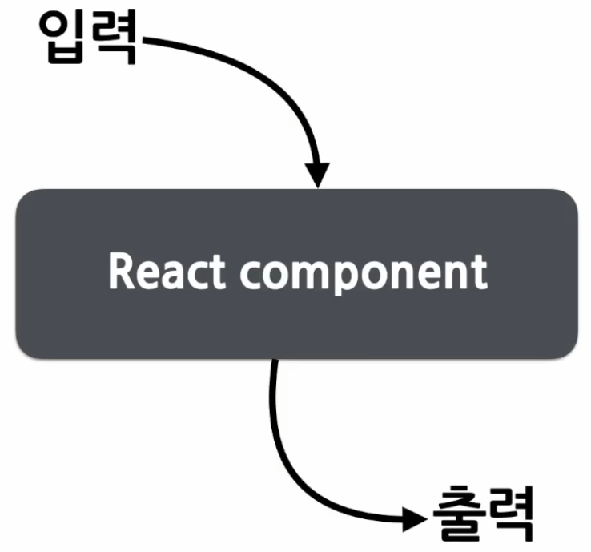
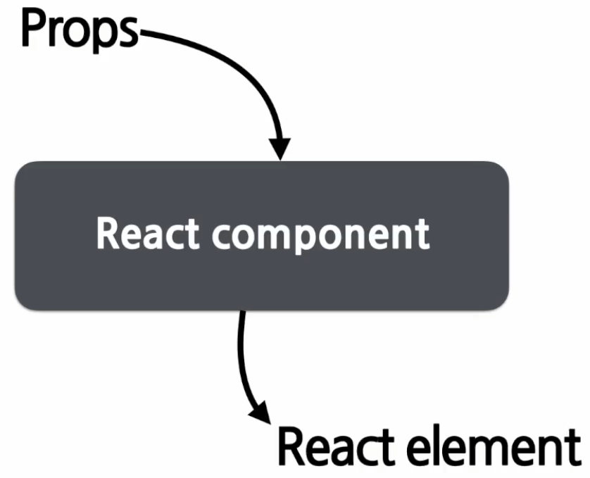
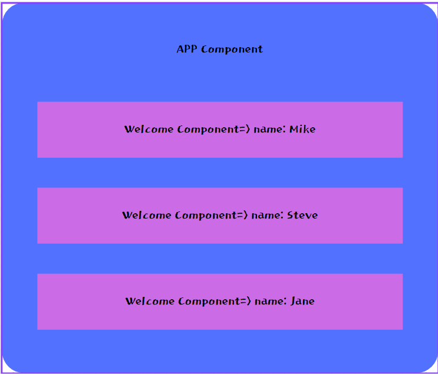
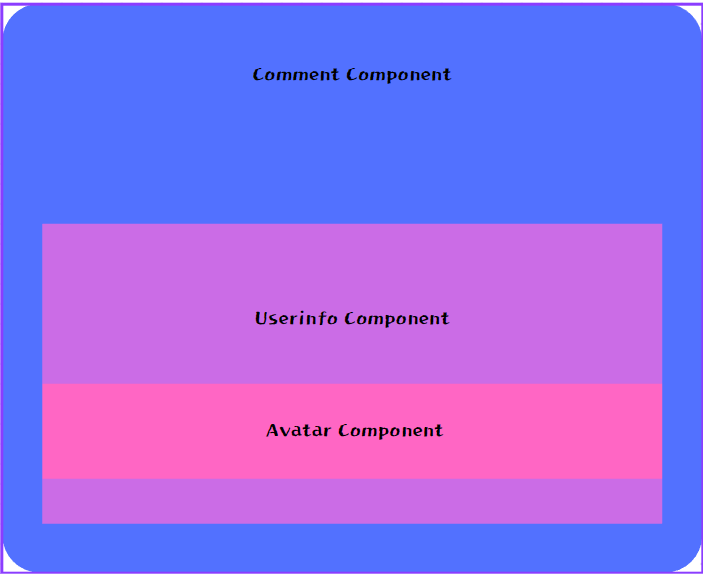

# Component

  - React는 Component-based 구조를 가진다.
  - 모든 페이지는 Components로 구성되어 있고 하나의 Component는 다른 여러개의 Components 로 구성되어 있다.
  - 레고 블록 조립을 통해 새로운 Component를 만들 수 있다.

  

  - React의 입출력은 JS와는 좀 다른 형식을 띈다

  

  - Props를 넣으면 그 속성에 맞는 Elements들을 만들어주는 역할을 한다.

# Props

  - Property라는 영어 단어를 줄여서 사용하는 말
  - React Component의 속성이다
  - 붕어빵의 속에 들어가는 재료로 보면 이해하기가 쉽다. (팥, 슈크림, 초코 등)
  
  - 특징
    - Read-only: 값을 변경 할 수 없다.
    - 붕어빵이 다 구워진 이후 속재료를 변경할 수 없는거와 마찬가지
    - 새로운 값을 Component에 전달하여 새로운 Element를 렌더링
    - 모든 React Component는 Props를 직접 바꿀 수 없고 같은 Props에 대해서는 항상 같은 결과를 보여줄것!
  
  - 사용법

```JSX
function APP(props) {
    return (
        <Profile 
            name="소플"
            introduction="안녕하세요, 근영입니다."
            viewCount={1500}
        />
    );
}
```
   - Profile Component에 속성으로 전달된다.
   - JSX를 사용하면 간단하게 넣어줄 수 있다.
   - JSX를 사용하지 않는경우
```JavaScript
React.createElement(
    Profile,
    {
        name: "근영",
        introduction: "안녕하세요, 근영입니다.",
        viewCount: 1500
    },
    null
);
```

# Component 만들기
  
  - Function Component
```JSX
function Welcom(props) {
    return <h1>안녕, {props.name}</h1>;
}
```

  - Class Component : 모든 클래스는 React.Component를 상속받아서 만든다!!
```JSX
class Welcome extends React.Component {
    render() {
        return <h1>안녕, {this.props.name}</h1>;
    }
}
```
  - Component의 이름은 항상 대문자로 시작해야 한다.
  - 소문자로 시작할 경우 DOM tag로 인식하기 때문이다.
  - Component 렌더링

```JSX
function Welcome(props) {
    return <h1>안녕, {props.name}</h1>;
}
// Component 를 불러와 name에 "인제" 라는 값을 넣어주는 역할
const element = <Welcome name="인제" />;
// ReactDOM.render 를 통해 element 를 root에 자식으로 삽입
ReactDOM.render(
    element,
    document.getElementById('root')
);
```

  - Component 안에 또 다른 Component를 넣을 수 있음
```JSX
function Welcome(props) {
    return <h1>안녕, {props.name}</h1>;
}

function App(props) {
    return (
        <div>
            <Welcome name="Mike" />
            <Welcome name="Steve" />
            <Welcome name="Jane" />
        </div>
    )
}

ReactDom.render(
    <App />,
    document.getElementById('root')
);
```
  - App이라는 Component는 Welcome 이라는 Component 3개를 가지게 된다

  

  - Component 추출
    - 재사용성이 증가
    - 개발 속도 증가

```JSX
function Comment(props) {
    return (
        <div className="comment">
            <div className="user-info">
                
                <div className="user-info-name">
                    {props.author.name}
                </div>
            </div>
            <div className="comment-text">
                {props.text}
            </div>
            <div className="comment-date">
                {formatDate(props.date)}
            </div>
        </div>
    );
}
```
  
  - 위 Comment 에서 Avatar 라는 Component를 추출해보자
```JSX
function Avatar(props) {
    return (
        
    );
}
```
  
  - 위 Comment 에서 User-info 라는 Component를 추출해보자
```JSX
function Userinfo(props) {
    return (
        <div className="user-info">
            <Avatar user={props.user} />
            <div className="user-info-name">
                {props.author.name}
            </div>
        </div>
    );
}
```

  - 이를 Comment Component에 적용해보면
```JSX
function Comment(props) {
    return (
        <div className="comment">
            <Userinfo user={props.author} />
            <div className="comment-text">
                {props.text}
            </div>
            <div className="comment-date">
                {formatDate(props.date)}
            </div>
        </div>
    );
}
```

  - 간단한 코드로 줄일 수 있고 이러한 Component들은 다른데서도 사용이 가능해진다.

  