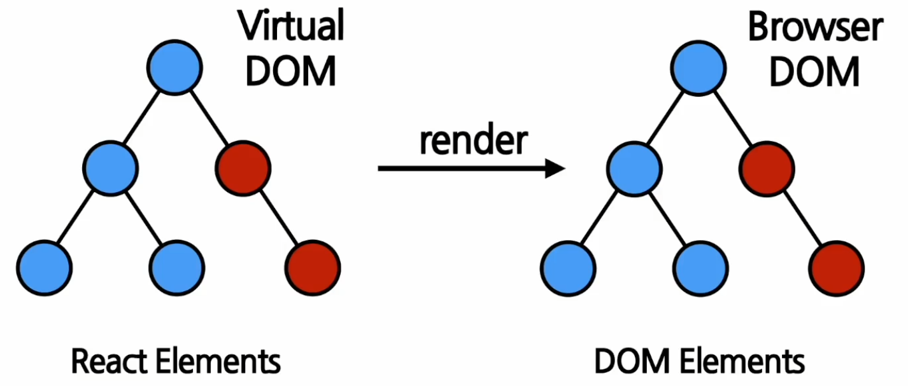

# Element

  - Element란 무엇인가?
   - Element는 React앱의 가장 작은 블록들이다.
   - DOM에서 모든 객체를 담고있는 것 (div,h1,h2,html 등등)

  - React Element와 DOM Element 차이점
   - 화면에 나타나는 내용을 기술하는 자바스크립트 객체 : DOM 이라고 말함

   

   - Virtual DOM에 있는 Element를 React Element Browser DOM을 DOM 이라고 부름

   - Element는 화면에 보이는 것을 기술함
   - 리액트 Element는 JS객체 형태로 존재

```JavaScript
{
    type: "button",
    props: {
        className: 'bg-green',
        childrend: {
            type: 'b',
            props: {
                children: 'Hello, element!'
            }
        }
    }
}
// 랜더링 될 경우
<button class="bg-green"> 
    <b>
        Hello, element!
    </b>
</button>
```

   - Element type이 문자열로 아니게 들어갈 경우

```JavaScript
{
    type: Button, //Button 은 React Component의 이름이 들어갔음.
    props: {
        color: 'green',
        children: "Hello, element!"
    }
}
```

   - props는 Element의 속성이라고 간단하게 이해하고 넘어가고 뒤에서 다룰 예정(className, Color 등등)
   - 실제 코드를 보면서 props 와 type 등에 대해서 좀 더 이해해보자

```JSX
function Button(props) {
    return (
        <button className={`bg-${props.color}`}> 
            <b>
                {props.children}
            </b>
        </button>
    )
}

function ConfirmDialog(props) {
    return (
        <div>
            <p>내용을 확인하셨으면 확인 버튼을 눌러주세요.</p>
            <Button color="green">확인</Button>
        </div>
    )
}
```
```JavaScript
{
    type: "div",
    props: {
        children: [
            {
                type: 'p',
                props: {
                    children: "내용을 확인하셨으면 확인 버튼을 눌러주세요."
                }
            },
            {
                type: Button,
                props: {
                    color: "green",
                    children: "확인",
                }
            }
            // {
            //     type: "button",
            //     props: {
            //         className: "bg-green",
            //         children: {
            //             type: "b",
            //             props: {
            //                 children: "확인"
            //             }
            //         }
            //     }
            // }
        ]
    }
}
```

   - React Element의 특징
     - immutable한 특성을 가지고 있다. (불변성)
     - Element 생성후에는 children이나 attribute를 변경할 수 없다. (ex: 붕어빵이 구워져 나오면 내용물을 바꿀 수 없다.)
     - 화면에 변경되는 Element를 보여주기 위해서는 새로운 Element를 만들어 기존과 바꿔치기를 해야한다.
     - React의 장점은 이러한 Element를 바꾸기위해 Virtual DOM을 사용한다.
     - Virtual DOM 은 변경할 Element 부분만 바꾸고 실제 DOM으로 바뀐 부분을 전송해준다.
    
   - Element 렌더링하기
   
```JSX
<div id="root"></div>

const element = <h1>안녕, 리액트!</h1>;
ReactDOM.render(element, document.getElementById("root"));
```

   - 렌더링된 Element를 업데이트 하기

```JSX
function tick() {
    const element = (
        <div>
            <h1>안녕, 리액트!</h1>
            <h2>현재 시간: {new Data().toLocalTimeString()}</h2>
        </div>
    );
    // root 함수를 가져와 element 를 렌더링해주는 부분
    ReactDOM.render(element, document.getElementById('root'));
}
// 1초마다 tick 함수를 실행
setInterval(tick, 1000);
```