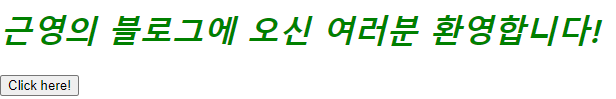
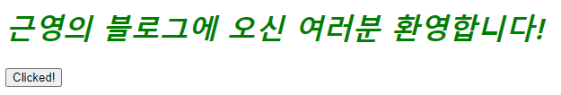
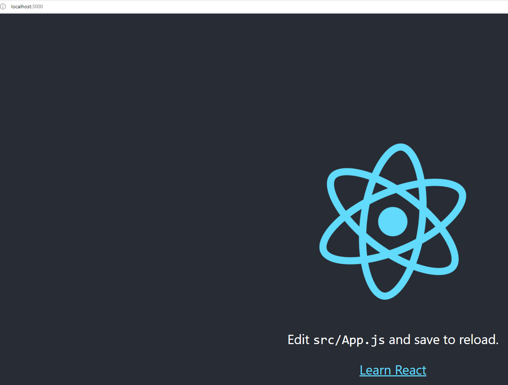

# 리액트 시작하기

  - html 파일을 간단하게 만든 후 html 과 css를 적용한 후

```html
<head>
    <meta charset="UTF-8">
    <meta http-equiv="X-UA-Compatible" content="IE=edge">
    <meta name="viewport" content="width=device-width, initial-scale=1.0">
    <title>근영의 블로그</title>
    <link rel="stylesheet" href="style.css">
</head>

<body>
    <h1>근영의 블로그에 오신 여러분 환영합니다!</h1>
    <div id="root"></div> <!-- Dom container (Root Dom Node) -->

    <!-- 리액트 가져오기 -->
    <script src="https://unpkg.com/react@17/umd/react.development.js" crossorigin></script>
    <script src="https://unpkg.com/react-dom@17/umd/react-dom.development.js" crossorigin></script>
    <!-- 리액트 컴포넌트 가져오기 -->
    <script src="MyButton.js"></script>
</body>
```
  - 리액트 가져오기를 이용하여 리액트를 사용하여 버튼을 만들어본다.

```javascript
// Mybutton.js
function MyButton(props) {
    const [isClicked, setIsClicked] = React.useState(false);

    return React.createElement(
        'button',
        { onClick: () => setIsClicked(true) },
        isClicked ? 'Clicked!' : 'Click here!'
    )
}
// root id 값을 가진 값을 가져옴
const domContainer = document.querySelector("#root");
// root div 내에 MyButton 이라는 버튼함수를 생성시키는 방법? 같음
ReactDOM.render(React.createElement(MyButton), domContainer);
```

   

   

  - 버튼을 React로 만들어 보았는데 React.useState 내부의 값들을 변수로 받고 return 값을 createElement로 돌려준다.
  - button 이라는 요소를 만들고 클릭 이벤트로 State에서 받아온 setIsClicked 값이 true 일 경우 Clicked 를 출력 아닐경우 Click here 출력 하게 만듬

  - 기존에 만들어진 html에 React를 적용하는 것이 아닌 새로운 앱을 React로 만들어보는 실습을 진행해보자.
  
  - 조건
    - Node.js v14.0.0 이상
    - npm v6.14.0 이상
    - VS Code 설치

```
    npx create-react-app <앱이름>
<!-- 오류 발생시 -->
https://gslabs.tistory.com/105
참조!!
    cd 앱이름
    npm start
```
   