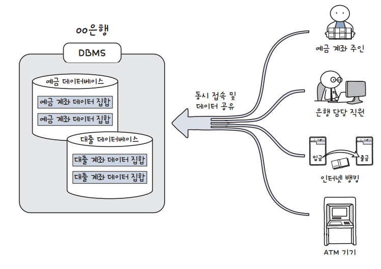
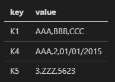
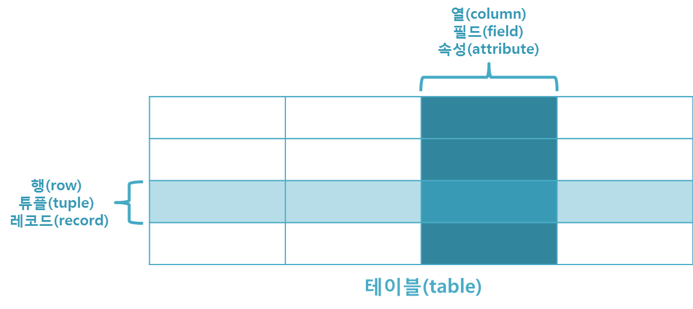

# 데이터베이스
  - 데이터의 집합
  - 데이터 => 자료(정보가 아님!)
  - 논리적으로 연관된 데이터를 모아 일정한 형태로 저장해 놓은 것을 데이터베이스라고 한다.

## 왜 필요한가?
  - 사용 목적 => 데이터 중복을 최소화 하여 조직의 목적에 맞게 효율적으로 관리
  - 기업, 기관부터 개인의 일상생활에 이르기 여러 분야에서 밀접하게 연관된 기술이다.
  - 데이터를 바탕으로 전략적 사업 목표를 세울때 유리함
  - 데이터 추출능력이 있으면 큰 성과를 얻을 수 있음.

## ISOS, R1C3으로 정리됨
  - ISOS => 데이터베이스 정의
    - I(Intergrated Data) : 통합 데이터 => 데이터 중복이 최소화된 데이터
    - S(Stored Data) : 저장 데이터 => 컴퓨터가 접근할 수 있는 매체에 저장된 데이터
    - O(Operational Data) : 운영 데이터 => 조직의 고유한 업무를 수행하는 데 필요한 데이터
    - S(Shared Data) : 공용 데이터 => 여러 응용 시스템이 공동으로 소유하고 유지하는 데이터

  - R1C3 => 데이터베이스 시스템 특징
    - R(Real Time Accessibility) : 실시간 접근성 => 사용자 질의에 실시간 처리해 응답
    - C(Continuous Evolution) : 지속적인 변화 => 삽입, 삭제, 수정 작업을 통해 항상 최신 데이터를 동적으로 유지
    - C(Concurrent Sharing) : 동시 공유 => 목적이 다른 여러 사용자가 동시에 같은 데이터를 공유
    - C(Content Reference) : 내용에 의한 참조 => DB에 있는 데이터를 참조할 때 레코드의 주소나 위치가 아닌 사용자가 요구하는 데이터 내용으로 참조

## 데이터베이스 관리
  - DBMS(Database Management System) : 데이터베이스 관리 시스템으로 입력, 수정, 삭제 등 다양한 기능을 제공하는 소프트웨어

  

  - DB(Database) : 데이터를 담는 통
  - DBMS(Database Management System) : 통을 관리하는 소프트웨어

## 데이터베이스 종류
  - 저장 방법에 따라서 계층형, 네트워크, 키-값, 관계형 으로 나뉜다.

  - 계층형 데이터베이스
    - 데이터가 부모 자식 관계를 이루는 트리 구조

    

    - 계층형 데이터베이스는 중복이 발생하기 쉬우며 상하 종소 관계로 이루어진다.
    - 초기에 이 방식을 사용시 이후 프로세스 변경이 어렵다

  - 네트워크형 데이터베이스
    - 데이터를 노드로 표현한 모델
    - 대등한 관계 => 계층형 데이터베이스의 단점인 데이터 중복, 상하 종속 관계를 해결함

    

    - 레코드 간의 관계가 일대다 또는 다대다로 표현이 가능하다.
    - 종속성 문제가 생기기 쉽기 때문에 데이터베이스 구조 변경이 어렵다는 단점을 가진다.

  - Key-Value 데이터베이스
    - Key-Value 일대일 대응하여 데이터를 저장한다
    - 데이터 중복이 발생하며 비정형 데이터 저장에 유리함.
    > 비정형 데이터 : 형식이 없는 데이터 => 음성, 텍스트 ,영상 등 데이터를 말한다
    > 정형 데이터 : 데이터베이스 규칙에 맞게 데이터를 저장
    - 관계형 데이터베이스와 더불어 많이 사용한다.
    - 고유한 식별자로 사용하여 단순한 객체에서 복잡한 집합체 이르는 모든 것이 Key와 Value가 될 수 있다.

    

    - 스키마 없이 동작한다.
    > 스키마 : 데이터베이스 구조와 제약 조건에 대해 전반적인 명세를 기술한 것 => 자료 개체의 성질, 관계, 조작, 자룟값 등
    - 데이터 구조를 미리 정의할 필요가 없고 시간이 지나도 언제든지 조작이 가능하다.
    
      | 데이터 형태 | 작성 예 |
      |---|---|
      | 데이터 테이블 |  |
      | JSON 형식 | {"K1":"AAA,BBB,CCC", "K4":"AAA,2,01/01/2015", "K5":"3,ZZZ,  5623"} |
      | XML 스키마 표현 | <K1>AAA,BBB,CCC</k1> <k4>AAA,2,01/01/2015</k4> <k5>3,ZZZ, 5623</k5> |

    - NoSQL 종류

      NoSQL 유형 | 특징 | 종류
      ---------|----------|---------
       Key-Value 데이터베이스 | Key-Value 형태로 저장하며 수평 확장이 쉽지만 값의 내용으로 쿼리할 수 없다. | Memcached, Redis, LevelDB 등
       Document 데이터베이스 | Key-Value 모델이 진화한 형태 값이 계층적인 형태로 저장된다.  | MongoDB, CouchDB, MarkLogic 등
       Column 데이터베이스 | 키에 해당하는 값에 각기 다른 스키마를 가질 수 있다. 대용량 데이터 압축, 분산 처리, 집계 처리 등이 뛰어남. | HBase, Cassandra, Hypertable 등
       Graph 데이터베이스 | 데이터를 노드로 표현하며 노드 사이 관계를 엣지로 표현, 소셜미디어나 네트워크 다이어그램 등에서 사용 | Neo4j, Blazegraph, OrientDB 등

    - 관계형 데이터베이스
      - 실무형 데이터베이스 종류의 하나
      - 데이터를 테이블 형태로 저장한다.

      

      - 열(column) 과 행(row)으로 구성한 테이블로 정리하며 고유키(Primary Key = PK)가 각 행을 식별한다.
      - 데이터는 행 단위로 저장 각 항목의 속성은 열로 저장
      
        용어 | 설명
        ---------|----------
        열 | 각 열은 고유한 이름을 가지고 자신만의 타입을 가진다. => 필드(field) or 애트리뷰트(attribute) |
        행 | 관계된 데이터의 묶음을 의미하고 한 테이블의 모든 행은 같은 수의 열을 가진다. => 튜플(tuple) or 레코드(record) |
        테이블 | 행과 열 값들의 모음을 나타내며, 도메인의 특성에 따라 데이터를 논리적으로 그룹화해 놓은 것이다. |

    - ERD를 통해 이해하는 테이블 관계
      - ERD(Entity Relationship Diagram) : 테이블 간의 관계를 표현한 그림으로 논리 모델과 물리 모델로 구성되어 있다.
        - 논리 모델 : 데이터 모델의 첫 단계로 데이터를 수집, 분석하여 데이터베이스의 전체 모양을 구성
        - 물리 모델 : 논리 모델을 바탕으로 실제 데이터를 저장할 수 있는 모델을 표현한 것
    - 방대한 양의 데이터가 있는 경우 데이터의 값이 수정될 경우 모든 데이터를 찾아서 수정하는 것이 힘들기 때문에 관계형 데이터를 사용할 경우 쉽게 해결이 가능하다.
    - 관계형 데이터베이스는 테이블을 분리하여 목적에 맞는 데이터만 추출한 후 테이블을 결합하여 값을 수정한다.
    - 데이터의 중복과 관리 효율성을 추구한다.

## SQL이란 무엇인가
  - 관계형 데이터베이스 시스팀의 데이터를 관리하는 프로그래밍 언어
  - DBMS에 따른 SQL 명칭

    DBMS | SQL 명칭 |
    ---------|----------|
     SQL Sever | Transact-SQL(T-SQL) |
     Oracle | PL/SQL |
     MySQL | SQL |
     국제 표준 | ANSI SQL |

  - SQL 문법
    
    - 데이터 정의 언어(DDL) : Data Define Language => 데이터베이스를 정의하는 언어
      - CREATE : 데이터베이스 또는 테이블을 생성한다.
      - ALTER : 테이블을 수정힌다.
      - DROP : 데이터베이스 또는 테이블을 삭제한다.
      - TRUNCATE : 테이블을 초기화 한다.
    
    - 데이터 조작 언어(DML) : Data Manipulation Language => 데이터베이스에 입력된 데이터를 검색, 입력, 수정, 삭제 한다.
      - SELECT : 데이터를 검색한다.
      - INSERT : 데이터를 입력한다.
      - UPDATE : 데이터를 수정한다.
      - DELETE : 데이터를 삭제한다.
    
    - 데이터 제어 언어(DCL) : Data Control Language => 데이터베이스에 접근하거나 객체에 권한을 부여 하는 역할
      - GRANT : 특정 데이터베이스 사용자에게 작업의 특정 수행 권한을 부여한다.
      - REVOKE : 특정 데이터베이스 사용자에게 작업의 특정 수행 권한을 삭제한다.
      - COMMIT : 트랜잭션 작업을 완료하는 역할.
      - ROLLBACK : 트랜잭션 작업을 취소하거나 이전 상태로 복구하는 역할.

## 왜 배워야 하는 건가?
  - 데이터는 많은 기업에서 중요한 의사결정을 내리는데 바탕이된다.
  - RDBMS, 빅데이터 시스템, NoSQL, 시스템 등 다양한 형태의 데이터베이스를 다룰 수 있다.
  
[참고 사이트](https://hongong.hanbit.co.kr/%EB%8D%B0%EC%9D%B4%ED%84%B0%EB%B2%A0%EC%9D%B4%EC%8A%A4-%EC%9D%B4%ED%95%B4%ED%95%98%EA%B8%B0-databasedb-dbms-sql%EC%9D%98-%EA%B0%9C%EB%85%90/)