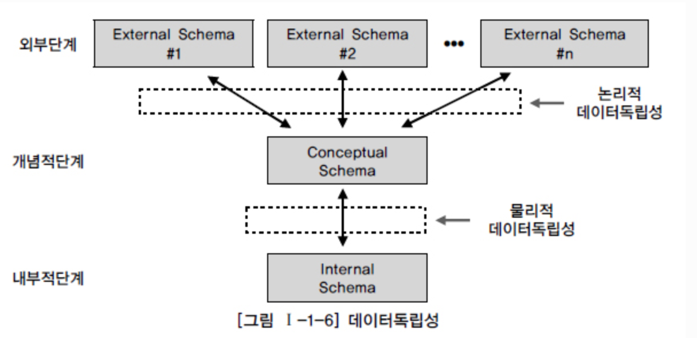
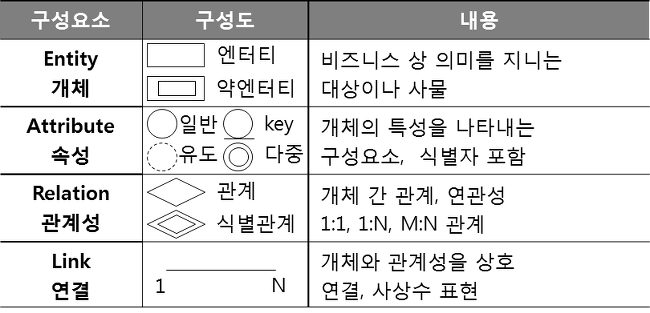
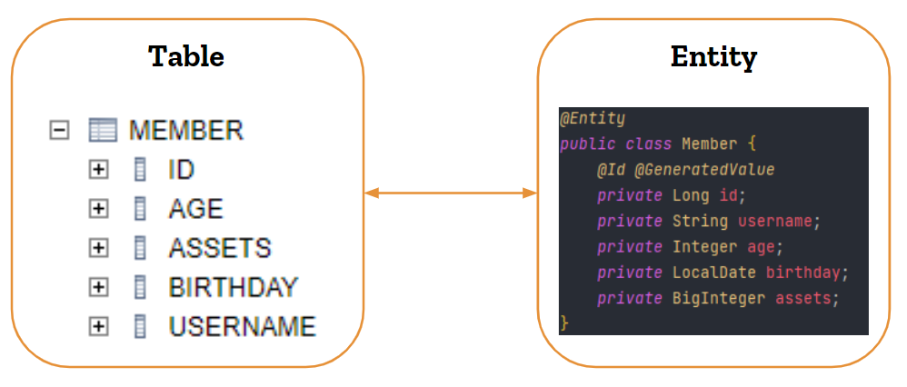
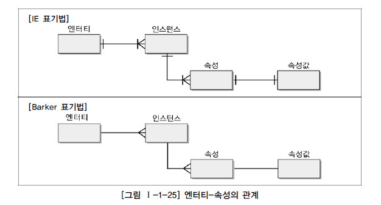
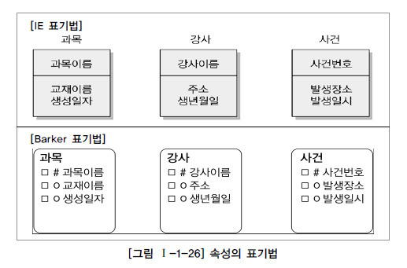
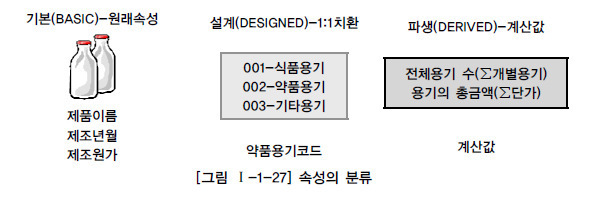
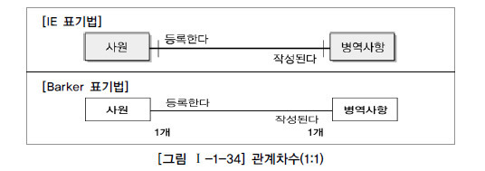
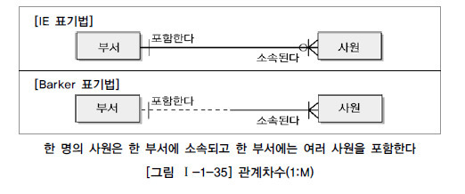
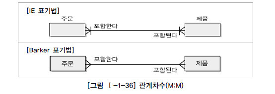

# 1장 데이터 모델링의 이해
  
  - 데이터 모델링의 중요성 및 유의점
    - 중복 : 같은 시간 같은 데이터 제공
    - 비유연성 : 사소한 업무변화에 데이터 모델이 수시로 변경되면 안됨. 데이터 정의를 사용 프로세스와 분리한다.
    - 비일관성 : 데이터 간 상호 연관 관계에 대해 명확히 정의해야 한다.

  - 데이터 모델링
    - 개념적, 물리적, 논리적 데이터 모델링

  - 데이터 독립성 요소

    항목 | 내용 | 비고
    ---------|----------|---------
    외부 스키마(External Schema) | -View 단계 여러 개의 사용자 관점으로 구성   -개개 사용자가 보는 개인적 DB 스키마   -DB 의 개개 사용자나 응용프로그래머가 접근하는 DB 정의 | 사용자 관점
    개념 스키마(Conceptual Schema) | -개념단계 하나의 개념적 스키마로 구성.   -모든 사용자 관점을 통합한 조직 전체의 DB를 기술하는 것   -모든 응용시스템들이나 사용자들이 필요로하는 데이터를 통합한 조직 전체의 DB를 기술한 것으로 DB에 저장되는 데이터와 그들간의 관계를 표현하는 스키마 | 통합 관점
    내부 스키마(Internal Schema) | -내부 단계, 내부 스키마로 구성.   -DB가 물리적으로 저장된 형식   -물리적 장치에서 데이터가 실제적으로 저장되는 방법을 표현하는 스키마 | 물리적 저장구조

  - 데이터 독립성

    

    - 논리적 독립성 : 개념스키마 변경, 외부스키마에 영향 X
    - 물리적 독립성 : 내부스키마 변경, 외부/개념스키마에 영향 X

  - Mapping(사상)
    - 상호 독립적인 개념을 연결시켜주는 다리
    - 논리적 사상 : 외부 스키마 - 개념 스키마 => 외부 화면이나 사용자에게 인터페이스하기 위한 스키마 구조는 전체가 통합된 개념적 스키마와 연걸된다.
    - 물리적 사상 : 개념 스키마 - 내부 스키마 => 통합된 개념적 스키마 구조와 물리적으로 저장된 구조의 물리적 테이블 스페이스와 연결되는 구조

  - 데이터 모델링의 3요소
    - 어떤 것(Things) : 엔티티(Entity Type = Entity Set = Entity)
    - 성격(Attributes) : 
    - 관계(Relationships) : 

  - 모델링의 특징
    - 현실세계 => 추상화, 단순화, 정확화 => 모델
    - 추상화 : 현실세계를 일정한 형식에 맞추어 표현을 하는 의미
    - 단순화 : 복잡한 현실세계를 특정 표기법 or 언어로 표현하여 쉽게 이해할 수 있도록 하는 개념
    - 명확화 : 대상에 대한 애매모호함을 제거하고 정확하게 현상을 기술하는 것.

  - 데이터 모델 표기법
    - Entity Relationship Model 개발(1976년 피터 첸)
    - IE, Baker 기법이 많이 사용됨
    - 엔터티, 관계, 속성으로 이뤄짐

  - ERD(Entity Relationship Diagram) 작업순서
    1. 엔터티 그림
    2. 엔터티 배치
    3. 엔터티 관계설정
    4. 관계명 기술
    5. 관계의 참여도 기술
    6. 관계필수여부

    

  - 좋은 데이터 모델의 요소
    1. 완전성 : 업무에 필요한 모든 데이터가 모델에 정의
    2. 중복배제 : 하나의 DB내에 동일한 사실은 한번만.
    3. 업무규칙 : 많은 규칙을 사용자가 공유하도록 제공
    4. 데이터 재사용 : 데이터가 독립적으로 설계돼야 한다.
    5. 의사소통 : 업무규칙은 엔터티, 서브타입, 속성, 관계 등의 형태로 최대한 자세히 표현
    6. 통합성 : 동일한 데이터는 한번만 정의, 참조 활용

  - 엔터티(Entity) : 업무에 필요하고 유용한 정보를 저장하고 관리하기 위한 집합적인 것, 보이지 않는 개념 포함

    

  - 엔터티의 특징
    1. 반드시 해당 업무에서 필요하고 관리하고자 하는 것
    2. 유일한 식별자에 의해 식별 가능
    3. 두 개 이상의 인스턴스의 집합
    4. 업무 프로세스에 의해 이용되어야 한다.
    5. 반드시 속성이 있어야 한다.
    6. 다른 엔터티와 최소 1개 이상의 관계가 있어야 한다. => 통계성/코드성 엔터티는 관계 생략 가능

  - 엔터티의 분류
    - 유무형에 따른 분류 
      - 유형 : 물리적 형태 => ex) 사원, 물품, 강사
      - 개념 : 개념적 정보 => ex) 조직, 보험상품
      - 사건 : 업무수행시 발생 => ex) 주문, 청구, 미납

    - 발생시점에 따른 분류
      - 기본 : 그 업무에 원래 존재하는 정보, 다른 엔터티의 부모 역할, 자신 고유한 주식별자를 가진다.
      - 중심 : 기본 엔터티로부터 발생, 다른 엔터티와 관계로 많은 행위 엔터티 생성 => ex) 계약, 사고, 주문
      - 행위 : 2개 이상의 부모 엔터티로부터 발생, 자주 바뀌거나 양이 증가 => ex) 주문목록, 사원변경이력

  - 속성 : 업무에서 필요로 하는 인스턴스로 관리하고자 하는 의미상 분리되지 않는 최소의 데이터 단위
    - 한 개의 엔터티는 2개 이상의 인스턴스 집합
    - 한 개의 엔터티는 2개 이상의 속성을 가짐
    - 한 개의 속성은 1개의 속성값을 가짐

    

    

  - 구성 방식의 분류
    - PK(Primary Key) 속성 : 엔터티를 식별 할 수 있는 속성
    - FK(Foreign Key) 속성 : 다른 엔터티와의 관계에서 포함된 속성
    - 일반속성 : PK, FK에 포함되지 않는 속성
    - 단순형 속성 : 더 이상 다른 속성들로 구성될 수 없는 단순한 속성
    - 복합형 속성 : 여러 세부 속성들로 구성될 수 있는 속성
    - 단일값 속성 : 속성 하나에 한 개의 값을 가지는 속성
    - 다중값 속성 : 여러 개의 값을 가지는 속성, 하나의 엔터티에 포함 될 수 없으므로 1차 정규화를 하거나 별도의 엔터티를 만들어 관계로 연결함
  
  - 속성의 분류
    - 기본 : 업무로부터 추출한 모든 일반적인 속성
    - 설계 : 업무를 규칙화하기 위해 새로 만들거나 변형, 정의하는 속성 => ex) 일련번호
    - 파생 : 다른 속성에 영향을 받아 발생하는 속성, 빠른 성능을 낼 수 있도록 원래 속성의 값을 계산, 적을수록 좋음 => ex) 합

    

  - 도메인
    - 속성에 대한 데이터 타입, 크기, 제약사항 지정

  - 속성의 명명
    - 해당업무에서 사용하는 이름 부여
    - 서술식 속성명은 사용 금지
    - 약어 사용 금지
    - 구체적으로 명명하여 데이터 모델에서 유일성 확보
  
  - 엔터티의 명명
    - 현업 업무에서 사용하는 용어 사용
    - 약어 사용금지
    - 단수명사 사용
    - 고유한 이름 사용 생성의미대로 부여

  - 관계
    - 엔터티의 인스턴스 사이의 논리적 연관성
    - 존재의 형태로서나 행위로서 서로에게 연관성이 부여된 상태, 관계 페어링의 집합
    ex) 강사 - 가르친다(관계) - 수강생

  - 패어링 : 엔터티 안에 인스턴스가 개별적으로 관계를 가지는 것

  - UML(통합모델링언어)에서의 관계
    - 연관관계(실선) : 항상 이용하는 관계 => 소속된다.
    - 의존관계(점선) : 상대 행위에 의해 발생하는 관계 => 주문하는것

  - 관계의 표기법
    - 관계명 : 관계의 이름
    - 관계차수 : 1:1, 1:M, M:N

    

    
    
    

    - 관계선택성(관계선택사양) : 필수관계, 선택관계

  - 관계 체크사항
    1. 2개의 엔터티 사이에 관심있는 연관규칙이 존재하는가?
    2. 2개의 엔터티 사이에 정보의 조합이 발생되는가?
    3. 업무기술서, 장표에 관계연결에 대한 규칙이 서술되어 있는가?
    4. 업무기술서, 장표에 관계연결을 가능하게 하는 동사가 있는가?

  - 식별자
    - 엔터티 내 인스턴스를 구분하는 구분자 식별자는 논리적, Key는 물리적 데이터 모델링 단계에 사용

  - 식별자의 특징
    - 유일성 : 주식별자에 의해 모든 인스턴스들이 유일하게 구분
    - 최소성 : 주식별자를 구성하는 속성의 수는 유일성을 만족하는 최소의 수가 되어야 함
    - 불변성 : 지정된 주식별자의 값은 자주 변하지 않아야 함. (변하면 이전 기록 말소)
    - 존재성 : 주식별자가 지정되면 반드시 값이 들어와야 함

  - 식별자 분류
    - 대표성여부 : 주식별자, 보조식별자
      - 주 : 엔터티 내 각 어커런스를 구분할 수 있는 구분자, 타 엔터티와 참조관계를 연결함
      - 보조 : 구분자이나 대표성X, 참조관계 연결X
    - 스스로생성여부
      - 내부식별자 : 스스로 생성되는 식별자
      - 외부식별자 : 타 엔터티로부터 받아오는 식별자
    
  - 속성의 수
    - 단일 : 하나의 속성으로 구성
    - 복합 : 2개 이상의 속성으로 구성

  - 대체 여부
    - 본질 : 업무에 의해 만들어지는 식별자
    - 인조 : 인위적으로 만든 식별자

  - 식별자 관계
    - 주식별자 : 자식의 주식별자로 부모의 주식별자 상속
      - 부모로부터 받은 식별자를 자식엔터티의 주식별자로 이용하는 경우
      - 강한 연결관계 표현, 실선 표기
      - 식별자 관계로만 설정 시 주식별자 증가로 오류 유발
    - 비식별자 : 부모 속성을 자식의 일반 속성으로 사용
      - 부모 없는 자식이 생성될 수 있는 경우
      - 부모와 자식의 생명주기가 다른 경우
      - 여러개의 엔터티가 하나의 엔터티로 통합되어 표현되었는데 각각 별도의 관계를 가진 경우
      - 자식엔터티에 별도의 주식별자를 생성하는 것이 더 유리한 경우
      - SQL 문장이 길어져 복잡성 증가되는 것 방지
        - 약한 연결관계 표현, 점선 표기
        - 비식별자 관계로만 설정 시 부모 엔터티와 조인하여 성능 저하

# 2장. 데이터 모델과 성능

  - 성능 데이터 모델링
    - DB 성능향상을 목적으로 설계단계의 데이터 모델링 때부터 정규화, 반정규화, 테이블통합, 테이블분할, 조인구조, PK, FK 등 여러 가지 성능과 관련된 사항이 데이터 모델링에 반영될 수 있도록 하는 것
    - 분석/설계 단계에서 성능을 고려한 데이터 모델링 수행시 성능저하에 따른 재업무 비용을 최소화 가능.
    - 데이터 증가가 빠를수록 성능저하에 따른 성능개선비용은 기하급수적 증가.

  - 성능 데이터 모델링 고려사항 순서
    1. 데이터 모델링을 할 때 정규화를 정확하게 수행
    2. DB 용량산정을 수행
    3. DB에 발생되는 트랜잭션의 유형을 파악
    4. 용량과 트랜잭션의 유형에 따라 반정규화를 수행
    5. 이력모델의 조정, PK/FK조정, 슈퍼/서브타입 조정
    6. 성능관점 데이터 모델을 검증한다.

  - 함수적 종속성 : 데이터들이 어떤 기준 값에 의해 종속되는 현상

  - 정규화 : 반복적인 데이터를 분리하고 각 데이터가 종속된 테이블에 적절하게 배치
    - 1차 정규화 : 같은 성격, 내용 컬럼이 연속될 때 컬럼 제거, 테이블 생성
    - 2차 정규화 : PK 복합키 구성일 떄 부분적 함수 종속 관계 테이블 정리
    - 3차 정규화 : PK가 아닌 일반 컬럼에 의존하는 컬럼 분리

  - 반정규화
    - 정규화된 엔터티, 속성, 관계에 대해 시스템의 성능향상과 개발 운영 단순화를 위해 중복, 통합, 분리 등 수행하는 데이터 모델링 기법
    - 조회 시 디스크 I/O가 많거나 경로가 멀어 조인에 의한 성능 저하 방지
    - 일반적 정규화시 입력/수정/삭제 성능이 향상되며 반정규화시 조인 성능이 향상된다.

  - 반정규화 절차
    1. 반정규화 대상조사 (범위처리빈도수, 범위, 통계성)
        1. 자주 사용되는 테이블에 접근하는 프로세스 수가 많고 항상 일정한 범위만 조회하는 경우
        2. 테이블에 대량의 데이터가 있고 대량의 데이터 범위를 자주 처리하는 경우 처리범위를 일정하게 줄이지 않으면 성능을 보장할 수 없는 경우
        3. 통계성 프로세스에 의해 통계 정보를 필요로 할 때 별도의 통계테이블을 생성한다.
        4. 테이블에 지나치게 많은 조인이 걸려 데이터를 조회하는 작업이 기술적으로 어려울 경우
    
    2. 다른 방법유도 검토 (뷰, 클러스터링, 인덱스 조정)
        1. VIEW 사용 : 지나치게 많은 조인이 걸려 데이터를 조회하는 작업이 기술적으로 어려울 경우 사용
        2. 클러스터링 : 대량의 데이터처리나 부분처리에의해 성능이 저하되는 경우 클러스터링을 적용하거나 인덱스를 조정함 (조회가 대부분일 때 클러스터링 적용)
        3. 파티셔닝 : 대량의 데이터는 PK의 성격에 따라 부분적 테이블로 분리할 수 있다. 파티셔닝 키에 의해 물리적 저장공간 분리
        4. 캐시 : 응용 애플리케이션에서 로직을 구사하는 방법을 변경함으로 성능을 향상시킬 수 있다.
    
    3. 반정규화 적용

        3-1 테이블 반정규화
          - 테이블 병합(1:1, 1:M, 슈퍼/서브 타입)
            1. 1:1관계를 통합하여 성능향상
            2. 1:M관계를 통합하여 성능향상
            3. 슈퍼/서브 관계를 통합하여 성능향상
          - 테이블할(수직분할, 수평분할)
            1. 수직분할 : 칼럼단위 테이블을 디스크 I/O를 분산처리하기 위해 테이블을 1:1로 분리하여 성능 향상
            2. 수평분할 : 로우단위로 집중 발생되는 트랜잭션을 분석하여 디스크 I/O 및 데이터 접근의 효율성을 높여 성능 향상하기 위해 테이블을 쪼갬
          - 테이블 추가
            1. 중복 : 다른 업무이거나 서버가 다른 경우 동일한 테이블구조를 중복하여 원격조인을 제거
            2. 통계 : SUM, AVG 등을 미리 수행하여 계산해 조회 시 성능 향상
            3. 이력 : 이력테이블 중 마스터 테이블에 존재하는 레코드를 중복하여 이력테이블에 존재시킴
            4. 부분 : 하나의 테이블 전체 칼럼 중 자주 이용하는 집중화된 칼럼들이 있을 때 디스크 I/O를 줄이기 위해 해당 칼럼들 모아놓은 별도의 반졍규화된 테이블 생성
        
        3-2 칼럼 반정규화
          1. 중복칼럼 추가 : 조인에 의해 처리할 때 성능저하 예방을 위해 중복 칼럼 위치
          2. 파생칼럼 추가 : 트랜잭션이 처리되는 시점에 계산에 의해 발생되는 성능저하를 예방하기 위해 미리 값을 계산하여 칼럼에 보관
          3. 이력테이블 칼럼추가 : 대량의 이력데이터를 처리할 때 불특정 날 조회나 최근 값을 조회할 때 나타날 수 있는 성능저하 예방하기 위해 기능성 칼럼(최근값 여부, 시작과 종료일자 등) 추가
          4. 응용시스템 오작동을 위한 칼럼 추가 : 업무적 의미는 없지만 사용자 실수로 원래 값으로 복구하기 원하는 경우 이전 데이터를 임시적 중복하여 보관
          5. PK에 의한 칼럼 추가 : 단일 PK 안에 특정 값을 별도로 조회하는 경우 성능 저하가 발생할 수 있기 떄문에 일반속성으로 추가
        
        3-3 관계 반정규화 : 무결성 유지
          - 중복관계 추가 : 데이터 처리를 위해 여러 경로를 거쳐 조인이 가능하지만 성능저하 예방을 위해 추가적 관계를 맺는 방법

  - 로우 체이닝 : 로우 길이가 너무 길어 데이터 블록 하나에 데이터가 저장되지 않고 두 개 이상의 블록에 걸쳐 하나의 로우가 저장되어 있는 형태
  - 로우 마이그레이션 : 데이터블록에서 수정이 발생하면 수정된 데이터를 해당 데이터 블록에서 저장하지 못하고 다른 블록의 빈 공간을 찾아 저장하는 방식
  
  - 로우 체이닝과 마이그레이션이 발생하여 많은 블록에 데이터가 저장되면 DB 메모리에서 디스크 I/O가 발생이 많이 되기 떄문에 성능저하 발생한다. 트랜잭션을 분석하여 적절하게 1:1관계로 분리하여 성능향상이 가능하도록 해야 한다.

  - PK에 의해 테이블을 분할하는 방법(파티셔닝)
    1. RANGE PARTITION : 대상 테이블이 날짜 또는 숫자값으로 분리가 가능하고 각 영역별로 트랜잭션이 분리되는 경우 => ex) 요금_0401
    2. LIST PARTITION : 지점, 사업소 등 핵심적인 코드값으로 PK가 구성되어 있고 대량의 데이터가 있는 테이블의 경우 -> ex) 고객_서울
    3. HASH PARTITION : 지정된 HASH 조건에 따라 해시 알고리즘이 적용되어 테이블이 분리

  - 테이블에 대한 수평/수직분할의 절차
    1. 데이터 모델링 완성
    2. DB 용량산정
    3. 대량 데이터가 처리되는 테이블에 대해 트랜잭션 처리 패턴을 분석
    4. 칼럼 단위로 집중화된 처리가 발생하는지, 로우 단위로 집중화된 처리가 발생하는지 분석
    5. 집중화된 단위 테이블을 분리하는 것을 검토 => 칼럼 많음 : 1:1 분리 / 데이터 많음 : 파티셔닝

  - 슈퍼/서브 타입 모델 : 업무를 구성하는 데이터 공통과 차이점의 특징을 고려하여 효과적 표현
    - 논리적 모델
      - 슈퍼 타입 : 공통 부분
      - 서브 타입 : 공통으로부터 상속받아 다른 엔터티와 차이가 있는 속성

  - 슈퍼/서브 타입 데이터 모델의 변환기술
    1. 개별로 발생되는 트랜잭션에 대해서는 개별 테이블로 구성 (1:1 Type)
    2. 슈퍼타입+서브타입에 대해 발생되는 트랜잭션에 대해서는 슈퍼+서브타입 테이블로 구성 (Plus Type)
    3. 전체를 하나로 묶어 트랜잭션이 발생할 때는 하나의 테이블로 구성 (Single Type, All in one Type)